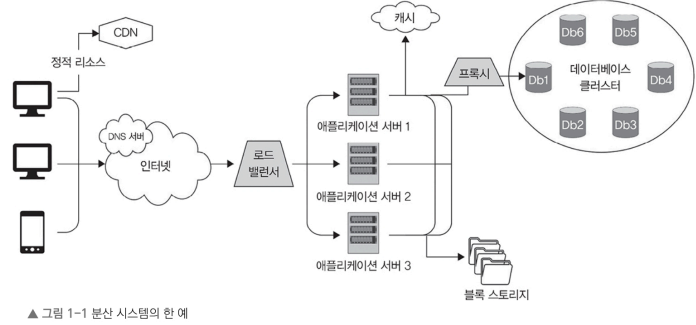
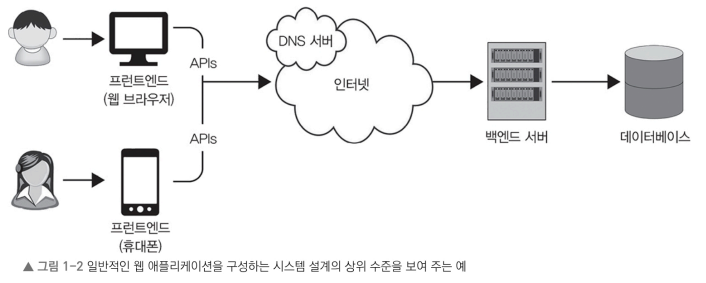

#  시스템 설계의 기본

# 1.1 시스템 설계의 정의

## 시스템의 필요성

소프트웨어 시스템의 아키텍처나 구성 요소, 인터페이스, 데이터 관리 전략을 세우는 데 **시스템 설계는 필수**다. 

- 잘 설계된 시스템은
  - 애플리케이션의 전반적인 성능, 사용자 경험(user experience)을 향상
  - 보안 강화
  - 개발 비용과 시간을 절감

> 이 장에서 다루는 내용: 소프트웨어 시스템 설계에 대한 기본적인 배경지식과 중요성
> - 시스템 설계 정의
> - 시스템 설계의 다양한 유형과 업계에서 시스템 설계가 갖는 중요성
> - 시스템 설계가 소프트웨어를 유지 보수(개발/성능 향상)에 미치는 영향

# 1.1.1 소프트웨어 시스템

> 소프트웨어 시스템: 특정 작업이나 일련의 작업을 수행하려고 함께 동작하는 컴포넌트나 모듈, 프로그램의 집합
 
일반적으로 원하는 기능(데이터 관리, 트랜잭션 처리, 최종 사용자를 위한 서비스 제공 등)을 실행할 수 있는 연관된 소프트웨어 애플리케이션으로 구성

소프트웨어 시스템은 
- 단순 프로그램처럼 간단
- 여러 컴퓨터와 네트워크에 걸쳐 있는 분산 시스템 

처럼 복잡할 수도 있다.

애플리케이션 개발시 고민 
- 어떤 프로그래밍 언어를 선택할지, 
- 어떤 에디터를 사용할지, 
- 테스트는 테스트 주도 개발(Test Driven Development, TDD) 방식으로 
- 

소프트웨어 시스템 개발 과정 및 고려사항
- 언어 선택에서 시작
- 설계에 적합한 여러 방법론 고민
- 업데이트와 유지 보수를 제공할수 있는지 

# 1.1.2 분산 소프트웨어 시스템

분산 소프트웨어 시스템은 **여러 독립적인 컴포넌트나 프로세스, 노드**로 구성할 수 있는데, 이들은 **서로 통신을 주고받으며 하나의 공동 목표를 달성**하려고 동작한다.

### vs 중앙 집중형 소프트웨어 시스템 
- 중앙 집중형 소프트웨어 시스템: 모든 구성 요소가 하나의 기기에 위치
- 분산 소프트웨어 시스템: 지리적으로 다른 위치에 있는 여러 기기와 네트워크에 걸쳐 위치(그림 1-1). 

### 동작 방식
- 분산 시스템의 각 구성 요소는 특정 작업이나 일련의 작업 모음을 처리
- 모두 하나의 공동 목표를 이해 동작
- 각 구성 요소끼리 다양한 통신 프로토콜을 통해 서로 소통
  - 통신 프로토콜:
    - 원격 프로시저 호출(Remote Procedure Call, RPC)
    - 메시지 전달(message passing)
    - 발행/구독 모델(publish/subscribe model)
### 필요성
- 분산 시스템은 주로 확장성, 가용성, 장애 허용이 중요한 요구 사항으로 등장하는 대규모 애플리케이션을 구축할 때 사용

### 분산 시스템 예
- 클라우드 컴퓨팅 플랫폼
- P2P 네트워크(peer-to-peer network). 
- 분산 데이터베이스, 
- 콘텐츠 전송 네트워크(Content Delivery Network, CDN)

### 분산 시스템의 유지보수 어려움

분산 시스템을 설계 및 개발, 유지 보수하는 일은 그렇게 쉽지 않습니다. 네트워크 통신, 데이터 일관성,
가용성, 장애 허용 시스템, 보안 등 고민해야 할 것이 많기 때문입니다.

## 여러 컴퓨터 자원과 네트워크로 구성된 분산 시스템 예

###  구성 개요
- 사용자 장치(Client): 컴퓨터, 휴대폰
- 사용자가 **변경되지 않는 정적 리소스를 요청**하는 경우 **콘텐츠 전송 네트워크(CDN)로** 미리 캐싱된 데이터를 사용자에게 **전달**한다. 
- 정적 리소스가 아닌 기타 요청 
  1. 요청은 먼저 DNS 서버를 통해 적절한 목적지로 라우팅 
  2. 이후 로드 밸런서로 전달 
  3. 로드 밸런서는 현재 부하가 적은 서버를 선택하여 요청을 분산(이러한 과정을 **라우팅(Routing)**이라고 한다). 
  4. 요청을 전달받은 서버는 응답에 필요한 데이터를 조회하기 위해 다양한 스토리지 시스템 및 데이터베이스와 통신

# 1.1.3 시스템 설계의 이해

> 시스템 설계: 소프트웨어 시스템의 아키텍처, 컴포넌트, 모듈, **인터페이스 및 상호 작용을 정의**하여 **기능적·비기능적 요구 사항을 채우는 과정**이다. 

이는 요구 사항을 소프트웨어 시스템의 구조, 구현, 유지 보수 방식을 설명하는 청사진(blueprint)이나 계획으로 변환하는 작업을 의미.

> Note 
> 
> 소프트웨어 시스템 설계의 목표는 이해하기 쉽고 유지 보수와 확장이 용이하며 시스템의 성능, 확장성, 신뢰성, 보안 요구 사항을 지킬 수 있는 설계를 만드는 것이다. 
> 시간이 지나면서 요구 사항이나 실행 환경은 바뀔 수도 있습니다. 이런 상황에서도 유연하게 대응이 가능하도록 만들어야 한다.

## 시스템 설계 과정

1. 요구 사항 분석 : 시스템의 기능적·비기능적 요구 사항을 면밀히 분석하고 이해하는 과정. 
   - 주로 **데이터 조회와 저장 패턴**을 심도 있게 분석하여 이런 패턴을 활용할 수 있도록 설계하는 작업 포함.
2. 상위 수준의 아키텍처 설계: 시스템의 전반적인 구조를 설계하는 과정으로(그림 1-2 참고) 컴포넌트, 모듈, 인터페이스 등을 정의.
3. 하위 수준의 상세 설계: 시스템의 내부 구조와 동작을 설계. 
   - 각 컴포넌트의 핵심 비즈니스 로직을 구현할 알고리즘을 정의하고, 컴포넌트 간 상호 작용을 설계.
4. 사용자 인터페이스 설계: API 통신을 통해 백엔드 서비스와 소통할 사용자 인터페이스를 정의. 
   - 이 과정은 보통 상위 수준에서 설계.
5. API 설계: 사용자 인터페이스 또는 프런트엔드가 백엔드 서비스와 상호 작용할 수 있도록 적절한 API를 정의.
6. 데이터베이스 설계: 시스템에서 사용하는 데이터 구조와 저장 메커니즘을 설계. 
   - 데이터베이스 다양한 선택지
     - 간단한 파일 저장소
     - MySQL 같은 관계형 데이터베이스
     - HBase나 카산드라 등 NoSQL 데이터베이스

## 웹 애플리케이션을 구성하는 흔한 시스템 설계 아키텍처

!

이후 더 많은 구성 요소와 시스템을 추가하면서 보다 상세하게 설계할 수 있도록 한다.

## 소프트웨어 시스템 설계 과정의 결과물
아키텍처 다이어그램이나 상세 설계 문서처럼 API와 사용자 인터페이스 프로토타입을 나열하고 정의한 일련의 설계 문서다. 

이런 문서는 소프트웨어 시스템을 구현하는 일종의 길잡이 역할을 한다.