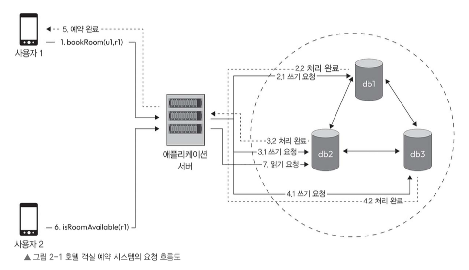

> 클라우드 컴퓨팅 및 인터넷 발전과 더불어, 전 세계 사용자에게 확장 가능하고 신뢰성 있는 서비스를 제공하는 데 분산 시스템의 중요성은 더욱 커지고 있다.     그러나 분산 시스템을 설계하고 운영하는 것은 `일관성`, `가용성`, `파티션 허용성`, `짧은 지연시간` 등 여러 요인 때문에 쉽지 않다.  이 외에도 `확장성`, `내구성` `신뢰성`, `장애 허용 시스템 구축` 등 여러 속성을 갖추는 것은 다수 사용자층을 대상으로 하는 대규모 비즈니스 애플리케이션에서는 필수 요구사항이라고 할 수 있다. 
> 복잡한 대규모 애플리케이션을 구성할 때 해당 요소들을 깊이 이해하고 있어야 각종 요구사항을 지키는 시스템을 구축할 수 있다.
>  > 이 장에서는 이런 속성이 분산 시스템 설계 과정에서 어떻게 작용하는지 살펴본다. 설계 과정에서 요구사항을 준수하려면 각 속성 간에 적절하게 균형을 잘 맞추어 주는 것이 중요하다.
>
>  이 장에서는 다음 내용을 다룬다
>  - 일관성
>  - 가용성
>  - 파티션 허용성
>  - 지연 시간
>  - 내구성
>  - 신뢰성
>  - 장애 허용성
>  - 확장성

# 2.1 호텔 객실 예약 시스템(a.k.a 예약서비스) 으로 살펴보는 분산 시스템 예시

## 예약 서비스의 상위 수준 아키텍쳐 설계도

- 한 사용자(u1)가 호텔 방(r1)을 예약하는 동안(bookRoom(u1, r1)) 다른 사용자는 같은 방(r1)의 예약 가능 여부를 확인(isRoomAvailable(r1))하려고 한다.
- 예약 서비스는 복제 데이터베이스(db1, db2, db3) 세 개와 연동하고 있다.
    - 이때 쓰기 작업의 결과를 다른 레플리카 데이터베이스에도 적용하는 방법은 두 가지이다.
        - 하나는 앱 서버가 모든 레플리카에 직접 쓰기를 수행하는 방식
        - 다른 하나는 데이터베이스 자체에 복제 기능이 있어 앱 서버가 직접 하나씩 쓰기 요청을 하지 않아도 쓰기 작업이 자동으로 모든 레플리카에 적용되는 방식이다.

### 각 쓰기/읽기 요청 처리방식
#### 쓰기 요청 흐름
사용자(u1)가 방(r1)을 예약한다.
- 이때 클라이언트는 RoomAvailable API를 이용하여 앱 서버에 (u1, r1) 예약 요청을 보냅니다.
- 서버는 하나 내지 여러 레플리카(혹은 모두가 될 수도)에 데이터를 기록한다.

#### 읽기 요청 흐름
사용자(u2)가 방(r1)의 예약 가능 여부를 확인한다.
- 사용자(클라이언트)는 RoomAvailable API를 이용하여 앱 서버에 (u2, r1) 예약 가능 여부를 요청한다.
- 서버는 하나 내지 여러 레플리카(혹은 모두가 될 수 도)에 데이터를 조회한다.

#### 데이터 쓰기 옵션
쓰기 작업에서 선택할 수 있는 방식은 다음과 같다.
- **직렬 동기 쓰기**
    - 서버가 먼저 db1에 데이터를 쓰고 처리 완료 응답을 받은 후 db2에 쓰고 응답을 받으며, 마지막으로 db3에 쓰고 응답을 받는다.
    - 이후 최종적으로 클라이언트에 확인응답(예약 완료)을 보낸다.
    - 이 경우 사용자가 객실예약을 완료하기까지 기다려야 하는 지연 시간은 매우 길어질 수 있다.
- **직렬 비동기 쓰기**
    - 서버가 db1에 데이터를 쓰고 확인 응답을 받은 후 즉시 클라이언트에 응답을 보낸다.
    - 이후 다른 레플리카 두 개는 비동기적으로 업데이트 된다.
    - 이 방식에서는 쓰기 동작의 지연 시간이 낮다.
- **메시징 서비스(kafka 등)에 쓰기**
    - 카프카 등 메시징 서비스에 데이터를 기록한 후 클라이언트에 바로 응답을 보낸다.
    - 이후 메시징 서비스에 저장된 데이터를 읽어오는 시스템(소비자)이 데이터를 가져가서 앞서 설명한 방법 중 하나로 각 레플리카에 데이터를 적용한다.
    - 이 방법은 지연 시간이 가장 짧고, 쓰기 요청이 아주 많아도 문제없이 처리할 수 있다.

#### 데이터 읽기 옵션
반대로 읽기 작업에서 선택할 수 있는 방식은 다음과 같다.
- **하나의 레플리카에서만 읽기**
    - 하나의 레플리카 데이터베이스에서만 데이터를 읽어 와 클라이언트에 반환한다.
- **일부 레플리카에서 읽기**
    - 과반수에 해당하는 레플리카에서 데이터를 읽어 와 일관성을 확인한 후 클라이언트에 반환한다.
- **모든 레플리카에서 읽기**
    - 모든 레플리카에서 데이터를 읽은 후 그 결과를 클라이언트에 반환한다.

어떤 방식으로 데이터를 조회하느냐에 따라 장단점이 달라질 수 있다.
- 예를 들어 하나의 레플리카에서만 데이터를 읽는다면, 경우에 따라 오래된 과거 데이터가 반환될 수 있어 `데이터의 정확성 문제`가 발생할 수 있다.
- 반면 모든 레플리카에서 데이터를 읽고 비교하여 최신 값을 찾아내는 방식은 `정확성 문제는 해결할 수 있지만, 속도가 느려질 수 있다.`
- 전체 레플리카 중 몇 개만 골라 데이터를 읽는 방식은 `일관성과 속도 사이에서 보다 균형있는 방식`일 수 있다.

# 2.2 일관성

- 여러 노드에 데이터가 복제, 분산되어 있더라도 모든 노드가 항상 동일한 상태, 데이터를 참조하도록 하는 개념
- 모든 노드가 동일 데이터를 저장하고, 같은 업데이트 요청에 대해 동일 순서로 업데이트 된 데이터를 반환하도록 하는 것.
- 강한 일관성, 최종일관성

## 2.2.1 강한 일관성

- 시스템 내 모든 노드가 공유하고 있는 데이터 업데이트를 동일 순서로 처리하도록 보장하는 특성을 의미한다.
- 쓰기 작업이 수행된 이후의 모든 읽기 작업이 항상 최신 값을 반환하도록 한다.
- 엄격한 동기화, 작업 순서가 유지되며 시스템이 선형적 상태로 보인다

분산 시스템에서는 강한 일관성을 유지하기 위해 여러 노드가 동시에 작업을 처리할 때 서로 데이터의 업데이트 순서를 맞추는 방법을 사용한다.
예를 들어 분산 트랜잭션과 분산락을 사용하거나, 팩소스, 래프트 등 알고리즘을 적용하기도 한다.
이러한 방법을 이용하여 모든 노드가 동일한 순서로 데이터를 업데이트 하고 시스템 전체가 일관된 상태를 유지할 수 있다.

> 합의 알고리즘
> - Paxos
    > 	- 과반수 동의를 얻은 값만이 공식 값이 되는 합의 알고리즘
           > 	- 제안자가 값 제안, 수용자가 과반수 동의 -> 값 결정
> - Raft
    > 	- Paxos를 이해하기 쉽게 만든 리더 기반 합의 알고리즘
           > 	- 리더 선출 -> 리더만 쓰기 처리 -> 팔로워 로그 복제 -> 과반수 저장되면 커밋

### 장점
- 모든 노드가 동일 순서에 따라 데이터를 업데이트 하도록 보장하므로, 개발자 입장에서는 시스템이 예측 가능하고 직관적인 방식으로 동작한다고 예상하며 개발할 수 있다.
- 시스템 상태에 대해 확신을 갖고 작업을 수행하는 순서에 따라 시스템이 어떻게 반응할 지 추측할 수 있다.

### 단점
- 하지만 강한 일관성을 유지하기 위해서는 각 노드가 데이터의 업데이트 순서에 동의할 떄까지 기다려야하기에 처리속도가 느리거나
- 시스템 가용성이 떨어질 수 있다.

### 사용 예시
은행 시스템 같은 민감한 데이터를 다루는 서비스에 사용하기 좋다.
계좌잔액, 거래 내역 등의 민감데이터를 다룰때에 강한 일관성을 사용하면 데이터 불일치를 방지하고, 재정손실 또는 잘못된 회계처리로 이어질 수 있는 상황을 예방할 수 있다.

## 2.2.2 최종 일관성

- 시스템 내에서 일시적이나마 데이터 불일치를 허용하지만, 시간이 지나면 모든 레플리카 데이터베이스나 노드가 결국 동일한 상태에 도달하도록 보장한다.
- 시스템에 각 노드를 비동기적으로 업데이트하지만 최종적으로는 모든 레플리카가 동일한 값을 가지게 된다.

강한 일관성과 달리 최종 일관성에서는 모든 노드가 실시간으로 동일한 순서로 데이터를 업데이트하지 않아도 되는 대신 일정 시간 동안 각 노드가 서로 다른 데이터를 가지고 있을 수 있다.
이런 일시적인 데이터 불일치는 주로 네트워크 지연, 메시지 전달 속도, 레플리카 동기화 같은 문제 때문에 생길 수 있다.

최종 일관성 문제는 충돌해결, 데이터복제, 가십프로토콜 같은 기법을 사용해서 해결할 수 있다.
- 예를 들어 서로 다른 노드에서 동일 데이터에 대해 동시 업데이트를 하는 경우와 같은 충돌이 발생하면, 시스템은 충돌 해결 전략을 적용하여 차이를 조정하고 데이터를 일관된 상태에 도달하도록 한다.
- 데이터 복제 전략은 데이터를 여러 노드에 복사하여 유지하는 방식으로, 하나의 노드에서 업데이트되면 그 변경 사항이 다른 레플리카에도 비동기적으로 전달되도록 한다. 이것으로 시간이 지나면 모든 레플리카가 동일한 데이터를 가질 수 있다
- 마지막으로 가십 프로토콜은 시스템 전체에 업데이트가 서서히 전파될 수 있도록 하는 방식이다.

최종 일관성의 핵심은 데이터 업데이트나 충돌이 없고 충분한 시간이 흐른다는 전제하에 모든 레플리카는 결국 동일한 데이터를 갖게 된다는 것이다.
동일한 상태에 도달하는 데 걸리는 시간은 네트워크의 지연 여부, 업데이트 빈도, 충돌 해결 방식 등 요소에 따라 달라질 수 있다.

### 장점
- 가용성과 확장성을 높이고, 클라이언트에 더 빠른 응답 시간을 줄 수 있다.
- 네트워크 분할이나 일시적인 장애가 발생해도 각 노드가 계속해서 운영되며 요청을 처리할 수 있다.
- 작업 부하를 여러 레플리카에 분산할 수 있어 시스템 성능이 향상된다.
### 단점
-  일시적인 데이터 불일치나 충돌을 처리해야 한다.
- 애플리케이션은 분산 시스템에서 각 노드가 동일한 데이터에 대해 서로 다른 버전이나 값을 가질 수 있는 상황을 처리할 수 있어야 한다.
    - 예를 들어 한 노드에서 데이터가 업데이트되었지만 다른 노드에 그 변경 사항이 아직 전달되지 않았다면 각 노드가 서로 다른 데이터를 보여 줄 수 있다.
    - 이를 해결하기 위해 충돌 해결, 버전 관리, 조정 알고리즘(reconciliation algorithm) 등 기법을 이용하여 최종적으로 모든 노드가 일관된 상태에 도달하도록 해야 한다.
>조정 알고리즘: 서로 다른 노드에 저장된 데이터 차이를 비교하고, 하나의 최종 상태로 맞추는 알고리즘

---
일관성 모델을 선택할 때 강한 일관성을 사용할지, 최종 일관성을 사용할지는 애플리케이션의 구체적인 요구 사항에 따라 다르다.
강한 일관성은 즉각적이고 엄격한 동기화가 필요한 경우에 적합하며, 최종 일관성은 일시적인 데이터 불일치를 감수하는 대신 가용성과 확장성을 높일 수 있다.

> 강한 일관성
> - 소라가 소스주문 먼저하자마자 민지 화면에 품절 뜨는것(상태가 실시간 반영됨)
    > 최종 일관성
> - 소라가 소스 주문 먼저 했어도 모든 기기에 즉시 반영되지 않아, '마지막 소스 하나 남음' 상태가 표시되었을 수 있음
