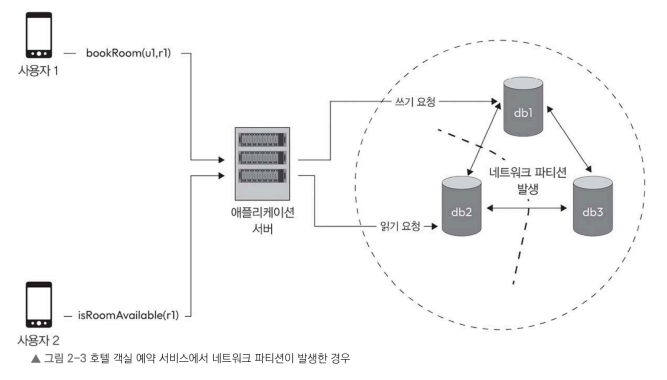

# 2.4 파티션 허용성

---

## 2.4.1 네트워크 파티션

> **분산 시스템에서 네트워크 파티션이란
> 네트워크 장애로 인해 일부 노드가 다른 노드와 통신하지 못하는 상태를 의미한다.**

네트워크 파티션이 발생하면 시스템이 서로 통신할 수 없는 여러 개의 독립된 그룹으로 나뉘게 된다.
각 그룹은 내부적으로는 동작할 수 있지만, 다른 그룹과는 데이터를 주고받을 수 없다.

---

네트워크 파티션은 다양한 원인으로 발생할 수 있다.

* 네트워크 장애
* 하드웨어 고장
* 시스템 버그
* 잘못된 네트워크 설정 변경
* 네트워크 공격

예를 들어, 분산 데이터베이스 환경에서 db2 노드가 고립되었다고 가정해보자.

* 사용자 1이 db1에 쓰기 요청을 보냄
* 해당 데이터는 db3에는 전달되지만 db2에는 전달되지 않음
* 사용자 2가 db2에 읽기 요청을 보내면 최신 데이터가 아닌 이전 데이터가 반환됨

**이처럼 네트워크 파티션은 데이터 불일치 문제를 발생시킨다.**

---

### 네트워크 파티션이 가져오는 문제

네트워크 파티션이 발생하면 다음과 같은 어려움이 생긴다.

* 노드 간 조율 방해
* 데이터 충돌 가능성 증가
* 일관성 저하
* 사용자 요청 처리 실패
* 분산 합의 실패

같은 파티션 내부의 노드는 계속 정상적으로 동작할 수 있지만,
다른 파티션과는 완전히 단절된다.

파티션의 지속 시간도 중요하다.

* 잠깐 발생했다가 복구되는 경우 → 영향이 제한적
* 장시간 지속되는 경우 → 데이터 불일치 및 서비스 장애 발생

**결과적으로 네트워크 파티션은 일관성, 가용성, 장애 허용성 같은 핵심 특성에 직접적인 영향을 미친다.**

---

## 2.4.2 파티션 허용성

> **파티션 허용성이란
> 네트워크 장애가 발생하더라도 시스템이 계속 동작할 수 있는 능력을 의미한다.**

**분산 시스템에서 네트워크 파티션은 피할 수 없는 현실이다.**
따라서 시스템은 파티션 상황에서도 완전히 멈추지 않도록 설계되어야 한다.

---

### 파티션 허용성을 갖춘 시스템의 특징

* 고립된 노드도 독립적으로 동작
* 각 파티션이 자체적으로 요청 처리
* 전체 시스템이 즉시 중단되지 않음
* 성능이 급격히 붕괴되지 않고 점진적으로 저하

파티션 허용성은 특히 다음 환경에서 중요하다.

* 클라우드 컴퓨팅
* 분산 데이터베이스
* 대규모 트래픽 서비스
* 고가용성이 요구되는 시스템

다만, 파티션이 발생하면
**일관성과 가용성 사이에서 선택이 필요할 수 있다.**
이 내용은 CAP 정리에서 더 자세히 다루게 된다.

---

# 2.5 지연 시간

> **지연 시간이란
> 요청이 들어온 시점부터 응답이 반환될 때까지 걸리는 시간이다.**

**분산 시스템에서는 네트워크를 거치기 때문에 지연 시간이 필연적으로 발생한다.**

지연 시간은 사용자 경험에 직접적인 영향을 미친다.

* 지연 시간이 짧으면 빠른 응답 제공
* 지연 시간이 길면 시스템이 느리거나 멈춘 것처럼 인식

---

### 지연 시간에 영향을 주는 요소

지연 시간은 여러 요인의 영향을 받는다.

* 노드 간 물리적 거리
* 네트워크 혼잡도
* 네트워크 홉 수
* 각 노드의 처리 시간
* 전송 데이터의 크기와 복잡성

**네트워크 홉이 많을수록 지연 시간은 증가한다.**

---

### 지연 시간을 줄이는 방법

1. 네트워크 최적화

   * 빠른 연결을 사용하고 홉 수를 줄이며 혼잡도를 최소화한다.

2. 캐싱

   * 자주 사용하는 데이터를 사용자와 가까운 위치에 저장하여 응답 속도를 개선한다.

3. 데이터 지역화

   * 데이터를 사용자와 가까운 곳에 배치하여 물리적 거리를 줄인다.

4. 비동기 통신

   * 메시지 큐나 이벤트 기반 아키텍처를 활용하여 병렬 처리 및 논블로킹 구조를 만든다.

5. 성능 튜닝

   * 데이터베이스 쿼리 최적화, 알고리즘 개선, 코드 실행 방식 개선 등을 수행한다.

**지연 시간을 완전히 제거하는 것은 불가능하다.**
지연을 극단적으로 줄이려다 보면 **일관성이나 장애 허용성에 영향을 줄 수 있다.**
따라서 **요구 사항에 맞는 균형 설계가 중요하다.**

---

# 2.6 내구성

> **내구성이란
> 장애가 발생하더라도 저장된 데이터가 손실되지 않도록 보장하는 능력이다.**

분산 시스템은 여러 노드로 구성되며,
각 노드에는 장애가 발생할 가능성이 존재한다.

**따라서 데이터 손실을 방지하는 설계가 필수적이다.**

---

### 내구성을 확보하는 방법

1. 복제
   - 데이터를 여러 노드에 저장하여 하나의 노드가 장애가 나더라도 다른 노드에서 복구 가능하도록 한다.

2. 백업
   - 재해 상황에 대비하여 별도의 안전한 저장소에 데이터를 보관한다.

내구성은 특히 다음과 같은 환경에서 중요하다.

* 금융이나 의료 관련 데이터를 저장하는 시스템
* 메시징 플랫폼을 사용하는 소셜 미디어처럼 지속적으로 서비스를 운영해야 하는 시스템

**내구성은 분산 시스템의 일관성이나 가용성과 밀접하게 연관되어 있다.**

예를 들어 데이터를 여러 곳에 복제하여 내구성을 높이면
**일관성을 유지하는 데 더 많은 시간이 필요할 수 있다.**

따라서 내구성은
**일관성, 가용성과 함께 균형 있게 설계해야 한다.**

---

# 2.7 신뢰성

> **신뢰성이란
> 다양한 장애가 발생하더라도 시스템이 원래 기능을 꾸준히 제공할 수 있는 능력이다.**

분산 시스템에서는 다음과 같은 문제가 발생할 수 있다.

* 하드웨어 고장
* 네트워크 장애
* 애플리케이션 버그
* 휴먼 에러

**신뢰성이 높은 시스템은 이러한 문제에도 불구하고 서비스를 지속적으로 제공한다.**

---

## 신뢰성을 높이는 방법

* 다중화
* 복제
* 자동 오류 감지
* 로드 밸런싱
* 장애 자동 복구

**신뢰성은 단순히 고장이 적은 것이 아니라,
고장이 나더라도 서비스가 멈추지 않는 구조를 의미한다.**

---

# 2.8 장애 허용성

> **장애 허용성이란
> 일부 구성 요소가 고장 나더라도 시스템이 정상적으로 동작을 지속할 수 있는 능력이다.**

이는 사람이 개입하지 않아도 자동으로 감지하고 복구하도록 설계하는 것을 포함한다.

---

## 장애 허용성을 구현하는 방법

1. 다중화

   * 동일한 역할을 수행하는 구성 요소를 여러 개 둔다.

2. 복제

   * 데이터와 서비스를 여러 위치에 분산시킨다.

3. 장애 감지 및 복구 메커니즘

   * 노드 응답 상태를 지속적으로 모니터링하고
     장애 발생 시 자동으로 대체 노드로 전환한다.

**장애 허용성은 신뢰성과 가용성을 높이는 핵심 설계 요소이다.**

---

**결국 분산 시스템 설계는
일관성, 가용성, 내구성, 신뢰성, 장애 허용성 사이에서
요구 사항에 맞는 균형을 찾는 과정이다.**
