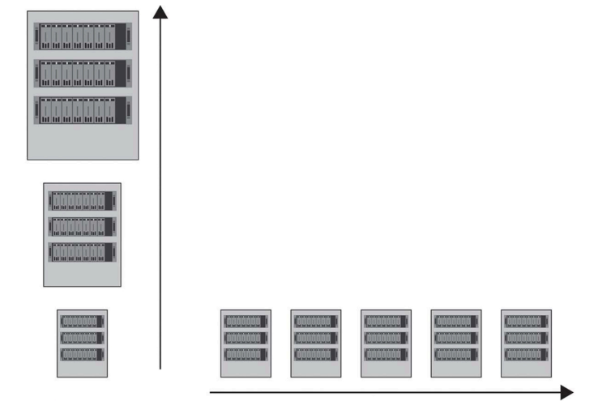

# 2.9 확장성

>  확장성이란? 
> 
> 사용자 수나 데이터양이 증가해도 성능이나 신뢰성을 유지하면서 시스템이 더 많은 작업을 처리할 수 있는 능력
> 
> 새로운 자원을 추가/기존 자원을 최적화하여 더 많은 작업을 효율적이고 효과적으로 처리할 수 있는 시스템을 설계/구현을 포함

## 분산 시스템에서 확장성 두 가지

- 수직 확장성: 기존 서버나 장비의 성능을 높여 처리 능력을 향상시키는 방식
- 예시
  - CPU 추가
  - 메모리 추가
  - 인스턴스 유형 업그레이드

- 수평 확장성: 서버나 장비를 여러 대 추가하여 전체 시스템의 처리 능력을 확장하는 방식
  - 예시
    - 인스턴스 수 증가

## 인스턴스

클라우드 컴퓨팅에서 한 번쯤은 들어 보았지만 한마디로 정의하기가 쉽지 않다.

### 상황에 따라 의미가 조금씩 다른 인스턴스

#### 일반적: ‘하나의 구체적인 예시’나 ‘실제로 만들어진 객체’를 의미

- 예 
  - 프로그래밍: 클래스라는 설계도를 바탕으로 만든 개별 객체를 인스턴스라 한다. 
  - 클라우드 컴퓨팅 환경: 하나의 서버를 독립적이고 가상화된 단위를 인스턴스라 한다.

> 라멘 이야기
> 
> - 각자의 휴대폰으로 매운 소스의 재고 상태를 확인. 
>   - 소스 관리 시스템에서 각자의 휴대폰 화면에 보인 정보 = 독립된 인스턴스
>   - 각 휴대폰 화면은 같은 소스 재고 상태를 보여 주고 있지만 사실은 각자 독립적으로 운영되는 시스템의 일부분. 
>     - 즉, 소라의 화면이 소라만을 위한 하나의 인스턴스, 민지의 화면도 민지만을 위한 또 다른 인스턴스. 
>   - 그래서 소라가 재고를 확인하는 동안 민지도 같은 정보를 볼 수 있지만, 정보는 각각의 인스턴스가 독립 처리
>     > 예를 들어 소라가 소스를 먼저 주문해서 재고가 소진되었다면, 
>     > 소라의 인스턴스는 즉시 ‘품절’ 상태를 반영합니다. 하지만 민지의 인스턴스는 이 정보를 약간 뒤늦게 반영할 수도 있습니다. 
>    
>    - 이처럼 각자의 화면에 독립된 인스턴스가 작동하기 때문에 잠깐 동안 서로 다른 정보가 표시될 수도 있지만 결국은 최종적으로 일치하는 정보를 보여 준다.

- 결론: **분산 시스템에서 인스턴스**는 여러 사용자가 동시에 같은 시스템을 이용하더라도 각자 **독립적으로 접근할 수 있는 개별적인 단위**를 의미한다. 
  - 각 사용자는 재고 상태를 독립적으로 확인할 수 있듯, 인스턴스로 여러 사용자가 시스템 자원을 효율적으로 공유하고 동시에 사용할 수 있다.

### 인스턴스들을 확장성을 이용하여 효율적인 활용 방법.

#### 수직 확장성(vertical scaling)

- CPU 추가: 주방에 더 좋은 조리 도구를 가져다 놓아 한 번에 더 많은 소스를 준비할 수 있도록 하는 것과 비슷
- 메모리 추가: 더 큰 재료 저장 공간을 마련하여 한 번에 더 많은 재료를 준비할 수 있게 하는 방식
- 인스턴스 유형 업그레이드: 주방의 모든 장비를 더 높은 사양으로 업그레이드하여 한 번에 더 많은 주문을 처리

즉, 기존 인스턴스를 더 강력하게 해서 더 많은 작업을 처리할 수 있게 하는 방법

#### 수평 확장성(horizontal scaling)

- 인스턴스 수 증가: 주방을 여러 개 만들어 각 주방이 독립적으로 일 처리를 분담하는 방법, 여러 인스턴스를 추가하여 시스템 처리 능력을 분산시키는 것
  - 한 주방에 문제가 생겨도 다른 주방이 소스를 계속 만들 수 있어 안정성도 높다.

즉, 여러 인스턴스를 만들어 전체 작업을 나누어 처리함으로써 시스템의 성능과 신뢰성을 높이는 방법

# 2.9.1 수직 확장성

> 개별 노드, 인스턴스, 노드 내 자원의 용량을 늘리는 것. 스케일 업이라고도 함.

주로 하드웨어의 구성 요소를 업그레이드하는 방법으로 CPU 성능을 높이거나 메모리를 추가하고 저장 용량을 확장하는 등의 방법이 있다. 

- 단일 노드 성능을 개선하여 작업량이나 요구 사항이 증가하더라도 정상적으로 이를 처리할 수 있도록 하는 데 중점을 둔다.

## 장점

- 단순성: 기존 시스템 아키텍처나 소프트웨어에 최소한의 변경만 필요.
- 소규모 작업에 대한 비용 효율성: 상대적으로 적은 작업량을 처리하는 시스템의 경우 비용 면에서 더 효율적인 방법일 수 있다. 
  - 여러 노드를 관리하고 유지할 필요가 없기 때문.

최소한의 변경으로 최대한의 효율을 추구

## 단점

- 하드웨어의 한계점: 단일 노드의 CPU 성능, 메모리, 저장 용량 업그레이드 한계
  - 업그레이드를 계속하다 보면 비용이 지나치게 높아지는 한계점에 도달.
- 단일 장애점: 시스템이 단일 노드에 의존하기 때문에 해당 노드에 장애가 발생하면 시스템 전체가 먹통이 될 수 있다.

# 2.9.2 수평 확장성

> 분산 시스템에 더 많은 노드나 인스턴스를 추가하여 작업량이나 요구 사항이 많아지더라도 문제없이 처리할 수 있도록 하는 것
> 
> 스케일 아웃이라고도 함.
 
여러 노드에 작업을 분산시켜 병렬 처리와 시스템 용량을 향상시키는 데 중점을 둔다.

## 장점

- 용량 및 성능 증가: 시스템에 더 많은 노드를 추가하여 기존보다 더 많은 요청이나 데이터 처리를 수행할 수 있어 성능과 반응 속도가 향상.
- 장애 허용성: 여러 노드가 있는 경우 시스템은 장애에 더 견고합니다. 한 노드에 문제가 생겨도 다른 노드가 계속 작동하여 시스템 가용성을 유지 가능.

## 단점

- 분산 조정: 여러 노드에 작업을 분산하려면 각 노드가 적절하게 협력하고 동기화할 수 있는 메커니즘이 필요
   > 예: 하나의 노드가 재고 수량을 업데이트할 때 다른 노드도 동시에 이 정보를 공유해야 재고 수량이 일관되게 유지. 
   > (그렇지 않으면 서로 다른 노드끼리 같은 상품의 재고를 동시에 판매하여 재고 수량이 잘못 표시.)

- 데이터 일관성: 데이터가 여러 노드에 걸쳐 분산되므로 데이터 일관성이 유지어려움. 
  - 이를 해결하려면 분산 트랜잭션이나 최종 일관성 같은 기법을 사용하여 여러 노드 간 데이터 일관성을 관리해야 합니다.

# 수직 확장성과  수평 확장성
수직 확장성, 수평 확장성은 반드시 하나만 선택해야 하는 방식이 아니며, 원하는 확장성과 성능 목표를 달성하기 위해 섞어서 사용할 수 있다. 

분산 시스템 내 컴포넌트나 서비스 계층을 효과적으로 확장하려고 함께 사용할 때가 많다. 

- 어떤 방식을 선택할지는 시스템의 구체적인 요구 사항, 작업 부하 패턴, 비용, 여러 노드에 작업을 효과적으로 분산하고 조율할 수 있는지에 따라 달라진다.

# 느슨한 결합 구조로 확장성 높이기

분산 시스템의 아키텍처를 설계할 때 아키텍처를 모듈화하고 느슨하게 결합된 구조로 만들면 확장성을 높일 수 있다. 

- 시스템을 여러 독립적인 기능별 모듈로 나누고 
- 각 모듈 간 연결을 최소화하여 필요할 때 쉽게 추가하거나 제거

할 수 있게 하는 구조. 

> 예시: 데이터베이스, 사용자 인증, 파일 저장 등을 각각 별도의 모듈로 관리
> 
> - 특정 기능에 문제가 생기거나 업그레이드가 필요할 때 전체 시스템을 건드릴 필요 없이 해당 모듈만 수정할 수 있다. 
> - 각 모듈이 꼭 필요한 정보만 주고받는 식으로 느슨하게 연결되므로 한 모듈에 변경이 생겨도 다른 모듈에 미치는 영향이 최소화
> - 이런 구조 덕분에 시스템은 작업 부하의 변화에 따라 자원을 유연하게 조정할 수 있어 안정적이면서도 확장 가능한 시스템을 만들 수 있습니다.

결론적으로 확장성은 분산 시스템에서 매우 중요한 요소다. 

확장성을 갖추면 시스템이 늘어나는 작업 부하를 감당하면서도 효율적이고 안정적으로 서비스를 제공할 수 있다.

좋아요. 앞에서처럼 **내용 수정 없이 맞춤법·띄어쓰기·오탈자만 교정**해서 이어서 정리해 드릴게요.

---

## ✔ 맞춤법 교정본 (이어서)

### 2.10 요약

이 장에서는 분산 시스템 설계의 중요한 요소인 일관성, 가용성, 파티션 허용성, 지연 시간, 내구성, 신뢰성, 장애 허용성, 확장성을 살펴보았다. 

- 일관성: 모든 노드가 동일한 순서로 동일한 데이터를 처리하도록 보장하는 특성
  - 강한 일관성과 최종 일관성 같은 다양한 모델이 존재
- 가용성: 시스템이 장애 상황에서도 계속 서비스를 제공할 수 있는 능력을 의미하며, 이를 위해 복제, 다중화, 장애 복구 기술이 활용.
- 파티션 허용성: 네트워크 장애가 발생하더라도 시스템이 계속 동작할 수 있도록 하는 특성, 시스템의 신뢰성/운영을 위한 분산 시스템 설계에서 반드시 고려해야 할 요소.
- 지연 시간: 요청과 응답 사이의 시간은 네트워크 거리, 데이터 크기, 처리 시간 등 다양한 요인의 영향을 받으며, 이를 적절히 관리해야 전체 시스템 성능 최적화.
- 내구성과 신뢰성: 확보를 위해 데이터 복제, 백업, 장애 허용성 등의 기술 사용. 
  - 장애시에도 데이터 손실 방지 및 시스템의 연속성을 보장.
- 확장성: 증가하는 요청을 처리하면서도 안정성을 유지. 
  - 수직 확장성과 수평 확장성은 각각 장단점이 있으며, 실제 시스템에서는 두 방식을 함께 활용하는 경우가 많다.

성능과 신뢰성을 유지하면서 많은 작업을 처리하려고 수직 확장성(스케일 업)과 수평 확장성(스케일 아웃)의 장단점도 살펴보았습니다.

이런 분산 시스템 설계의 기본 요소를 잘 이해하면 여러분만의 시스템 아키텍처에서 더 합리적으로 결정을 내리고, 문제를 보다 효과적으로 해결할 수 있는 역량을 갖출 수 있을 것이다.

> 다음 장 예고: 분산 시스템을 더 잘 이해하기 위해 중요한 이론과 데이터 구조들.

## 여행 마무리, 야마다 라멘에서 배운 특별한 주문 시스템

라멘 스마트 주문 시스템

### 첫 주문, 소스 추가의 순간(일관성)

주문할 때 각자 스마트폰을 이용해 라멘과 추가 소스를 선택. 소라는 매운 소스를, 민지는 추가 고명을 선택했습니다. 

- 소라가 매운 소스를 추가하자마자 민지 화면에도 소스가 품절되었다는 메시지. 
  - 시스템이 실시간으로 정보를 공유하여 둘이 동시에 같은 소스를 주문하지 않도록 하는 방식
  - 주문하면서 헷갈리거나 혼란스러운 일 없이 진행.

### 어디에서나 끊김 없는 주문(가용성)

언제나 주문받을 준비. 

- 가게가 꽉 찼는데도 바로 주문 가능
- 시스템은 언제나 매끄럽게 작동.

### 네트워크 장애에도 끄떡없는 시스템(파티션 허용성)

네트워크가 불안정에도 주문은 정상적으로 처리. 

- 주방 네트워크가 잠시 끊겼어도 각자 받은 주문은 그대로 들어가 주방에서도 문제없었고, 손님들도 그대로 주문을 이어 갈 수 있었습니다.

### 빠르게 업데이트되는 주문 화면(지연 시간)

주문 화면이 빠르게 업데이트되는 것. 

- 주문이 들어가자마자 화면에 조리 상태가 바로바로 반영
- 소라와 민지는 매번 기다림 없이 즉각적인 반응을 받음, 
- 언제 라멘이 나올지 실시간으로 확인. 
- 주문 대기 화면이 지연 없이 움직이는 것.

### 데이터 손실 걱정 없는 주문 시스템(내구성)

“주문 내역이 갑자기 사라진다면?”

- 시스템이 주문 데이터를 여러 곳에 저장하고 있어 혹시 문제가 생겨도 안전하게 데이터를 복구. 
- 주문 내역이 사라지지 않도록 여러 군데에 복제한 데이터.

### 예상치 못한 상황에도 변함없는 서비스(신뢰성)

주방 쪽에서 정전이 발생하거나 문제를 대비한 비상 전력 시스템과 자동 복구 기능

- 전력 문제가 생겨도 시스템이 곧바로 다시 작동.

### 시스템 장애에도 끄떡없었던 주문 경험(장애 허용성)

“주문 서버가 하나 고장 나면?”

- 주문 서버가 여러 개여서 하나가 고장 나도 다른 서버가 대신 주문 처리
- 주문 시스템이 끊김 없이 운영될 수 있도록 철저히 준비.

### 여행을 마무리하며 얻은 깨달음

주문 시스템도 이렇게 똑똑하고 안정적일 수 있다

- 주문 내역이 실시간으로 반영
- 문제가 생겨도 계속 주문 가능
- 데이터가 안전하게 저장되어 있어 주문을 신뢰. 
- 예상치 못한 상황에서도 변함없이 운영

