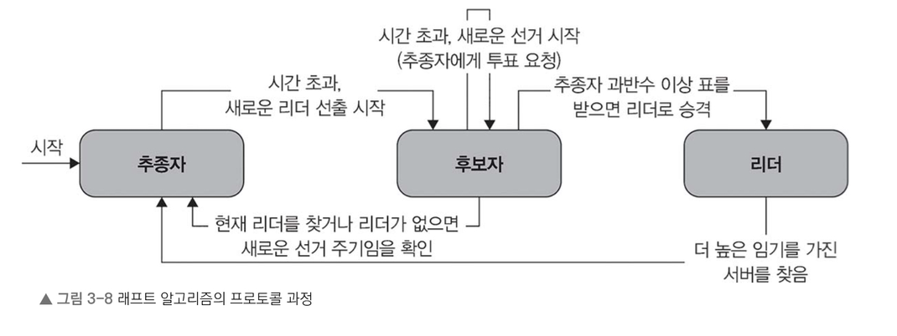

### 팩소스 알고리즘이 발전한 방향과 최적화 기법

팩소스를 기반으로 한 여러 가지 버전(최적화, 알고리즘 단순화)

- **멀티 팩소스(multi-paxos)**
    - 기본 팩소스 프로토콜을 확장하여 값 여러 개에 대해 지속적으로 합의할 수 있도록 한다.
    - 이 과정에서 준비 단계와 수용 단계의 반복을 피할 수 있어 합의 과정에서 발생하는 요청 오버헤드를 줄이고 후속 값에 대한 합의 속도를 높일 수 있다.

- **패스트 팩소스(fast-paxos)**
    - 합의에 필요한 메시지 수를 줄이는 방식의 팩소스
    - 제안자가 일반적인 준비 단계를 건너뛰고 직접 수용자에게 값을 제안할 수 있게 하여 합의에 도달하는 데 걸리는 시간을 단축한다.

- **심플 팩소스(simple-paxos)**
    - 원래의 팩소스 프로토콜을 단순화하는 것을 목표로 한다.
    - 이를 위해 준비 단계와 수용 단계를 하나의 라운드로 통합하여 필요한 메시지 교환 수를 줄이고, 프로토콜을 더 쉽게 이해할 수 있도록 하는 데 중점을 둔다.

---

### 팩소스 알고리즘을 사용한 사례

>팩소스는 분산 시스템에서 장애 허용성 시스템을 구축할 때 사용할 수 있다.

- **분산 데이터베이스**
    - 각 복제 데이터베이스 사이의 일관성과 내구성을 확보하는 데 사용한다.
    - 이것으로 데이터베이스 노드가 성공적으로 수행된 트랜잭션 순서를 정하고, 장애를 효과적으로 처리할 수 있다.

- **분산 파일 시스템**
    - 구글 파일 시스템(GFS)이나 하둡 분산 파일 시스템(HDFS) 등 분산 파일 시스템에서 여러 노드 간 메타데이터의 일관성과 가용성을 유지한다.
    - 장애 상황에서도 모든 복제본이 동일한 명령에 합의하도록 보장하여 파일 시스템의 상태를 일관되게 유지할 수 있도록 한다

- **상태 기계 복제**
    - 팩소스는 상태 기계 복제를 구현하는 데 기초가 된다. 
    - 이 시스템에서는 노드 클러스터가 작업 순서를 합의하여 레플리카 간 일관성을 유지함으로써 분산 키-값 저장소와 합의 기반 알고리즘 같은 시스템에서 장애 허용성과 복제를 가능하게 한다.
  > 상태 기계 복제: 모든 노드가 같은 명령을 같은 순서로 실행하는 것

---

# 3.2.2 래프트 알고리즘

- 2013년 디에고 옹가로(Diego Ongaro)와 존 아우스터하우트(John Ousterhout)가 개발한 합의 알고리즘
- 분산 합의를 간단하고 직관적인 접근 방식으로 만들어 낸 것.
- 이해하기 쉬운 구조, 상대적으로 낮은 구현 난이도로 팩소스 알고리즘의 대안으로 많이 사용한다.

래프트는 분산 시스템에 장애가 발생하더라도 하나의 일관된 상태에 합의할 수 있도록 하는 것이 목표이다. 이를 위해 하나의 합의 문제를 리더 선출, 로그 복제, 안정성이라는 하위 문제 세 개로 나눈다. 이런 하위 문제를 하나씩 해결함으로써 각 노드 간 소통과 통신을 간소화하여 합의에 쉽게 도달할 수 있도록 한. 래프트는 팩소스와 달리 지정된 ‘리더’가 있다는 점에서 차이가 있다

---

# 래프트 알고리즘의 핵심 포인트

래프트 알고리즘의 구성 요소를 알아봅시다.

- **리더(leader)**
    - 래프트는 시스템에 지정된 리더가 있다고 가정한다.
    - 리더는 시스템의 중심 역할을 하는데, 합의 과정을 관리하고 로그 항목을 다른 노드에 복제하도록 지시한다.
    - 리더가 새로운 정보를 만들면 이를 다른 노드에 전달하여 모든 노드가 동일한 정보를 갖도록 하는 일을 한다.

- **추종자(follower)**
    - 리더의 로그를 복제하고 들어오는 요청에 응답하는 수동적인 역할을 하는 노드.
    - 합의 과정에서 리더가 내리는 지침을 따르는 역할을 한다.

- **후보자(candidate)**
    - 리더가 실패하거나 새로운 리더를 선출해야 할 때 노드 상태가 ‘후보’ 상태로 바뀐다.
    - 후보가 된 노드는 시스템 내 다른 노드에 투표를 요청하여 리더 선출을 시작한다.

---

## 래프트 알고리즘의 프로토콜 과정

1. **리더 선출**
    1. 시스템이 시작되거나 리더가 없음을 감지하면 새로운 리더를 선출한다.
    2. 노드는 후보 상태로 전환하고 다른 노드에 요청 투표(RequestVote) 메시지를 보낸다.
    3. 후보가 과반수의 표를 받으면 리더가 된다.

2. **로그 복제**
    1. 리더는 클라이언트 요청을 받아 로그에 추가하고, 해당 로그 항목을 추종자에게 복제하는 역할을 한다.
    2. 추종자는 받은 로그를 자신의 상태 기계(state machine)에 적용하여 시스템 전반의 일관성을 유지한다.

3. **안정성과 일관성**
    1. 래프트는 ‘로그 추가’ 및 ‘투표’ 규칙처럼 특정 규칙을 적용하여 안정성과 일관성을 유지한다.
    2. 이 방식으로 불일치를 방지하고, 가장 최신의 로그 항목만 커밋되도록 한다.

---

## 래프트 알고리즘에서 고려할 사항

- **리더 가용성**
    - 리더 역할을 맡은 노드는 항상 활성화되어 있어야 한다.
    - 그렇지 못하면 합의에 지장이 없도록 신속하게 새로운 리더를 선출해야 한다.

- **확장성**
    - 시스템이 커지고 노드 개수가 늘어나면 통신 오버헤드가 커져 성능 저하로 이어질 수 있다.
    - 따라서 확장성을 안정적으로 유지하려면 적절한 최적화와 시스템 설정 조정이 필요하다.

- **장애 허용성**
    - 래프트 추종자 노드는 리더 노드가 정상적으로 동작하지 않을 때 이를 감지하여 새로운 리더 선출을 시작함으로써 시스템의 장애 허용성을 확보한다.
    - 이 알고리즘은 시스템에 장애가 발생하더라도 지속적으로 운영될 수 있도록 한다.

---

# 래프트 알고리즘을 사용한 사례

- **분산 데이터베이스(아마존 DynamoDB)**
    - 분산 데이터베이스에서 레플리카 간 일관성과 내구성을 유지하기 위해 래프트와 같은 합의 알고리즘을 사용한다.
    - 모든 노드가 커밋된 트랜잭션 순서에 동의하고 장애를 원활하게 처리할 수 있도록 하기 위함
    - 아마존 DynamoDB 역시 분산 시스템에서 데이터 일관성과 가용성을 보장하기 위해 래프트를 활용한다.

- **분산 파일 시스템(구글 파일 시스템)**
    - 분산 파일 시스템은 여러 노드 간에 파일 메타데이터의 일관성과 가용성을 유지하려고 합의 알고리즘을 사용한다.
    - 래프트는 장애가 발생해도 모든 레플리카가 파일 시스템 상태에 대해 동일한 상태를 유지하도록 한다.
    - 구글이 대규모 분산 데이터를 저장하는 데 사용하는 구글 파일 시스템은 래프트 등 합의 알고리즘을 활용하여 장애 허용성, 데이터 일관성, 복제 같은 기능을 수행

- **클러스터 관리 및 서비스 디스커버리(아파치 주키퍼)**
    - 분산 시스템에서는 리더 선출이나 서비스 디스커버리 같은 작업을 위해 노드 간 협력과 합의가 필요
    - 아파치 주키퍼 같은 클러스터 관리 프레임워크는 래프트 알고리즘을 사용하여 시스템을 일관된 방식으로 관리한다.
    - 주키퍼는 리더 선출, 구성 변경, 분산 잠금 등 중요한 시스템 메타데이터에 대한 합의를 거쳐 여러 분산 서비스가 장애를 견디면서 안정적으로 협력할 수 있도록 한다.

- **합의 기반 알고리즘(구글 스패너)**
    - 팩소스나 래프트 같은 합의 기반 알고리즘은 강력한 일관성 보장이 필요한 분산 시스템을 구축하는 데 필수요소
    - 구글 스패너는 전 세계에 분산된 데이터베이스로, 전역에 걸친 복제 데이터베이스 간 일관성과 장애 허용성을 보장하는 데 래프트를 사용한다.
    - 래프트는 작업 순서와 트랜잭션 커밋에 대한 합의를 이끌어 내 스패너의 분산 아키텍처에서 데이터 무결성과 일관성을 보장한다.

- **클라우드 인프라 관리 시스템(넷플릭스 카오스 자동 플랫폼(ChAP))**
    - 넷플릭스의 ChAP 같은 클라우드 인프라 관리 플랫폼에서 자원 할당, 장애 허용, 오토스케일링 등을 작업하려면 분산된 구성 요소들이 협력하고 합의하는 과정이 필요하다.
    - 래프트는 플랫폼의 여러 구성 요소 간 일관된 합의를 이루어 분산 인프라 전체에서 자원 관리 결정을 일관되게 할 수 있도록 한다.

래프트 알고리즘의 이해하기 쉽고 장애에도 견딜 수 있는 견고한 구조 덕분에 분산 데이터베이스, 파일 시스템, 클러스터 관리, 인프라 관리 등 여러 분야에서 분산 합의의 알고리즘으로 선호하고 있다.

다만 래프트 알고리즘은 시스템 내 특정 노드가 예기치 않게 중단되거나 작동을 멈추는 상황에서는 신뢰할 수 있는 합의 프로토콜로 작동하지만, 노드가 잘못 작동하거나 악의적으로 행동하는 등 더욱 복잡한 오류 상황까지는 다루지 못한다. 이 문제는 비잔티움 장군 문제라고 하는 더 복잡한 합의 문제로 이어진다.