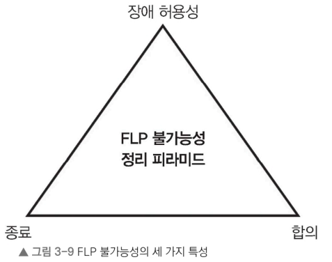

# 3.3 비잔티움 장군 문제

- 분산 시스템에서 **신뢰성과 장애 허용성을 논할 때 등장**하는 개념
- 시스템 내 여러 하위 시스템 중 일부가 오류를 발생시키거나 잘못된 명령을 전달할 때, 나머지 시스템이 어떻게 정상 기능을 유지하며 작동할 수 있는지를 고민하는 일종의 사고 실험
- 시스템의 일부 요소가 신뢰성을 잃거나 오동작 할 때 있는 합의를 이루는 일이 얼마나 까다로운지 알 수 있다.

> 기원후 300년경 로마 비잔티움 제국 장군들이 각자 군대를 이끌고 적의 도시를 포위하여 주변에 진을 치고 있다. 
> 장군들은 서로 직접 대화할 수 없고 오직 전령을 통해서만 명령을 주고받을 수 있다. 
> - 전투 승리 조건: 하나의 통일된 공격 명령에 따라야 한다. 
>   - 즉, 모든 군대가 같은 시각에 동일하게 행동하지 않으면 적의 반격으로 궤멸.
> - 문제: 장군 중 일부가 배신자일 수 있다.
>   - 배신자
>     - 거짓 명령을 퍼뜨려 충성스러운 장군을 혼란에 빠뜨리거나 공격 작전을 방해해서 실패로 몰고 가려고 할 수 있다. 
>       - 배신자가 전령을 조작하거나 허위 정보를 퍼뜨리면 충성스러운 장군 사이에서도 신뢰가 깨질 위험이 커진다. 
> - 배신자의 방해 속 에서도 진실한 정보를 기반으로 모든 군대가 하나의 계획 아래 움직이도록 확실하게 합의에 도달해야 한다.
> 
> 비잔티움 장군 문제는 이처럼 신뢰할 수 없는 환경에서 모든 구성원이 어떻게 일관된 합의를 이끌어 낼 수 있는지 설명하는 사고 실험이다.  

분산 시스템에서 일부 노드가 잘못된 정보를 전달하거나 의도치 않은 데이터를 퍼뜨리는 상황에서도 신뢰성과 장애 허용성을 확보하는 문제로 자주 활용된다.

### 배신자가 거짓 정보를 퍼뜨리는 상황에서도 하나의 통일된 명령을 믿고 따르기 어려운 이유
  - 장군들은 오직 전령을 통해서만 소통할 수 있으며, 전령이 도중에 가로채이거나 전달이 실패할 가능성이 있다. 
  - 일부 장군은 배신자로, 의도적으로 혼란에 빠뜨려 합의를 방해. 
  - 장군들은 서로 누가 배신자인지 구별할 수 없으며, 겉보기에는 모든 장군이 동일.
  - 배신자들은 서로 공모하여 충성스러운 장군들이 합의에 이르는 것을 방해할 수도 있다.
### 비잔티움 장군 문제를 해결을 위한 요구 사항
  - 충성스러운 장군이 과반수를 넘을 경우 합의에 도달할 수 있어야 한다.
  - 전체 장군 수를 N, 배신자 수를 F라고 할 때, 배신자가 있더라도 합의할 수 있어야 합니다(단 F <(N-1)/2).
  - 장군들이 합의를 내리는 데 적당한 시간이 필요하며, 즉각적으로 합의는 할 수 없다.

### 문제 핵심

일부 노드가 고장/오동작 할 수 있는 분산 시스템에서 신뢰할 수 있는 합의에 도달하는 것

비잔티움 장군 문제 = 발생하는 복잡성을 보여 주는 대표적인 예시 = 장애를 견딜 수 있는 분산 시스템과 알고리즘을 개발하는 중요한 초석

### 비잔티움 장군 문제 해결 방식

- 투표 알고리즘: 모든 장군이 도시 공격 계획(실행 계획)에 대해 투표 진행
  - 특정 기준(ex. 3분의 2 이상의 찬성)이 충족되면 해당 계획에 동의하는 셈
  - 배신자가 투표를 이상한 방향으로 몰아가더라도 충성한 장군이 3분의 2 이상이면 장군들이 합의점에 이를 수 있다.
- 반복 서명 방식: 장군들은 계획을 제안하고 서명으로 찬성을 표시. 
  - 장군 3분의 2 이상이 서명 했으면 그 계획을 선택. 
  - 서명하지 않은 장군은 배신자로 간주하며, 여러 라운드를 거쳐 배신자 거름.
- 쿼럼 방식: 쿼럼(집단)은 분산 시스템에서 합의나 의사 결정을 내리는 데 필요한 최소한의 동의 인원을 의미. 
  - 비잔티움 제국의 장군들은 여러 쿼럼으로 나뉘며, 각 쿼럼에는 충성스러운 장군이 과반수 이상 포함되어야 한다. 
  - 각 쿼럼은 독립적으로 계획에 대해 투표를 진행, 
  - 모든 쿼럼에서 과반수 찬성을 얻은 계획이 최종 선택. 
  - 여러 쿼럼이 서로 겹치기 때문에 한 쿼럼에서 선택된 계획이 다른 쿼럼에서도 지지를 받는 구조
  > 예를 들어 각 쿼럼에 충성스러운 장군들이 과반수 이상 포함되어 있다면 
  > 여러 쿼럼의 교차 지점에서 충성스러운 장군들의 지지가 자연스럽게 중첩.
  > 
  > 이렇게 선택된 계획은 전체적으로 충성스러운 장군들의 과반수 지지를 확보하게 되어 배신자들이 방해를 해도 합의를 이룰 수 있다.
- 타임아웃과 확인 절차: 계획을 제안하고 투표를 진행. 
  - 일정 시간이 지나도 투표하지 않은 장군은 의심 대상으로 표시. 
  - 장군에게 투표 내용을 질문 후 투표 내용과 답변이 일치하지 않는 장군은 배제할 수 있다.
- 무작위 선택 방식: 장군들은 임의의 난수를 포함한 계획을 제안. 
  - 배신자들은 이 난수를 사전에 알 수 없으므로 투표 내용에서 난수를 정확히 맞춘 장군은 충신일 가능성이 높다. 배신자들이 계획에 개입하기 어렵게 한다. 

### 비잔티움 장군 문제 해결책의 핵심

- 투표로 배신자 색출, 
- 배신자를 제외한 나머지 인원만으로도 합의할 수 있도록 중복성을 확보. 

결국 장군 간에 합의를 할 수 있는 알고리즘을 설계하는 것. 

특히 배신자의 방해에도 합의 과정이 중단되지 않고 계속 진행될 수 있어야 한다.

# 3.3.1 비잔티움 장애
> 비잔티움 장애란?
> 
> 시스템 내 일부 노드가 예측할 수 없고 신뢰할 수 없는 행동을 보이는 상황

- 비잔티움 장군 문제의 배신자에 비유 가능.
- 비잔티움 장애는 (소프트웨어 버그나 하드웨어 고장, 악의적인 공격 등) 다양한 문제로 발생하여 노드가 예측 불가능한 방식으로 고장 날 수 있다.
  - 모순된 정보를 만들어 내기 때문에 시스템이 문제를 일으키는 노드를 식별하고 격리하기가 어렵고 관리가 어렵다.

# 3.3.2 비잔티움 장애 허용성
비잔티움 장군 문제를 해결하려면 시스템이 비잔티움 장애 허용성을 구현해야 한다. 

> 비잔티움 장애 허용성? 
> 
> 일부 노드가 고장 나거나 악의적으로 행동하더라도 시스템이 올바르게 기능하며 합의에 도달할 수 있는 성질을 의미. 

다시 말해 비잔티움 장애가 발생하더라도 사용자가 시스템을 정상 사용이 가능하다면 해당 시스템은 비잔티움 장애 허용성을 갖추고 있다고 할 수 있다.

- 비잔티움 장애 허용성의 초기 버전
  - 레슬리 램포트, 쇼스탁(Shostak), 피스(Pease) 세 사람이 공동으로 제안. 
  - 각 노드가 자신의 값을 다른 모든 노드에 투표 형식으로 전송하는 방식. 
  - 각 노드는 이를 바탕으로 최종 값을 다수결로 결정. 
  - 문제점
    - 고장 난 노드의 비율이 전체 3분의 1 미만일 때만 작동. 
    - 모든 노드가 서로 통신해야 하므로 계산 및 통신 비용이 많이 소요.

# 3.3.3 최신 비잔티움 장애 허용성
비잔티움 장애 허용성이 실용적 비잔티움 장애 허용 알고리즘(PBFT)으로 개선. 

- 최근 시스템은 모두 실용적 비잔티움 장애 허용성을 기반으로 구축. 
- 기존 비잔티움 장애 허용성의 단점이었던 통신 비용을 줄이고, 대규모 네트워크에서 보다 효율적으로 동작 가능한 합의 메커니즘을 갖추고 있다. 
- (비트코인과 이더리움 같은 블록체인 기술을 포함한)최신 분산 시스템 운영에서 중요한 역할을 차지.

신뢰성, 장애 복원력을 갖춘 분산 시스템 네트워크 설계 및 구현을 위해선 지속적인 비잔티움 장애 허용성 연구와 알고리즘 개발 필수.

비잔티움 장군 문제의 본질적 의미와 비잔티움 장애 허용성을 갖추는 방법을 이해하여 신뢰성 있는 분산 시스템을 구축 필요. 

디지털 화폐, 분산 데이터베이스, 대규모 컴퓨팅 클러스터까지 세상이 이러한 시스템에 점점 더 의존하며 비잔티움 장군 문제의 중요성이 커졌다.

# 3.4 FLP 불가능성 정리

> FLP 불가능성 정리란? 
> 
> 하나의 노드에 문제가 생겼을 때 완전 비동기 환경에서 모든 노드가 동일한 결정을 내리도록 하는 것이 불가능하다는 이론. 
 
- 1985년에 피셔(Michael J. Fischer), 린치(Nancy Lynch), 패터슨(Michael S. Paterson)이 증명
- 분산 시스템에서 문제가 생길 때 모든 참여자가 의견을 맞추는 것이 근본적으로 어렵다는 의미. 
  - ex. 여러 장군이 각기 다른 위치에서 적을 포위하고 있을 때 모두가 동시에 공격을 결정해야 한다(비잔티움 장군 문제). 
    - 이 상황에서 모든 장군이 같은 공격 계획에 동의해야 하지만, 누군가 메시지를 전달받지 못하거나 중간에 문제가 생기면 합의에 도달하기 어렵다. 
    - FLP 불가능성 정리는 이러한 상황에서 완벽한 합의가 불가능함을 의미.

## FLP 불가능성 정리가 성립하는 주요 전제 조건.

- 비동기성: 메시지 지연 시간이나 프로세스 속도에 제한이 없으며, 프로세스는 메시지를 통해 통신하지만 항상 서로 같은 시간 값을 갖지는 않는다.
- 프로세스 장애: 전체 프로세스 수가 n일 때 프로세스가 최대 f(최소 1개의 프로세스가 장애(정지 장애, crash failure))개 고장 날 수 있다(0 < f < n).
- 유한한 단계: 각 프로세스는 정해진 유한한 단계만 수행하며 메시지 크기도 제한.

이 조건이 모두 충족될 때,

“항상 종료하면서(termination) 올바른 합의에 도달하는 알고리즘은 존재하지 않는다”
는 것이 FLP의 결론

완전 비동기 환경에서 단 하나의 프로세스라도 고장 날 수 있다면,
항상 종료를 보장하는 결정적 합의 알고리즘은 존재하지 않는다.

> 왜 하나만으로는 안 될까?
> 
> 예를 들어:
> 
> ✔ 비동기성만 있고 장애가 전혀 없다면?
> → 결국 언젠가는 모든 메시지가 도착하므로 합의가 가능.
> 
> ✔ 장애는 있지만 시스템이 동기적이라면?
> → 타임아웃을 통해 장애를 감지할 수 있으므로 합의 알고리즘을 설계 가능.
> 
> ✔ 비동기 + 장애가 있어도 확률 알고리즘을 쓰면?
> → FLP는 “결정적 알고리즘”에 대한 정리이므로, 무작위(randomized) 알고리즘은 이 한계를 우회할 수 있습니다.
> 
> 즉, 비동기성 + 장애 허용 + 결정적 알고리즘이라는 조합이 문제의 핵심입니다.

FLP 불가능성 정리는 
- 비동기 분산 시스템에서는 장애 허용성, 합의, 종료라는 세 가지 중요한 특성을 동시에 달성하는 것이 불가능하다고 설명. 
  - = 시스템을 설계할 때 아래 세 가지 중 두 가지 특성만을 보장 가능.
    - 

- 이 증명의 핵심은 비동기 시스템에서는 여러 프로세스 중 느리게 응답하는 프로세스와 실제로 고장 난 프로세스를 구별할 방법이 없다. 
  - ex. 메시지 지연이 길어지면 멈춘 것처럼 보일 수 있다(정상임에도 불구하고). 
- 이러한 모호성 때문에 신뢰할 수 있는 합의에 도달하기가 어렵다.

## 시스템 설계 측면에서 FLP 불가능성 정리가 갖는 의미. 

완전히 비동기적인 환경에서는, 장애가 있을 경우 모든 노드가 반드시 합의에 도달한다고 보장할 수 없다. 

## 한계 극복 대표적인 방법

- 메시지 지연 시간에 일정한 상한을 두는 동기적 가정을 도입하는 방법
- 높은 확률로 합의에 도달할 수 있도록 확률적 알고리즘을 사용하는 방법
- 무작위 요소나 시간 동기화 메커니즘을 도입하는 방법
- 리더를 선출하거나 조정자 역할을 두는 방법

## 정리
- FLP 불가능성 정리는 분산 시스템에서 합의가 왜 복잡한 문제인지를 이론적으로 설명해 준다. 
- 또한 분산 알고리즘과 시스템을 설계할 때 무엇을 포기하고 무엇을 선택할 것인지 끊임없이 고민해야 하는 이유를 명확히 보여 준다. 
  - 즉, 특정 조건하에서 분산 시스템이 달성할 수 있는 것과 달성할 수 없는 것의 경계를 제시하는 이론적 기준이라 할 수 있다.

- 결국 완전히 비동기적인 분산 시스템에서는 단 하나의 프로세스만 고장 나더라도 합의를 보장할 수 없다. 
- 이러한 이론적 한계는 시스템 설계 시 반드시 고려해야 할 전제 조건이다.
  - 이를 극복하기 위해 다양한 기법과 절충안이 연구되고 있다.

이제 분산 시스템 설계에 널리 활용되는 몇 가지 기법/데이터 구조를 살펴보겠습니다. 