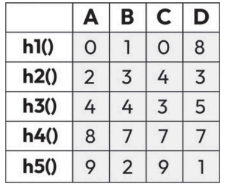
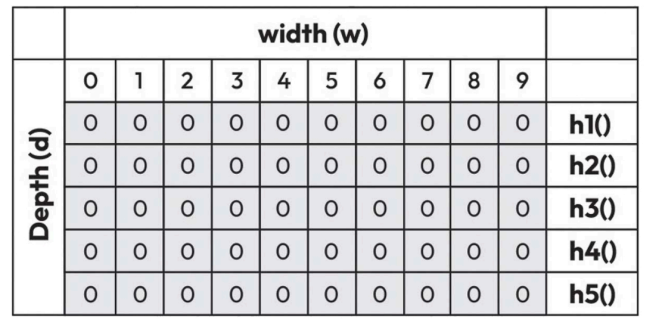
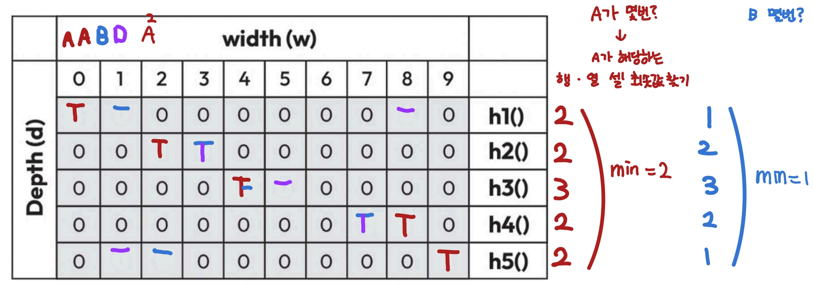

# 3.7 카운트-민 스케치

> 카운트-민 스케치(count-min sketch): 데이터 스트림에서 요소의 빈도를 추정하는 확률적 데이터 구조

- 각 요소의 빈도 분포를 근사적으로 표현하면서도 메모리를 적게 사용
- 메모리가 제한 or 대규모 데이터 스트림을 실시간으로 처리해야 하는 상황에서 효과적
- 이차원 배열 형태의 카운터로 구성
  - 배열의 행과 열 수는 원하는 정확도와 오류율로 결정
- 데이터 스트림에서 요소가 나타나면 해시 함수를 여러 개 실행하여 배열에서 해당 요소의 카운터 위치를 결정하고, 그 위치의 카운터를 증가
- 여러 해시 함수가 충돌을 분산시키고, 각 카운터에 걸쳐 요소 빈도를 추정

## 예시. 알파벳 A, B, C, D 네 개가 시스템으로 순서대로 들어오는 스트림

- 데이터 스트림에 알파벳이 몇 개나 들어왔는지 언제든지 확인할 수 있어야 한다.
- 알파벳이 4개이니까 해시 함수를 다섯 개 만들어서 이차원 배열에 표시
  - 
    - d(해시 함수 개수) = 5, w(배열 길이) = 10

- 또 다른 이차원 배열
  - 
    - 처음에는 이차원 배열의 모든 값을 0으로 채움(=문자 입력 전 초기 상태)
    - 각 문자를 해시 함수에 통과시킨 값을 배열의 인덱스로 참조해서 값을 변경하는 용도로 사용할 예정

- 스트림을 통해 (A, A, B, D, B, A, A, D, B, B, ...) 순서로 문자가 들어온다고 가정
  - A가 데이터 스트림에서 몇 번 나타났는지 세려면 문자 A에 해당하는 행과 열의 셀 값 중 최솟값을 찾아야 한다.
- 

## 정리
- 카운트-민 스케치의 정확도는 사용한 카운터 수와 해시 함수 개수에 따라 다르다.
  - 카운터 수를 늘리면 정확도는 올라가지만 메모리 사용량은 증가
  - 해시 함수를 더 많이 사용하면 충돌 확률은 줄어들어 정확도는 올라가지만, 그만큼 추가적인 계산 비용이 발생

- 사용처(여러 분야에서 폭넓게 사용)
  - 빈도 추정: 특정 요소의 빈도를 추정하여 텍스트에서 특정 단어가 등장한 횟수를 세거나 온라인 쇼핑몰에서 인기 품목을 파악하는 통계 작업에 사용
  - 트래픽 분석: 네트워크 트래픽 분석에서 특정 프로토콜이나 네트워크 주소와 관련된 패킷이나 흐름의 수를 파악하는 데 활용
  - 웹 분석: 웹 사이트 방문 횟수, 클릭 수, 사용자 상호 작용 빈도를 추적하여 웹 트래픽을 효율적으로 분석
  - 분산 시스템: 분산 시스템에서 여러 노드에 걸친 요청 빈도를 추적하고 주요 지표를 모니터링하는 데 사용 
  - 데이터 스트림 처리: 실시간 데이터 스트림에서 메모리에 전체 데이터를 저장할 수 없다면 근삿값으로 빈도 추정

- 유의점: 빈도를 근사적으로 표현하기 때문에 충돌18로 과대 추정이 발생할 수 있다는 점
- 메모리를 적게 쓰면서도 어느 정도 정확도를 유지할 수 있어 정확한 빈도 계산이 필없고 메모리가 부족한 상황에서 유용

--- 
개인 메모
 
- 일관된 해싱: 분산 시스템 / 데이터를 여러 노드에 분배하면서 노드를 추가/삭제 시 데이터 위치를 다른 곳으로 옮겨야 하는 과정이 최소화되도록 하는 방식
  - 확장성과 장애 허용성을 높이는 데 도움
  - 노드 추가/삭제 ➡️ 해시함수 변경(데이터 키 노드 매핑하는) ➡️ 데이터 다시 매핑 및 재분배 ➡️ 리소스 소모
  - 특징
    - 데이터 저장 노드수 고정
    - 콘텐츠 전송 네트워크(CDN)나 분산 데이터베이스처럼 노드의 추가와 제거가 빈번한 대규모 시스템에서 유용
- 모듈로(modulo) 해싱: 노드 개수로 나눔
  - 담당 노드(=관리노드): 저장 및 처리 역할
  - 해시 함수 h(): 서버 ID를 받아 해시 링에서 위치 값을 반환
  - 문제: 서버 하나가 다운되면 시계 방향으로 다음 서버가 고장 난 서버의 과부하
    - 해결방법: 서버마다 별도의 가상 지점을 해시 링의 여러 위치, 추가 해시 함수 사용
- 블룸필터: 특정 요소가 집합에 속해 있는지 빠르게 확인할 수 있는 데이터 구조(존재 여부, '포함될 가능성', 없음은 알 수 있으나 있음은 불확실)
  - 메모리를 적게 사용
  - 해시 함수와 비트 배열을 기반으로 한 구조
    - 고정된 크기의 비트 배열(초기 세팅: 모든 비트 0, 나온 위치의 비트를 1로 설정)
    - 여러 해시 함수
  - 활용 예시: 포함 여부 검사(URL, 맞춤법 검사기), 캐시으 데이터베이스 최적화, 네트워크 라우팅, 중복 제거 
