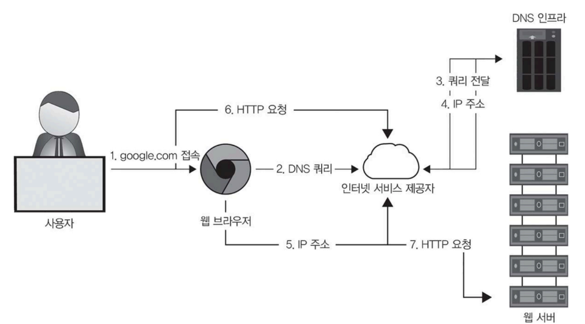
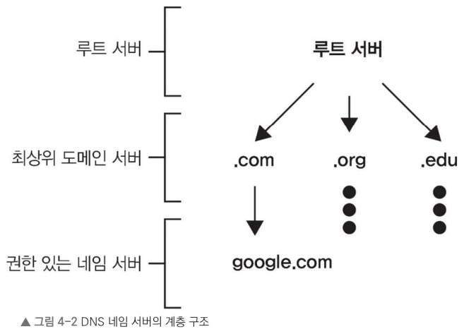

이 장에서는 
- 확장성 좋고, 안정적인 시스템을 구축하는 데 필요한 핵심 요소를 다룬다.
- DNS, 로드 밸런서, 애플리케이션 게이트웨이의 세부 원리를 깊이 이해한다.(앞의 이론 원칙을 적용할 수 있는 구체적인 기반)
- 시스템 아키텍처를 한층 깊게 이해한다.
- 실무에서 바로 활용할 있는 기술도 익힌다.
- 아래의 내용을 배워 복잡한 설계 요구 사항을 어떻게 맞추어야 할지 알 수 있다. 
  - DNS(글로벌 연결성을 확보)
  - 로드 밸런서(서버 성능을 최적화)
  - 애플리케이션 게이트웨이(보안을 강화)

# 4.1 DNS(도메인 네임 서버(Domain Name Server, DNS)) 이해

> DNS: 사람이 이해하기 쉬운 도메인 이름을 기계가 읽을 수 있는 IP 주소로 변환하는 시스템

1. 사용자가 웹 브라우저에 도메인 이름을 입력
2. 웹 브라우저가 해당하는 IP 주소를 DNS 인프라에 쿼리를 보내 얻음(백그라운드에서 진행)
3. IP 주소에 있는 목적지 웹 서버로 사용자 요청을 전달

- DNS는 사용자가 웹 브라우저에 입력한 도메인 이름을 컴퓨터가 웹 사이트와 리소스를 찾는데 사용하는 IP 주소로 변환하는 중요한 역할

- DNS 구성
  - 네임 서버(name servers): 사용자 쿼리에 응답하는 DNS 서버
    - DNS는 하나의 서버가 아니라 수많은 서버가 네트워크를 구성
  - 리소스 레코드(resource records): DNS 데이터베이스에 매핑 정보를 저장하는 리소스 단위
    - 유형
      - A 레코드: 호스트 이름을 IP 주소에 매핑
      - NS 레코드: 도메인의 DNS 요청을 처리할 수 있는 권한 있는 네임 서버를 매핑
        - ex. 특정 도메인(example.com)에 대한 모든 DNS 요청을 처리하는 서버가 어디인지 알려 주는 역할.
      - CNAME 레코드: 하나의 도메인 이름에 별칭을 부여, 별칭 도메인 이름을 실제(정식) 도메인 이름으로 연결
        - ex. 'www.example.com'을 'example.com'으로 연결 ➡️ 두 주소가 같은 서버를 가리킴
      - MX 레코드: 도메인을 메일 서버에 매핑
  - 캐싱: DNS는 여러 단계에서 캐싱을 사용하여 대기 시간 및 인터넷 전체의 쿼리 인프라 부하를 줄임
  - DNS 서버의 계층 구조: DNS의 네임 서버는 계층적으로 구성 ➡️ DNS가 거대한 규모와 쿼리 부하를 감당 가능
    - 전체 DNS 데이터베이스를 효율적으로 관리

- 여러 네임 서버와 리소스 레코드 데이터베이스, 단계적 캐싱, 계층적 구조를 이용하여 도메인 이름을 IP 주소로 변환
  - ex. 사용자가 웹 사이트에 접속할 때 필요한 IP 주소는 웹 브라우저, 운영 체제, 네트워크의 DNS 서버에서 단계적으로 캐싱되어 빠르게 주소를 찾아올 수 있다.
- 이런 구조 덕분에 인터넷에 접속할 때 빠르고 효율적으로 연결 가능

## DNS 네임 서버 계층 유형

각 다른 계층에 위치한 네임 서버는 DNS 인프라에서 중요한 요소다.

- 루트 서버: 로컬 리졸버에서 쿼리를 받아 `.com`, `.edu`, `us` 같은 최상위 도메인의 네임 서버 정보 관리 
  - ex. google.com에 대한 쿼리가 들어오면 루트 서버는 .com 최상위 도메인의 서버 정보 반환.
- 최상위 도메인 서버(TLD): 해당 도메인의 권한 있는 네임 서버 IP 주소 보유 
  - ex. `.com TLD` 서버는 `google.com`의 권한 있는 서버 정보 반환
- 권한 있는 네임 서버: 특정 조직이나 도메인의 최종 DNS 서버, 웹 및 애플리케이션 서버의 IP 주소 정보 제공

> 요약, 
> DNS 쿼리 과정은 리졸버가 시작
> 
> 루트 서버는 최상위 도메인 서버를 가리키고, 
> 
> 최상위 도메인 서버는 최종적으로 도메인 이름을 IP 주소로 변환해 주는 권한 있는 네임 서버를 가리킴. 
> 
> 이런 계층 구조 덕분에 DNS는 전 세계 인터넷에서 확장성을 가질 수 있다.

## DNS 쿼리 동작 단계

1. 리졸버가 사용자 쿼리를 시작.
2. 루트 서버가 최상위 도메인 서버를 가리킨다.
3. 최상위 도메인 서버가 권한 있는 네임 서버를 가리킨다.
4. 권한 있는 네임 서버가 최종 IP 주소를 전달한다. 
5. 이런 계층 구조 덕분에 DNS는 인터넷 규모로 확장될 수 있다.