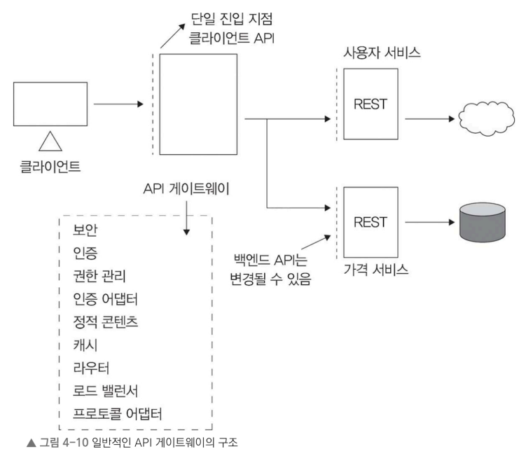

# 4.3.7 로드 밸런서의 배치
- 일반적으로 데이터 센터는 로드 밸런싱을 여러 계층에서 진행
- 각 계층별 로드 밸런서는 고유한 역할을 담당합니다.

- 0단계: DNS 시스템을 이용하여 특정 웹 사이트나 서비스에 대해 여러 IP 주소를 선택적으로 제공해서 트래픽 분산.

- 1단계: 특수 라우터를 사용하여 라운드 로빈 같은 규칙이나 IP 주소를 기준으로 인터넷 트래픽을 분배. 
  - 이 단계의 라우터는 필요에 따라 로드 밸런서를 쉽게 추가할 수 있도록 지원.

- 2단계: 전송 계층(4계층) 로드 밸런서를 사용하여 동일한 사용자 세션이나 연관된 데이터 요청이 한 로드 밸런서로 일관되게 전달. 
  - 이를 위해 일관된 해싱과 네트워크 설정 변경 사항 추적 같은 기술을 활용.

- 3단계: 응용 계층(7계층) 로드 밸런서를 주요 서버와 직접 연결. 
  - 이 단계의 로드 밸런서는 서버 상태를 모니터링하고 정상 작동 중인 서버 간에 트래픽을 분산. 
  - 서버 효율성을 높이는 일부 작업도 수행. 때로는 주요 서버와 연동.

이 계층적 구조는 
- 시스템의 확장성과 가용성을 높이고 
- 각 계층에서 자원을 효율적으로 활용하도록 설계. 
- 하위 계층에서는 기본적인 트래픽 분배를 담당
- 상위 계층으로 갈수록 더 많은 정보를 바탕으로 트래픽을 더욱 세밀하게 분산. 
- 이 방식으로 전체 시스템은 더욱 효율적이고 빠르고 안정적으로 동작할 수 있다.

# 4.3.8 로드 밸런서의 구현
로드 밸런서는 각자 상황이나 애플리케이션의 요구 사항에 따라 여러 방식으로 구현.

## 하드웨어 로드 밸런서(1990년대에 처음 도입된 로드 밸런서 유형) 
  - 장점
    - 독립된 장치로 작동 
    - 많은 동시 사용자를 처리할 만큼 성능이 뛰어남. 
  - 단점
    - 높은 비용
    - 설정이 까다롭고 유지 보수 비용이 높다. 
    - 특정 벤더에 종속되는 문제가 있다. 
    - 가용성을 높이려면 추가 하드웨어가 필요해 장애 대비 비용이 높다.
## 소프트웨어 로드 밸런서

- 유연함 프로그래밍 
  - 다양한 트래픽 분배 방식을 상황에 맞춰 적용 가능. 
    - ex. 특정 조건에 따라 로드 분배 규칙을 설정 or 서버 과부하 같은 상황에 맞추어 코드 작성 가능.

## 클라우드 로드 밸런서, LBaaS(Load Balancer as a Service)

클라우드 제공 업체에서 공급하는 서비스. 

- 사용량이나 서비스 수준 계약(SLA)에 따라 비용을 지불, 
- 로컬 부하 분산뿐만 아닌 클라우드 지역 간 글로벌 트래픽 관리 기능도 수행 가능. 
- 장점 
  - 사용의 용이성
  - 확장성
  - 사용량 기반의 비용 관리
  - 고급 모니터링 기능
---
- 소프트웨어와 클라우드 로드 밸런서
  - 하드웨어 로드 밸런서에 비해 여러 장점이 있어 인기.
    - 비용 효율성이 높고 관리가 용이해 많은 회사가 기존 하드웨어 로드 밸런서보다 더 선호.
- 하드웨어 로드 밸런서
  - 매우 높은 처리량을 보장해야 하는 상황에서는 최고의 성능을 자랑. 
- 하이브리드 방식
  - 시스템이 복잡할수록 여러 종류의 로드 밸런서를 혼합해서 사용
  - 성능, 가용성, 비용 효율성을 모두 최적화하는 데 효과적일 수 있다.
- 로드 밸런서의 이상적인 구현 방식
  - 시스템 아키텍처, 데이터 처리 요구량, 관리 요구, 비용, 자원 가용성 등 여러 요소에 따라 다르다. 
  - 각 유형마다 장단점이 있으므로 서비스의 특성과 목표에 맞는 방식을 선택 하는 것이 가장 중요. 
  
# 4.4 애플리케이션 게이트웨이(=API 게이트웨이)

로드 밸런서가 네트워크의 트래픽을 분배할 수 있기는 하지만, 애플리케이션 게이트웨이는 현대의 클라우드 환경에 맞추어서 더 고도화된 프록시 기능 제공

- 클라이언트와 백엔드 서비스 사이에서 트래픽을 가로채 라우팅, 보안 강화, 성능 가속, 분석, 유연성 등을 지원
- 마이크로서비스(여러 독립적인 서비스를 하나의 통합 API로 묶어야 하는 서비스) 기반 아키텍처에서 큰 장점을 발휘
- 주요 기능
  - 보안, 인증, 권한 관리, 캐싱, 로드 밸런싱 등 다양한 기능을 수행
    - 
  - 단순 로드 밸런서와 달리 특정한 프록시 서비스에 더 중점
  - 고급 요청 라우팅: 호스트 이름, 경로, 헤더, 요청을 보낸 IP 주소 등 다양한 조건에 따라 적합한 백엔드 서비스로 요청을 전달. 
    - 마이크로서비스 환경에서 각 서비스에 맞는 요청을 정확하게 매핑하고 연결하는 데 중요한 역할
  - 보안: 공통 보안 기능을 중앙에서 관리하여 모든 백엔드 애플리케이션과 서비스를 보호. 
    - 인증
    - 접근 제어
    - TLS 종료
    - DDoS(분산 서비스 거부) 방어
    - 웹 애플리케이션 방화벽(WAF)을 통합해 보안을 강화. 
    - 이렇게 함으로써 OWASP(Open Web Application Security Project)에서 정의한 다양한 보안 위협에 대응
  - 가속화와 오프로딩: 성능을 향상시키기 위해 캐싱, 압축, TCP 연결 관리, TLS 오프로딩 같은 기능을 수행. 
    - CPU 부하가 많이 걸리는 작업을 게이트웨이가 시스 템의 '에지'에서 대신 처리하게 함으로써 백엔드 서비스가 작업으로 받는 부담을 덜어줌.
  - 모니터링 기능: 중앙에서 로그, 메트릭, 트레이스를 통합 수집하여 애플리케이션 상태 를 종합 파악 가능. 
    - 전체 트래픽에 대한 통합된 정보를 제공하고 모니터 링과 분석, 문제 해결을 더욱 효과적으로 수행
  - 적응성: 요청과 응답을 조정하여 백엔드 서비스의 변화하는 기능을 유연하게 처리 가능.
    - ex. 레거시 서비스와 연결하려고 프로토콜을 맞추거나 요청 방식을 조절 가능

현대의 서비스 지향 아키텍처에서 로직, 보안, 신뢰성을 관리에 적합. 

넷플릭스 같은 기업들은 마이크로서비스 기반 아키텍처를 도입하고 있으며, 실제 운영 환경에서 마이크로서비스를 수천 개 배포. 

마이크로서비스 관리에서 중요한 역할