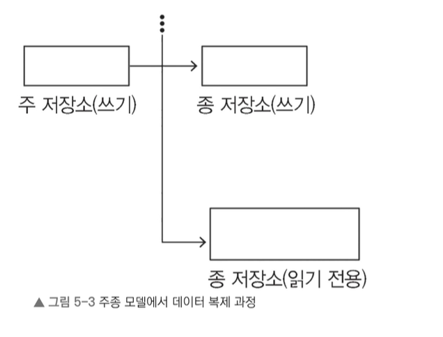
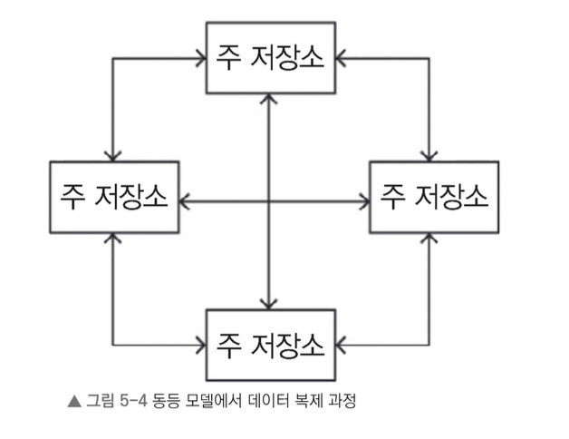

# 5.3.3 가상 노드 사용

노드 간 부하를 보다 고르게 분산하고자 가상 노드를 사용할 수 있다. 단일 해시 함수를 적용하는 대신 동일한 키에 여러 해시 함수를 적용하는 방식이다.

예를 들어 해시 함수가 세 개 있다면 각 노드에 대해 해시 값(h1,h2,h3 -> p1,p2,p3)을 세 개 계산하여 링에 배치한다.(해시 링 위에서의 위치를 정하기 위한 목적) 요청이 들어올 때는 하나의 해시 함수(키위치를 정하기 위한 해시)만 사용하며, 링에서 해시 값이 도달한 위치부터 시계 방향으로 가장 가까운 노드가 요청을 처리한다. 각 서버는 링에서 위치를 세 개 가지므로 요청 부하가 더 고르게 분산된다.

또 특정 노드가 다른 노드보다 더 많은 저장 공간을 갖고 있다면 추가 해시 함수를 사용하여 더 많은 가상 노드를 생성할 수 있다. 이렇게 하면 해당 노드는 링에서 더 많은 위치를 차지하게 되어 더욱 많은 요청을 처리할 수 있다.

> 왜 여러 해시 함수를 쓰는지 궁금했는데, 핵심은 “해시 함수 개수”가 아니라 “가상 노드 개수(링 위의 위치 수)”였다.  
> 노드 하나를 링 위에 여러 위치로 배치해 부하를 고르게 만들려는 목적이고, 그 위치를 만드는 방법이 두 가지로 설명될 수 있다.
>
> 1) 여러 해시 함수를 사용하는 방식(설명 방식)
> - 각 노드에 대해 `h1(nodeId)`, `h2(nodeId)`, `h3(nodeId)`처럼 서로 다른 해시 함수로 여러 좌표를 계산해 링에 배치한다.
> - 결과적으로 노드가 링 위에 여러 위치를 갖게 된다.
>
> 2) 하나의 해시 함수에 서로 다른 입력을 사용하는 방식(구현 방식)
> - 해시 함수는 하나만 두고 `h(nodeId#1)`, `h(nodeId#2)`, `h(nodeId#3)`처럼 입력값에 접미사를 붙여 여러 좌표를 만든다.
> - “함수는 같고 입력만 다르게” 해서 가상 노드 좌표를 여러 개 만드는 방식이다.
>
> 두 방식 모두 목적은 동일하고, 노드를 링 위에 여러 점으로 배치해 부하를 평균화한다는 점이 핵심이다.

## 가상 노드 장점

가상 노드를 사용하면 다음 장점을 얻을 수 있다.

- 노드에 장애가 발생하거나 서비스 점검을 진행하더라도 작업 부하가 다른 노드에 고르게 분산된다. 새로운 노드를 추가하거나 가용하지 않았던 노드가 다시 사용 가능한 상태로 돌아오면 비슷한 수준으로 다른 노드로도 부하가 분산된다.
- 각 노드는 물리적 장비의 성능 차이를 고려하여 담당할 가상 노드 개수를 조정할 수 있다. 예를 들어 어떤 노드가 다른 노드보다 계산 능력이 두 배 정도 크다면 더 많은 작업을 처리할 수 있도록 설정할 수 있다.

키-값 저장소를 확장 가능하게 설계하는 방법을 살펴본 만큼 이제는 시스템 가용성을 높이는 단계로 넘어가 봐야 한다. 이를 위해 복제 전략을 적용하고 장애를 효율적으로 처리하는 방안을 마련해야 한다.

---

# 5.3.4 데이터 복제 전략

스토리지 시스템에서 데이터를 복제하는 방법은 다양하지만 대표적으로 두 가지 방식이 있다. 하나는 주 노드와 보조 노드로 구성된 **주-종(primary-secondary)** 모델이고, 다른 하나는 모든 노드가 대등한 역할을 하는 **동등(peer-to-peer)** 모델이다.

> **주종의 뜻**  
> 여기에서 사용한 ‘주’와 ‘종’은 각각 한자로 主(주인 주)와 從(따를 종)을 뜻한다.  
> ‘주’는 중심이 되는 역할, 즉 데이터를 관리하고 쓰기 요청을 처리하는 **핵심 저장소**를 나타낸다.  
> ‘종’은 ‘주’를 보조하며 데이터를 복제하고 읽기 요청을 처리하는 **보조 저장소**를 의미한다.
> 이를 바탕으로 ‘주-종 모델’은 주 저장소와 종 저장소가 각자 역할을 분담하여 데이터 복제를 수행하는 구조이다.

## 주종 모델

이 모델에서는 하나의 저장소를 주 저장소로 설정하고 나머지는 종 저장소 역할을 하도록 구성한다. 주 저장소는 쓰기 요청을 처리하며, 종 저장소는 주 저장소의 데이터를 복제하고 읽기 요청을 담당한다. 그러나 쓰기 작업 이후에 복제가 되므로 복제 지연이 발생할 수 있다. 또 주 저장소에 장애가 발생하면 시스템의 쓰기 기능이 중단되어 단일 장애점(single point of failure, SPOF) 문제가 생길 수 있다.

주 저장소에서 쓰기 작업이 종 저장소로 복제되는 과정과 읽기 요청이 또 다른 읽기 전용 복제본에서 처리되는 구조를 나타낸다.

## 동등 모델

반면에 동등 모델에서는 모든 저장소가 주 저장소로 설정된다. 각 저장소는 읽기와 쓰기 요청을 모두 처리할 수 있으며, 서로 데이터를 복제하여 최신 상태를 유지한다. 그러나 모든 노드에 데이터를 복제하는 것은 비효율적이고 비용이 많이 든다. 이를 해결하려고 보통 노드를 세 개 내지 다섯 개만 선택해서 데이터를 복제하는 방법을 사용한다. 다음 그림은 모든 노드가 쓰기 데이터를 보존하고, 읽기 요청을 처리하는 동등 데이터 복제 모델을 나타낸다.

책에서는 데이터 복제 방식으로 동등 모델을 사용하길 추천한다. 지연 시간과 가용성 측면에서 유리하기 때문이다. 주종 모델에서는 주 저장소에 장애가 발생하면 단일 장애점 문제가 생길 수 있지만, 동등 모델을 사용하면 이를 완전히 방지할 수 있다. 동등 모델은 여러 호스트(host)에 데이터를 분산하여 저장함으로써 내구성과 높은 가용성을 확보하는 데 효과적이다. 각 데이터 항목은 호스트 n개에 분산 저장되며, 여기에서 n은 키-값 저장소의 각 인스턴스에서 설정할 수 있는 값이다. 예를 들어 n을 5로 설정하면 데이터는 노드 다섯 개에 걸쳐 저장된다.

각 노드는 자신의 데이터를 다른 노드에 복제한다. 읽기나 쓰기 작업을 처리하는 노드를 코디네이터(coordinator)라고 하며, 특정 키를 직접적으로 책임진다. 예를 들어 코디네이터 노드가 키 K를 할당받았다면, 이 노드는 해당 키를 시계 방향으로 후속 노드 n-1개에 복제하는 역할도 수행한다. 이런 후속 노드들의 목록을 우선 목록(preference list)이라고 한다. 또 복제본이 동일한 물리적 노드에 저장되지 않도록 우선 목록을 구성할 때, 이미 포함된 물리적 노드에 속한 가상 노드는 제외할 수 있다. 이제 키-값 저장소에서 get 및 put 함수를 구현할 때 고려해야 할 몇 가지 세부 사항을 살펴보겠다.