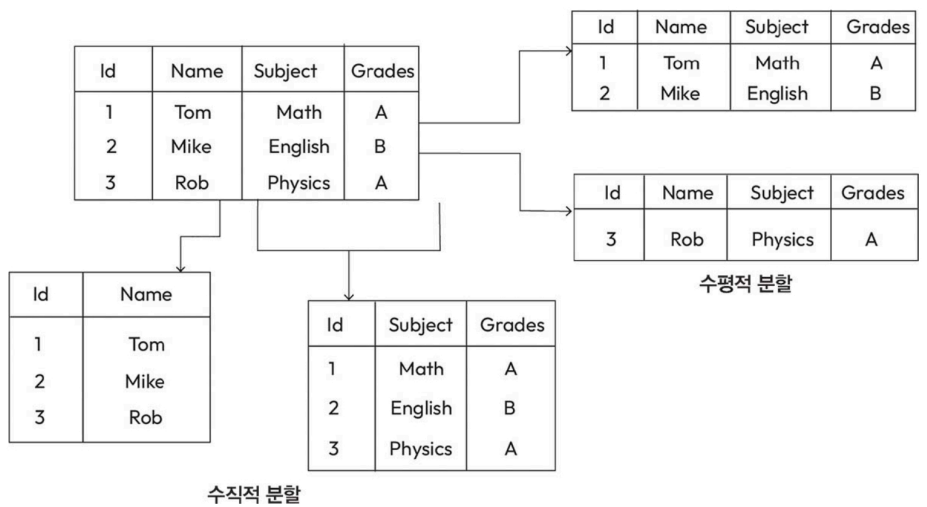
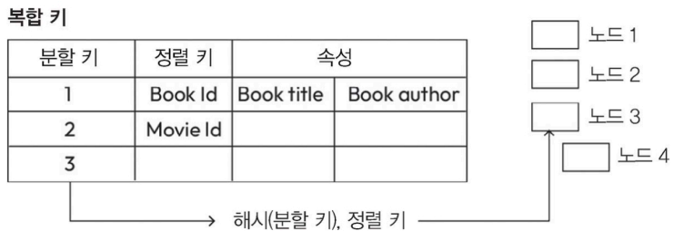

# DynamoDB API 함수

DynamoDB에서 사용할 수 있는 주요 함수

- PutItem: 입력된 키를 기준으로 데이터를 추가하거나 동일한 키가 있으면 기존 데이터를 덮어쓴다.
- UpdateItem: 기존 데이터를 수정하거나 해당 키의 데이터가 없으면 새로 만든다.
- DeleteItem: 지정된 기본 키에 해당하는 데이터를 삭제.
- GetItem: 기본 키를 사용하여 데이터를 조회하고 해당 속성을 가져온다.

# DynamoDB의 데이터 분할

DynamoDB는 데이터를 여러 저장 서버에 걸쳐 수평적으로 나누어서 저장한다.

데이터를 나누는 방법에는 수직적 분할과 수평적 분할이 있다. 

수직적 분할은 미리 스키마를 정의해야 하지만, DynamoDB는 스키마 없이 동작하며 방대한 양의 행(row)을 처리해야 하기에 수평적 분할이 더 적합

각 테이블은 작은 데이터 단위로 쪼개지고, 이 데이터는 SSD 스토리지에 저장해서 빠르게 처리

- DynamoDB에서 수직적 분할과 수평적 분할
      

## 기본 키 유형
- DynamoDB에서 항목을 조회하거나 업데이트하려면 데이터를 나누어 저장한 특정 영역에서 항목을 찾을 수 있어야 한다. 
  - 이 경우 두 가지 키 체계를 사용. 
    1. 분할 키: 단일 속성을 이용하여 항목을 고유하게 식별
    2. 분할 키에 정렬 키를 결합한 복합 키: 두 속성을 결합하여 항목을 고유하게 식별
      - 동일한 분할 키를 가진 여러 항목을 정렬 키를 기준으로 구분 가능

### DynamoDB에서 분할 키, 정렬 키, 복합 키 사용 예시

분할 키에 해시를 적용 후 정렬 키와 데이터가 저장될 서버 위치 결정

## 보조 인덱스

DynamoDB는 기본 키 외에도 다른 쿼리 키를 사용할 수 있어 쿼리를 더 유연하게 실행할 수 있다.

# DynamoDB에서 처리율 최적화

- 여러 데이터베이스 중 DynamoDB에서는 특히 처리율 최적화가 매우 중요
  - 처리율: 시스템이 읽기나 쓰기 요청을 처리할 수 있는 능력
  - 테이블을 효율적으로 분할하고 처리 속도를 체계적으로 관리 시, 성능 향상 및 다운타임을 최소화

DynamoDB의 읽기 및 쓰기 처리 용량 단위와 버스팅과 적응형 용량 관리가 처리율을 높이는 데 어떻게 기여하는지 알아보자

# 처리율 할당

DynamoDB에서는 테이블에 사용할 읽기 처리 용량(RCUS)과 쓰기 처리 용량(WCUs)의 상한선을 설정할 수 있다.

초기 분할에서는 모든 파티션에 처리 용량을 균등하게 나누고 각 파티션의 데이터를 비슷한 빈도로 접근한다고 가정 (ex. 파티션이 세 개 있다면 처리 용량을 각각 1/3씩 나누는 방식)

- 실제로는 특정 파티션에 요청이 집중되거나 반대로 거의 요청이 없는 파티션이 생길 수 있다.
  - 이 경우 처리 용량이 비효율적으로 소모되거나 낭비될 수 있다.
- 읽기 처리 용량 단위와 쓰기 처리 용량 단위 =  요청 처리 능력 측정 지표
  - 처리율 최적화를 논의할 때 매우 중요한 요소
  - 2만 RCUs와 5000WCUs의 처리 용량: 시스템이 항목을 초당 최대 2만 개 읽고 5000개를 쓸 수 있다는 의미(항목 크기가 일정하다는 조건하에)
- DynamoDB에서는 데이터 저장 용량이 늘어나거나 읽기/쓰기 작업이 증가하면 파티션을 추가하거나 제거해야 할 때가 있다. 
  - 파티션 수가 변경되면 기존 파티션 간의 처리량을 다시 분배해야 한다.
    - ex. 초기 테이블에 파티션이 열 개 있고 각 파티션에 2000RCUs와 500WCUs가 할당
      - 파티션을 열 개 더 추가하면 처리량은 모든 파티션에 균등하게 나뉘고, 각 파티션의 처리량은 절반으로 준다.

## DynamoDB 테이블에서 읽기와 쓰기 요청이 균등하지 않을 때 해결 방법

### 버스팅: 단기 오퍼 프로비저닝
버스팅: 특정 키에 요청이 몰리면서 파티션 간 요청 분포가 고르지 않을 때 순간적인 트래픽 증가를 처리하고자 다른 파티션에서 남아 있는 여유 처리 용량을 잠시 활용하는 전략

- 버스팅을 허용할 때는 한 파티션의 추가 처리 용량이 인접한 파티션 작업에 영향을 주지 않도록 작업량을 분리하는 것이 중요
  - ➡️ 특정 파티션에서 단기적인 처리량 증가가 전체 시스템 성능에 악 영향을 미치는 것을 방지
  - DynamoDB에서 버스팅을 지원했을 때 얻는 장점
    - 더 많은 요청을 효과적으로 처리할 수 있음
    - DynamoDB에서 버스팅 지원 여부에 따른 초당 읽기 처리량 비교
      - 

### 토큰 버킷 시스템

토큰 버킷 시스템은 노드에서 데이터 처리 속도를 조절하고 일시적으로 처리량을 높이는 데 사용

- 버킷을 두 개 활용
  1. 기본 처리량 버킷:  기본적으로 처리할 수 있는 데이터양 관리
  2. 버스트 처리량 버킷: 추가적으로 데이터를 처리할 수 있는 여유분 관리
     - 기본 처리량 버킷이 비어 있을 경우 시스템은 버스트 처리량 버킷에 남아 있는 토큰을 확인
     - 버스트 처리량 버킷에 토큰이 남아 있다면 처리 속도를 일시적으로 높여 더 많은 데이터 처리

- 버스팅은 단기적인 작업량 변동을 처리하는 데 효과적이지만, 처리량을 장기적으로 관리하려면 DynamoDB의 적응형 용량 관리 기능을 활용

### 적응형 용량 관리(adaptive capacity): 장기적 관점의 방향

- 장기적인 사용 패턴에 따라 처리량을 변경하는 방식(버스팅이 단기적으로 급증하는 요청에 대응하는 방식)

- 특정 파티션의 사용량은 계속 낮은데 다른 파티션은 과부하 상태라면 DynamoDB는 이런 상황에 맞게 처리량을 점차적으로 재분배

### 적응형 용량 관리가 동작하는 방식

- DynamoDB는 내부적으로 알고리즘을 활용하여 시간에 따라 데이터를 읽거나 쓰는 패턴을 분석
- 자주 접근하는 핫 파티션(hot partitions)과 덜 접근하는 콜드 파티션(cold partitions)을 찾음
  - 이후 시스템 내에서 읽기 처리 단위와 쓰기 처리 단위를 효율적으로 나누어 읽기와 쓰기 작업을 더 균형 있게 처리
    - 과도한 작업이 몰리는 파티션에서 처리량 제한(throttling)이 발생할 가능성이 준다.
- 그러나 적응형 용량 관리가 이런 역할을 잘 수행하더라도 즉각적인 효과는 기대하기 어렵다.
  - 접근 패턴을 학습하고 자원을 재분배하기까지는 일정 시간이 필요
  - 한 번에 하나의 파티션에서 처리량을 크게 늘리는 데는 한계

- 런 한계를 극복하는 것이 글로벌 접근 제어(global admission control)

### 글로벌 접근 제어(global admission control): 파티션 간 관리

모든 파티션의 처리량을 효율적으로 관리하는 기법

-  테이블 전체를 고려하는 더 포괄적인 방식으로 자원을 관리(적응형 용량 관리는 개별 파티션에 초점을 맞춤)
  - ex. 초당 작업 횟수에 글로벌 제한을 설정하고 이를 각 파티션의 부하에 따라 분배하는 방식. 
- 특정 파티션에 작업이 과도하게 몰리는 상황을 방지하고 처리량이 더 균형 있게 분산되도록 함.

### 사용량에 맞춘 분할(splitting for consumption): 선제적 파티션 관리

작업 부하가 크게 변함을 대비해 파티션을 미리 나누거나 합치는 방식

- 파티션을 나눌 때는 데이터 분포와 접근 패턴을 기반으로 키 범위 파티셔닝(key range partitioning)이나 해시 파티셔닝(hash partitioning)을 적용할 수 있다. 
  - 이렇게 데이터를 재분배하면 각 파티션의 작업 부하가 고르게 분산되어 처리량 효율을 극대화할 수 있다.

# 결론

DynamoDB의 파티션 구조에서 처리량을 최적화하려면 여러 전략을 상황에 맞게 단계적으로 활용하는 것이 중요

전략은 고유한 장점과 한계를 지니고 있으므로 이를 제대로 이해하고 적절히 적용하면 데이터베이스의 성능, 안정성, 효율성을 크게 향상시킬 수 있다.

---
- get 및 put 연산을 통합
  - 코디네이터: get(읽기) 및 put(쓰기) 연산을 담당하는 노드
  - 클라이언트가 노드 선택하는 방식
    - 요청을 일반 로드 밸런서로 라우팅하는 방식
      - 장점: 클라이언트가 코드에 종속되지 않음
    - 분할 인식 클라이언트 라이브러리를 사용하여 요청을 해당 코디네이터 노드로 직접 전달하는 방식
      - 장점: 클라이언트가 특정 서버에 직접 접근할 수 있어 홉 수가 줄어들어 지연 시간을 낮출 수 있다.
    - 유연성을 높이려면 가용성, 일관성, 비용 효율성, 성능 간 균형을 조정할 수 있어야
      - 우선 목록 상위 n, 시계 방향으로 데이터 저장
-  r과 w 사용
  - r은 읽기 작업이 성공하는 데 필요한 최소 노드 개수
  - w는 쓰기 작업이 성공하는 데 필요한 최소 노드 개수
  - r과 w의 값을 설정할 때
    - 읽기와 쓰기 작업이 최소 하나의 노드에서 공통으로 교차되도록 해야 함. 
      - 이로 읽기 작업이 항상 최신 쓰기 데이터를 접근할 수 있게 보장할 수 있다. 
        - 이를 위해서는 r+w > n이라는 조건을 만족해야