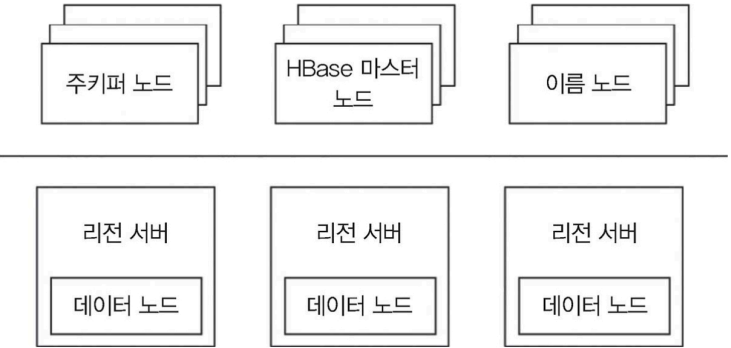
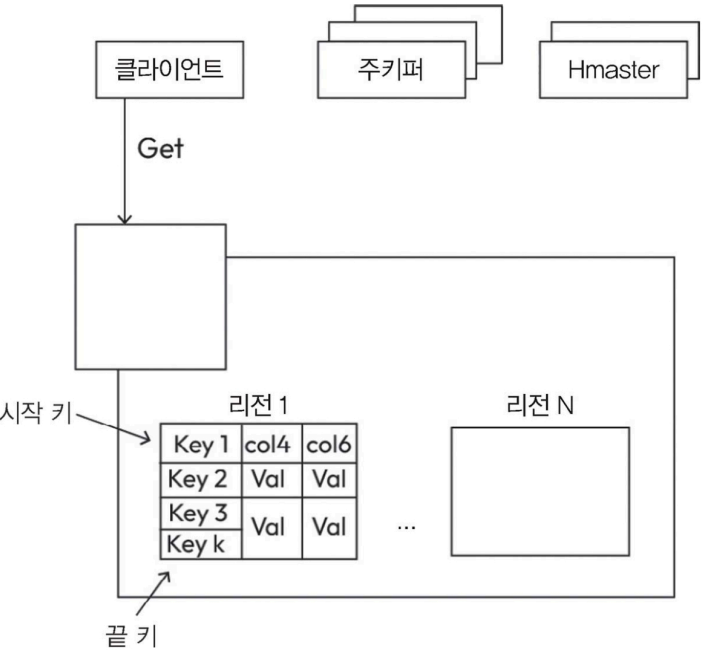
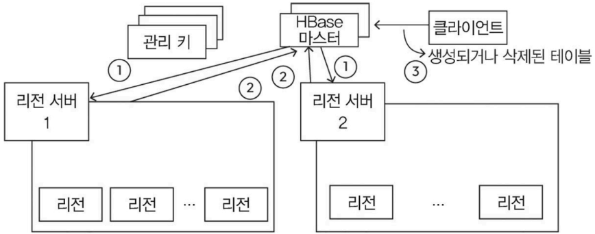
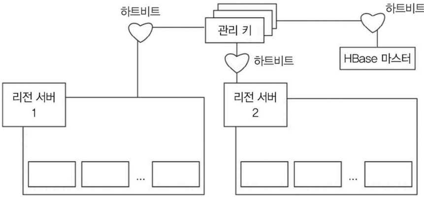
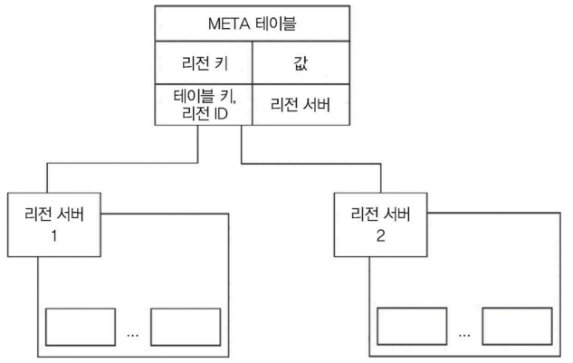

# 5.9 HBase

- 아파치의 HBase: 오픈 소스 기반의 분산형 확장 가능한 비관계형 데이터베이스 관리 시스템
  - 대량의 데이터를 높은 읽기 및 쓰기 속도로 처리할 수 있도록 설계
  - HDFS(Hadoop Distributed File System)(하둡 분산 파일 시스템)를 기반으로 만듦
  - 구글의 빅테이블(Bigtable)에서 영감을 받아 개발
  - 대규모 데이터를 실시간으로 랜덤 액세스할 수 있는 기능으로 널리 알려짐
  - 빅데이터 처리나 분산 컴퓨팅 환경처럼 대량의 데이터를 다루어야 하는 애플리케이션에 적합
## 구성
- 테이블: 여러 행으로 구성
- 행: 여러 컬럼 패밀리를 포함
- 컬럼 패밀리: 여러 컬럼으로 구성
- 컬럼: 키 값 쌍의 모음

## 특징

- 분산 처리 및 확장성: 
  - 범용 하드웨어로 구성된 클러스터에서 동작하도록 설계
  - 수평적 확장이 가능 
    - 클러스터에 노드를 추가함으로써 대규모 데이터를 효율적으로 저장하고 처리가능
- 컬럼 패밀리 데이터 모델: 
  - 카산드라와 마찬가지로 컬럼 패밀리 데이터 모델 사용
    - 데이터는 컬럼 패밀리로 구성
      - 각 컬럼 패밀리는 필요한 만큼 컬럼을 자유롭게 추가 가능
- 일관성 모델: 
  - 강한 일관성 보장 모델 사용
  - 엄격한 데이터 일관성이 필요한 애플리케이션에 적합
  - WAL을 활용하여 데이터의 내구성과 일관성을 보장
    > Write-Ahead Logging (WAL): 데이터를 바로 저장하지 않고, 먼저 ‘로그’에 기록해두는 방식
- 데이터 버전 관리: 
  - 데이터 버전 관리를 지원 
  - 이전 버전의 데이터를 조회하거나 쿼리 가능
    - 이는 과거 데이터 분석에 유용
- 확장성과 부하 분산: 
  - 데이터 자동 분산, 노드 간 부하를 균형 있게 조정 
    - ➡️ 자원을 효율적으로 활용할 수 있도록 설계
- 높은 읽기 및 쓰기 처리량: 
  - 빠른 읽기와 쓰기 작업 처리
    - ➡️ 실시간 데이터 처리와 분석에 적합
- 하둡을 이용한 통합 기능:
  - 하둡 생태계와 연동 가능 
  - 하둡 MapReduce, 아파치 스파크(Spark), 아파치 하이브(Hive) 등 여러 데이터 처리 도구와 결합하여 데이터 처리와 분석 작업을 효과적으로 수행
- 블룸 필터와 블록 캐시: 
  - 블룸 필터와 블록 캐시(BlockCaches) 같은 데이터 구조를 활용
    - ➡️ 데이터 검색 속도 최적화 및 쿼리 성능 향상
- 데이터 압축: 
  - 데이터를 압축하고 저장 공간을 절약하여 시스템 성능 향상
- 사용 사례: 
  - 대규모 데이터셋에서 무작위로 데이터에 접근이 필요한 애플리케이션에서 주로 활용
    - ex. 시간 관련 데이터, 센서 데이터, 로그 데이터 뿐 아니라 광고 타기팅이나 추천 엔진 등 인터넷 서비스 관련 애플리케이션에도 적합
- 활발한 커뮤니티와 생태계: 
  - 아파치 프로젝트로서 활발한 오픈 소스 커뮤니티와 함께 다양한 도구, 라이브러리, 시스템 간 연결을 지원하는 인터페이스를 포함한 풍부한 생태계로 개발

- 대규모 데이터를 실시간으로 저장하고 조회해야 하는 애플리케이션에 특히 적합
- 복잡한 데이터 모델을 다루거나 높은 확장성이 필요할 때도 강점을 발휘
- 하둡 등 빅데이터 기술과 연계하여 빅데이터와 분석이 필요한 애플리케이션에서 효과적인 선택지로 자리 잡음

## 5.9.1 HBase 자세히 살펴보기

### HBase 아키텍처의 다양한 구성 요소 

리전 서버가 데이터 노드(DataNode)와 함께 배치되며 이름 노드(NameNode), 주키퍼, HBase 마스터 노드를 포함

HBase는 리전 서버(RegionServer), HBase 마스터(Master), 주키퍼(ZooKeeper)라는 세 가지 주요 서버로 구성

- 리전 서버: 읽기와 쓰기 작업에서 데이터를 처리하는 핵심 서버
  - 데이터 요청은 HBase 리전 서버와 직접 연결되어 처리
  - 리전 서버가 관리하는 데이터는 하둡 데이터 노드(DataNode)에 저장
    - 성능 최적화를 위해 HDFS(Hadoop Distributed File System)의 데이터 노드와 동일한 물리 노드에 배치되는 경우가 많으며, 이를 통해 데이터와 서버 간 물리적 거리를 최소화함으로써 작업 속도를 높임
  - HBase의 테이블은 Row Key 범위 기준으로 Region 단위로 분할
    > 리전: 시작 키에서 끝 키까지 범위
    > - 해당 범위 안의 모든 행을 포함
    > - Region은 하나의 RegionServer에 의해 관리
    >   - 리전 서버라는 클러스터 노드에 할당되어 읽기와 쓰기 작업을 효율적으로 처리
    >   - 리전 서버는 리전을 약 1000개 관리할 수 있으며, 리전의 기본 크기는 1GB로 설정(필요에 따라 조정 가능)
    > - 리전 서버 내부 구조 - 여러 리전을 담당
    >   - !
    >   
  - 이런 구조는 대규모 데이터를 효과적으로 분산 저장, 병렬 처리를 가능하게 함
- HBase 마스터: HBase 클러스터의 전체적인 관리 역할을 담당
  - 리전 할당과 데이터 정의 언어(DDL) 작업(테이블 생성, 수정, 삭제(CREATE, ALTER, TRUNCATE, DROP) 등)을 총괄
  - 이름 노드는 파일을 구성하는 모든 물리적 데이터 블록의 메타데이터 정보를 유지하고 관리
    > NameNode: Hadoop Distributed File System(HDFS)의 마스터 노드, 하둡(HDFS)의 구성 요소
    > - 메타데이터를 관리하는 중앙 서버
    > - 하둡의 파일 저장 방식: 파일을 여러 블록으로 쪼갬 ➡️ 각 블록을 여러 서버(DataNode)에 분산 저장, 이때 NameNode가 파일이 어디에 어떻게 저장되어 있는지 기억하는 역할을 한다.
    > - HBase Master 역할
    >    - Region 할당/이동
    >    - 테이블 생성/수정/삭제 (DDL)
    >    - 클러스터 관리
    >    - “데이터를 어떻게 나눌지” 담당
    > - NameNode 역할
    >   - 파일 → 블록 → DataNode 위치 관리
    >   - 메타데이터 유지
    >   - “데이터가 어디 있는지” 담당
    > - HBase 동작 흐름:
    >   - HBase가 데이터 저장
    >   - 실제 파일은 HDFS에 저장됨
    >   - 그 위치 정보는 NameNode가 관리
    > - 얘는 왜 갑자기 나왔을까...
  - 역할
    - 
      - 리전 서버를 관리하고 조율하는 작업
      - 시작할 때 리전을 할당하거나 복구 및 부하 분산 상황에서 리전을 다시 배치하는 작업
      - 클러스터 내 모든 리전 서버를 모니터링하며, 주키퍼에서 상태 변경 알림을 수신
      - 테이블 생성, 삭제, 업데이트 등 주요 테이블 작업을 처리하는 인터페이스 제공
- 주키퍼: 클러스터의 실시간 상태를 관리하는 분산형 조율 서비스
  - HBase에서 클러스터 내 서버들의 최신 상태를 유지하는 데 사용
  - 여러 서버가 “같은 상태를 보도록 맞춰주는 시스템"
  - 서버의 가용성을 추적하며 서버 장애가 발생하면 이를 알리는 역할
  - 서버(ZooKeeper 서버들(= ZooKeeper Ensemble)) 간 상태를 합의 메커니즘으로 공유
    - 일반적으로 서버 세대에서 다섯 대가 합의 과정에 참여
  - 

### META 테이블과 META. 서버

- HBase의 META 테이블
  - 클러스터 내 리전의 위치 정보를 저장
    - 
  - HBase 테이블처럼 작동하며, 시스템 내 모든 리전의 전체 목록을 관리
  - HBase 카탈로그 테이블(HBase Catalog Table)이라고도 함
  - 주키퍼가 관리하는 META. 서버가 이 테이블을 관리
  - 구조
    - 키(Keys): 리전의 시작 키와 고유한 리전 ID로 구성
    - 값(Values): 해당 리전이 속한 리전 서버를 나타냄

- HBase에서 META 테이블과 .META. 테이블?
  - 같은 테이블을 지칭
  - 시스템 내부적으로는 '.META. 테이블'이라는 명칭이 정확
  - 설명이나 대화에서는 간단히 'META 테이블'이라고도 함 
  - 점(.)이 붙어 있든 없든 테이블은 HBase에서 각 리전의 위치 정보를 관리하는 중요한 역할을 함
  - 쉽게 말해, 'META 테이블'은 약간의 편의를 위해 점을 생략한 표현이고, '.META. 테이블'은 공식적인 이름이다.