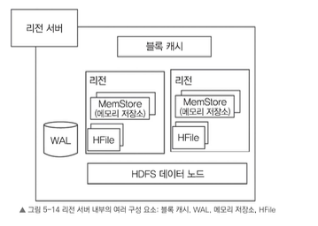
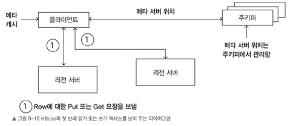
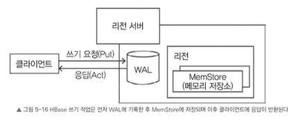
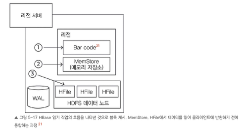

# 리전 서버 구성 요소

리전 서버는 HDFS의 데이터 노드에서 동작하며, 다음과 같은 요소로 구성되어 있다.

- **WAL**
    - WAL은 분산 파일 시스템에 저장된 파일로, 아직 영구적으로 저장되지 않은 새로운 데이터를 보관한다.
    - WAL의 주요 목적은 장애가 발생할 때 데이터를 복구할 수 있도록 지원하는 것이다.

- **블록 캐시**
    - 자주 읽는 데이터를 메모리에 저장해서 읽기 속도를 높이는 역할
    - 캐시가 꽉 차면 가장 오래 사용하지 않은 데이터를(Latest Recently Used, LRU)를 삭제하여 공간을 확보한다.
    - cache hit 시에 최근사용 정보 갱신함

- **MemStore(메모리 저장소)**
    - 데이터를 디스크에 기록하기 전 임시로 저장하는 쓰기 캐시 역할
    - 디스크에 기록하기 전에 데이터를 정렬하며, 리전 내 각 컬럼 패밀리마다 하나의 저장소가 생성된다.
        - Table - region - column family - memstore/hfile
        - hbase는 컬럼 패밀리 단위로 flush, compaction, cache 등이 동작한다. (하나의 물리 저장 단위로 봄)
    - 수정된 데이터는 메모리에 키-값 형태로 정렬하여 저장되며, 이후 HFile에 기록될 때도 동일한 구조를 유지한다.

- **HFile**
    - HFile은 디스크에 데이터를 정렬된 키-값 형태로 저장한다.
    - 저장소에 데이터가 충분히 쌓이면 정렬된 키-값 데이터를 새로운 HFile에 순차적으로 기록한다. (apend only)
    - 이 방식은 디스크 드라이브 헤드를 이동할 필요가 없어 저장 작업을 매우 효율적으로 처리할 수 있다.

---

# HBase의 작업 실행 과정

## HBase에서 처음으로 읽기나 쓰기 작업을 실행할 때 필요한 단계

1. 클라이언트(hbase client)는 ZooKeeper와 통신하여 `.META.` 테이블이 위치한 RegionServer 정보를 조회한다.
    1. `.META.` 역시 HBase 내부의 special table이며, 일반 RegionServer 중 하나가 이를 담당한다.
    2. `.META.` 위치 정보는 ZooKeeper가 관리한다.

2. 이후 클라이언트는 `.META.` 테이블을 조회하여 특정 RowKey 범위를 담당하는 RegionServer 정보를 얻는다.
    1. 즉 `.META.` 테이블은 실제 Region 위치 메타데이터를 저장하는 역할을 한다.

3. 클라이언트는 이렇게 얻은 META 테이블 위치 정보를 포함한 데이터를 캐싱한다.

4. 캐싱된 정보를 바탕으로 클라이언트는 해당 리전 서버에서 원하는 행 데이터를 가져온다.
    1. 데이터 위치를 먼저 찾고 → 실제 데이터를 요청하는 2단계 구조

이후 읽기 작업에서는 클라이언트가 이전에 가져온 META 테이블 서버 위치와 행 키를 캐시에서 참조한다.
시간이 지나면서 리전이 다른 곳으로 이전되어 캐시에 정보가 없는 경우가 아니라면 META 테이블을 다시 쿼리할 필요가 거의 없다.
만약 캐시가 없는 상황이라면 클라이언트가 META 테이블을 다시 쿼리하고 캐시를 갱신한다.

---

# HBase 쓰기 작업

클라이언트가 Put 요청을 보내면 가장 먼저 데이터를 WAL에 기록한다.
> 그림에서는 리전 서버 먼저 접근한걸로 보이는데, client가 먼저 rowkey를 생성하고,  해당 범위에 맞는 리전서버를 메타서버에서 조회하고 리전 서버를 찾은 이후 작업으로 봐야할 듯 하다.

1. 변경된 데이터는 WAL 파일의 끝부분에 추가된다. 이 파일은 디스크에 저장된다.
    1. WAL은 서버가 다운되었을 때 아직 영구적으로 저장되지 않은 데이터를 복구하는 데 사용된다.
    2. 이 파일은 리전 서버가 아닌 HDFS나 다른 파일 시스템에 속한다. (wal 기록, 관리 주체 - 리전서버, 실제 저장소 - hdfs)
        1. 요렇게 하는 이유는 리전서버 죽을때 wal 같이 죽으면 안되니까

2. 데이터가 WAL에 기록되면 MemStore에 저장한다. 이후 요청 처리가 완료되었다는 응답을 클라이언트에 보낸다.

---

# HBase 리전 플러시

- MemStore에 데이터가 충분히 쌓이면 전체 데이터셋을 정렬한 후 HFile을 새로 만들어 기록한다.

- HBase는 컬럼 패밀리마다 HFile을 여러 개 생성하며 이 파일에는 실제 데이터 셀(KeyValue 인스턴스)이 저장된다.
- MemStore에서 데이터를 정렬한 후 디스크로 플러시하며, KeyValue 변경 내용을 새로운 HFile에 추가한다.
    - 왜 새로운 hfile이냐면 -> flush 시점이 “첫 번째 HFile(immutable disk file)”이 생성되는 시점이기 떄문이다.
    - 기본적으로 hfile은 수정되지 않으며, 이런 1차 hfile들이 쌓여서 merge(합치고) compacting (row 키 기반 최신값만 남김 등) 하는 작업이 반복된다.

- HBase는 마지막으로 기록된 시퀀스 번호를 저장하여 사용자가 지금까지 영구 저장된 데이터 범위를 확인할 수 있도록 한다.
- 가장 높은 시퀀스 번호는 각 HFile의 메타 필드에 기록하여 데이터가 어디까지 저장되었는지와 이후 저장 작업이 어디서 시작되어야 하는지 알 수 있다

- 리전이 시작되면 시스템이 해당 시퀀스 번호를 불러오고, 가장 높은 번호를 새로운 수정 작업의 시퀀스 번호로 사용한다.

---

## 옮긴이 노트

KeyValue 를 마스크 케이스(각 단어의 첫 글자가 대문자인 표기법)로 적은 이유는 단순히 스타일 때문이 아니다.
HBase에서 KeyValue는 데이터를 저장하고 처리하는 핵심 역할을 하는 ‘슈퍼 셀’ 같은 존재!!라고 한다.

예를 들어 KeyValue는 데이터의 고유 키(이름표)와 그에 대응하는 값(내용), 추가 정보(언제 만들었는지, 몇 번째 버전인지 등)를 모두 한 패키지로 묶어 관리한다.
KeyValue는 마치 데이터 세계의 스위스 군용 칼처럼 다양한 역할을 하는 특별한 존재임을 강조하려고 이름도 파스칼 케이스로 멋지게 디자인한 것이라고 한다.

---

# HBase 읽기 작업

행 데이터를 읽으려면 관련된 셀을 어떻게 찾아서 반환해야 할까?

한 행에 포함된 KeyValue 셀은 다음과 같이 여러 위치에 나누어 저장할 수 있다.

- 이미 저장된 행 셀은 HFile에 기록되어 있다.
- 최근에 업데이트한 셀은 MemStore에 있다.
- 최근에 읽은 셀은 블록 캐시에 있다.

그림 5-17에서 표현하고 있듯이, 데이터를 읽으려면 블록 캐시(barcode가먼지모르겠음요..; 블록캐시 아닐까요), MemStore, HFile에 있는 키-값 데이터를 차례대로 조회한 후 이를 합쳐야 한다.

1. 먼저 스캐너가 블록 캐시에서 행 데이터를 검색한다. 최근에 사용한 키-값 데이터가 여기에 저장되며, 메모리가 부족하면 가장 오래 사용하지 않은 데이터부터 삭제된다.

2. 다음으로 스캐너가 MemStore 안을 찾아본다. MemStore 저장소는 가장 최근에 저장한 데이터를 담고 있는 쓰기 캐시이다.

3. 다만 스캐너가 MemStore와 블록 캐시에서 모든 셀을 찾지 못했다면, HBase는 다음으로 블록 캐시에 저장된 인덱스와 블룸 필터를 활용한다.
    1. HFile의 인덱스는 HFile 내부 data block의 위치를 찾기 위한 block index다.
    2. HBase의 데이터는 RowKey를 포함한 KeyValue 기준으로 정렬되어 저장되기 때문에, 인덱스는 특정 RowKey가 어느 data block에 존재할 가능성이 있는지 찾는 데 사용된다.
    3. 그럼으로써 필요한 데이터가 들어 있을 가능성이 있는 HFile 내 특정 data block을 메모리로 불러오고, 스캐너는 거기에서 다시 목표 행 셀을 검색한다. 

