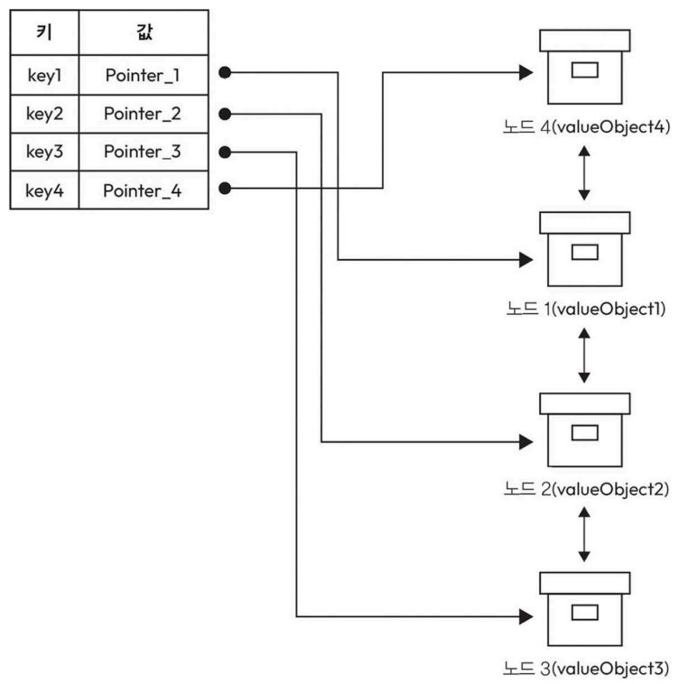
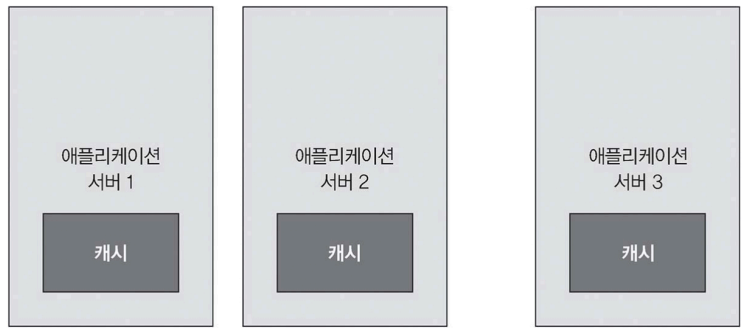
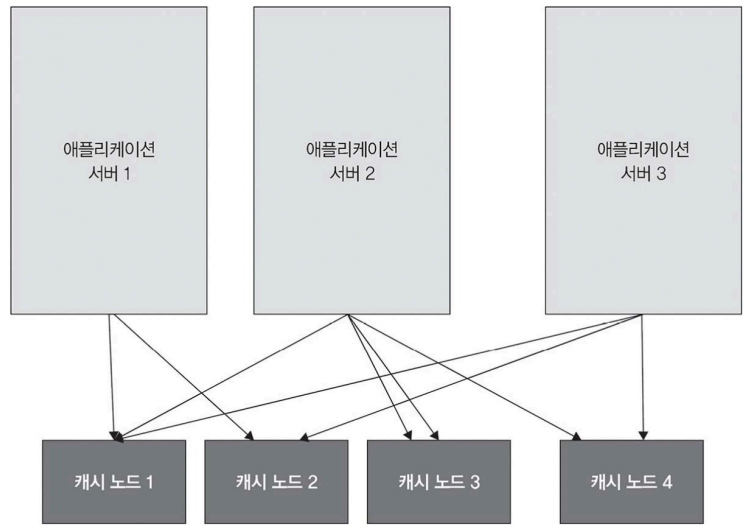

# 가장 오래된 항목 제거 (Least Recently Used, LRU) 캐시 설계하기

- 캐시에는 저장할 수 있는 항목 수 = N
- 캐싱 시간: O(1)
- 삭제 시간: O(1)

## (이중 연결 리스트 & 해시 맵) 구조

- 이중 연결 리스트와 해시 맵을 조합한 데이터 구조
- 읽기와 쓰기 두 가지 작업 흐름으로 구성
  - 가정
    - 쓰기 작업은 데이터베이스에 직접 저장 
    - 읽기 작업에서는 캐시에 데이터가 없을 때만 새로운 데이터를 추가

### 경우의 수

| 경우      | 상황                                     | 처리 단계                                                                                                                                                                                    | 시간 복잡도 |
| ------- | -------------------------------------- | ---------------------------------------------------------------------------------------------------------------------------------------------------------------------------------------- | ------ |
| 경우의 수 1 | 키가 해시 맵에 없음 (캐시 미스) + 캐시에 여유 공간 존재     | 1. 데이터베이스에서 해당 키의 `valueObject` 조회 2. `valueObject`로 새 노드 생성 3. 연결 리스트 맨 앞에 노드 추가 4. 해시 맵에 `key → 노드 포인터` 저장                                                                    | O(1)   |
| 경우의 수 2 | 키가 해시 맵에 없음 (캐시 미스) + 캐시가 가득 참 (N개 저장) | 1. 연결 리스트 끝(Least Recently Used) 노드 확인 2. 해당 노드를 연결 리스트에서 제거 3. 해시 맵에서도 해당 키 제거 4. 데이터베이스에서 해당 키의 `valueObject` 조회 5. 새 노드 생성 후 연결 리스트 맨 앞에 추가 6. 해시 맵에 `key → 노드 포인터` 저장 | O(1)   |
| 경우의 수 3 | 키가 해시 맵에 이미 존재함 (캐시 히트)                | 1. 해시 맵에서 키 검색 2. 저장된 포인터로 연결 리스트 노드 접근 3. 해당 노드를 연결 리스트 맨 앞으로 이동                                                                                                                  | O(1)   |

### 구조 요약

| 자료구조                          | 역할                        |
| ----------------------------- | ------------------------- |
| 해시 맵(Hash Map)                | 키를 통해 연결 리스트 노드를 O(1)에 찾기 |
| 이중 연결 리스트(Doubly Linked List) | 최근 사용 순서 관리               |
| 리스트 맨 앞                       | 가장 최근에 사용한 데이터(MRU)       |
| 리스트 맨 뒤                       | 가장 오래 사용하지 않은 데이터(LRU)    |

# 시스템 통합하기

효과적인 캐시 배포 구성 방안 살펴보기

## 방법 1. 애플리케이션 서버와 캐시를 함께 배치하기

캐시를 애플리케이션 서버와 같은 머신에 함께 배치해서 실행

## 방법 2. 애플리케이션 서버와 독립적으로 구현하기

| 구분           | 방법 1. 애플리케이션 서버와 캐시 함께 배치      | 방법 2. 애플리케이션 서버와 캐시 분리                      |
| ------------ | ------------------------------ |---------------------------------------------|
| 구조           | 애플리케이션 서버 내부(같은 머신)에 캐시 포함     | 별도의 캐시 서버 클러스터 운영                           |
| 배치 형태        | App Server + Cache가 한 머신에 존재   | App Server와 Cache Server가 독립적으로 존재          |
| 캐시 접근 방식     | 동일 머신 내부 프로세스 호출               | 네트워크를 통한 원격 호출                              |
| 성능           | 매우 빠름 (메모리/프로세스 내부 접근)         | 네트워크 비용 발생                                  |
| 확장 방식        | 앱 서버 증가 시 캐시도 함께 증가            | 캐시 서버만 별도로 확장 가능                            |
| 장점           | 구현이 단순함 로컬 접근이라 속도가 빠름      | 높은 확장성 제공 (앱 서버와 독립적으로 운영 가능)            |
| 장애 상황        | 서버 다운 시 해당 캐시도 함께 사라짐          | 특정 앱 서버 장애와 캐시가 분리됨                         |
| 단점           | 서버 장애 시 캐시 유실 새 서버는 빈 캐시 상태 | 키 분산 및 라우팅 전략 필요(로드 밸런서, 키 검색 테이블 방법 고려 필요) |
| 데이터 분산 방식    | 별도 분산 전략 불필요                   | 키 기반 샤딩 필요                                  |
| 사용 가능한 분산 전략 | 일반적으로 단일 서버 내부 관리              | Hash, Mod 연산, 일관된 해싱 사용 가능                  |
| 적합한 환경       | 소규모 서비스 빠른 응답이 중요한 경우       | 대규모 트래픽 수평 확장이 필요한 경우                    |

---

끄적 끄적 노트,,,

분산 캐싱
캐싱 정의/분산 캐시 설계/대표적 분산 캐시 솔류션

확장성, 성능 수요

검색, 저장 병목 -> 캐싱

단일 캐시 -> 불충 -> 분산(여러 도서관 = 하나의 대형 도서관)

분산캐싱: 여러 서버나 노드에 데이터를 메모리에 분산 저장

- 적용범위: 단일 vs 네트워크로 여녀결된 여러 노드(노드간 캐싱 데이터 공유)
- 아키텍처: 로컬 캐시(동일 기기) vs 여러 캐시 노드(각 노드에 로컬 캐시)
- 확장성: 소규모 vs 대규모
- 일관성 및 동기화: 분산시 각 노드의 최신화를 위해 동기화 프로토콜과 전략 사용

- 분산 캐시의 요구 사항
  - 기능적: put get
  - 비기능적: 성능(빠름), 가용성(중단), 확장성(트래픽 증가)
- 데이터 구조: 해시 맵
- 캐시 삭제 정책
  - 삽입 순서 기반(접근 시간 고려 x): FIFO(예약), LIFO(추천)
  - 접근 기반: 가장 최근에 사용한 항목 제거(Most Recently Used, MRU)(최근본문서삭제), 가장 오래된 항목 제거 (Least Recently Used, LRU)(웹브라우저), 최소 사용 빈도 제거(Least Frequently Used, LFU)(음악 스트리밍)

---
