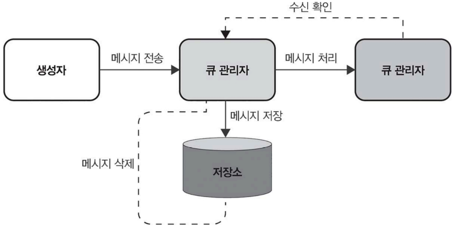

# 발행/구독과 분산 큐

- 분산시스템이 효과적인 대용량 데이터 처리를 위해 확장성이 좋은 시스템 역할을 한다.

- 분산 시스템에서 주로 사용하는 메시징 패턴
  - 발행/구독 시스템
  - 분산 큐
  - 느슨한 연결 ➡️ 확장성, 안정성을 높임

# 7.1 분산 시스템의 발전 과정

발전: 모든 구성 요소가 하나의 서비스 안에 밀접하게 연결된 모놀리식 아키텍처 ➡️ 각 서비스가 독립적으로 분리된 상태로 메시지를 주고받으며 소통하는 마이크로서비스 아키텍처

## 분산 큐

- : 여러 서버에서 분산된 큐 
- 역할: 메시지를 저장/전달
- 사용처:
  - 메시지를 보낸 순서 처리 
  - 각 메시지가 하나의 소비자만 대상으로 할 때

## 7.1.1 분산 큐 설계

분산 큐는 현대 분산 시스템의 핵심 요소로, 시스템 내 다양한 구성 요소가 메시지를 안정적으로 처리하고 전달할 수 있게 한다.

- 부하 고르게 분산
- 수요 증가에도 유연한 확장 

### 분산 큐를 활용할 때 얻을 수 있는 주요 이점

- 부하 관리 : 큐는 메시지 생성자(producer)와 소비자(consumer) 사이에서 완충 역할 ➡️ 메시지가 폭증하는 상황에서도 시스템 과부하 방지
- 구성 요소 간 결합도 낮추기: 시스템의 각 부분이 서로 독립적으로 동작 
  - 메시지를 생성하는 생성자와 처리하는 소비자가 서로의 상태를 신경 쓰지 않아도 되므로 시스템을 더 모듈화 ➡️ 유지 보수를 쉽게 해줌
- 신뢰성과 일관성: 안전한 메시지 처리
  - 소비자가 메시지 처리에 실패하더라도 큐가 이를 다시 전달해서 데이터 일관성을 유지

### 분산 큐 설계 고려사항

작업 부하 관리, 안정성, 메시지를 전달하는 방식을 어떻게 구현할지 고민해야 한다.

- 확장성: 메시지 크기가 많아도 안정적으로 감당할수 있어야한다.
- 장애 허용성: 시스템 일부에 장애가 발생하더라도 큐가 지속적으로 작동할 수 있어야 한다.
- 메시지 일관성: 메시지가 한 번만 정확히 전달되고, 필요하다면 올바른 순서로 처리해야 한다.

### 분산 큐의 주요 특징: 효율적 관리를 위한 구성 요소

- 큐 관리자(queue manager): 큐 관리자란 큐에서 메시지 분배를 책임지는 핵심 구성 요소
  - 메시지 순서를 유지하고, 적절한 소비자에게 전달하며, 처리에 실패했을 때 재전송을 관리하는 역할
- 메시지 저장소(message storage): 소비자가 메시지를 처리하기 전까지 보관되는 공간
  - 높은 신뢰성을 바탕으로 대량의 데이터를 처리할 수 있어야 하며, 빠른 읽기 및 쓰기 작업으로 메시지 처리를 효율적으로 지원
- 로드 밸런싱(load balancing): 분산 큐는 특정 소비자에게 메시지가 몰리는 일을 방지하기 위해 부하를 고르게 분산
  - 각 소비자의 현재 작업량과 처리 능력을 고려해서 메시지를 균형있게 배분
- 장애 허용과 복구(fault tolerance and recovery): 분산 큐는 시스템에 문제가 생겨도 안정적으로 작동 
  - 실패한 메시지나 처리 오류를 감지하고, 메시지를 다시 전달하거나 다른 경로로 보낼 수 있는 기능을 이용하여 안정성과 신뢰성 확보
- 확장성(scalability): 메시지와 소비자가 늘어나더라도 성능 저하 없이 이를 효과적으로 처리하며 확장 가능

#### 각 구성 요소 연계

### 아키텍처를 설계할 때 고려할 사항

효율적이고 안정적이며 확장가능한 시스템 운영을 위한 요소들

-  메시지 순서 보장: 분산 큐 시스템 설계에서 중요한 요소 중 하나는 메시지의 순서와 전달 방식을 설정하는 것
  - 애플리케이션 요구에 따라 큐가 메시지 순서를 엄격히 유지해야 할 수도 있고, 최소 한 번(at-least-once) 또는 정확히 한 번(exactly-once) 메시지를 전달해야 할 수도 있다. 
  - 이는 시스템이 데이터를 처리하고 우선순위를 정하는 방식에 영향을 미치며, 구성 요소 간 신뢰성 있고 정확한 통신을 유지하는 역할.
- 데이터 영속성: 메시지를 시스템에 얼마나 오래 저장할지 결정하는 요소
  - 애플리케이션에 따라 소비자가 메시지를 확인(acknowledge)할 때까지 보관해야 하는 경우도 있지만, 성능을 우선시하려고 일정 수준의 메시지 손실을 허용하는 방식이 필요할 수도 있다. 
  - 데이터 무결성과 시스템 성능 간 균형을 신중히 고려해야 하는 부분
- 보안과 접근 제어
  - 메시지 무결성을 보호하고 안전한 환경을 유지하려면 강력한 보안 조치를 마련해야 한다. 
  - 데이터 자체를 보호하는 것뿐만 아니라, 큐에 접근할 수 있는 사용자를 제어함으로써 데이터의 프라이버시를 지키고 규제 요건을 준수하도록 하는 것을 포함.
- 기술 스택 선택: 어떤 기술 스택을 사용할지 결정하는 단계
  - 언어 지원, 성능 요구 사항, 기존 인프라와 호환성 같은 요소에 따라 달라진다. 
  - RabbitMQ, 아파치 카프카, 아마존 SQS 같은 도구는 각각의 특징과 장점이 있어 다양한 애플리케이션에 맞는 선택지로 많이 사용하기도 한다.
- 메시지 형식 설계: 메시지 크기를 정하고 데이터를 직렬화하거나 다시 풀어내는 방식, 추적과 디버깅에 필요한 메타데이터를 구성하는 작업을 의미 
  - 메시지 형식은 큐의 성능과 사용 편의성에 영향
- 장애 허용성: 시스템 신뢰성을 위해 장애 허용성을 갖추는 것이 중요
  - 구성 요소에 장애가 발생하면 재시도(retry) 메커니즘 또는 처리 불가능한 메시지를 관리하는 데드 레터 큐(dead letter queue) 같은 전략을 도입 
    - ➡️ 시스템을 지속적으로 운영하고 데이터 손실을 최소화

결론적으로 분산 큐를 설계하는 과정은 기술적 요소와 실질적 요구 사항 간에 균형을 신중히 고려해야 하는 작업이다.

메시지 순서 처리부터 보안 조치까지 각각의 요소가 오늘날 애플리케이션이 요구하는 바를 충족하는 견고하고 효율적인 시스템을 구축하는 데 중요한 역할울 한다.