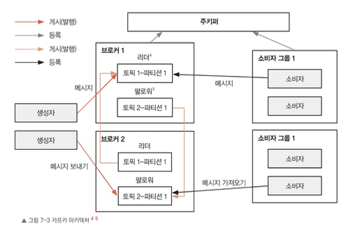

# 카프카

- 대용량, 실시간 데이터 피드를 처리하도록 설계된 분산 스트리밍 플랫폼
- 내구성, 속도, 확장성을 고려해서 설계됨
- 발행/구독과 큐 기반 메시징 패턴 모두를 구현하는 데 적합한 성능

## 카프카의 핵심 개념

- 토픽
    - 카프카에서 레코드는 토픽이라는 카테고리로 분류된다. 생산자는 이 토픽에 데이터를 보낼 수 있고, 소비자는 원하는 토픽을 선택해서 데이터를 받아 볼 수 있다.
- 생산자와 소비자
    - 카프카에서 생산자는 특정 토픽과 관련된 데이터를 보내며, 소비자는 이 데이터를 읽는다.
- 브로커(broker)
    - 카프카 클러스터는 브로커라고 하는 하나 이상의 서버로 구성된다
    - 브로커는 생산자가 보낸 데이터를 저장하고, 소비자를 관리한다.
    - 소비자가 어디까지 데이터를 읽었는지 추적하고, 소비자 요청에 따라 데이터를 전달하는 역할을 한다.
- 파티션과 복제(partitions and replication)
    - 각 토픽은 여러 파티션으로 나눌 수 있다.
    - 데이터를 복제하여 여러 브로커에 분산시켜 장애에도 견딜 수 있도록 설계되었다.

1. 실제 생산자는 메시지를 토픽에 전달하고, 이 메시지는 파티션에 분할되어 저장된다.
2. 소비자는 토픽을 구독하고 있다가 각 파티션에서 메시지를 읽는다.
    1. 카프카는 소비자마다 메시지 오프셋을 관리하여 모든 메시지를 한 번씩 순서대로 읽을 수 있도록 보장한다
    2. 또한 여러 브로커에 데이터를 복제하여 데이터 손실을 방지하고 시스템 신뢰성을 높인다.

카프카는 토픽, 파티션, 브로커를 활용하여 메시지와 소비자 요청을 고르게 분산시켜 부하를 효율적으로 관리한다. 이 때문에 뛰어난 확장성과 안정적인 성능을 유지할 수 있어 실시간 데이터 처리가 필요한 분산 환경에 적합하다고 볼수있다

---

## 옮긴이노트

>토픽에 보낸다는 의미는?

사실 이 용어는 방송 시스템을 라디오 방송국으로 비유하면 이해하기 쉽습니다. 거기에서 토픽을 채널이라고 생각하면 메시지가 생성되면 소비자에게 어떻게 전달되는지 설명이 됩니다. 카프카에서도 토픽은 같은 개념입니다. 다만 카프카에서 토픽은 좀 더 기술적인 개념으로 다뤄집니다.

카프카에서 토픽은 데이터를 분류하고 관리하는 논리적 카테고리입니다. 예를 들어 ‘날씨 정보’라는 토픽을 생성하면 생산자는 오늘의 기온 데이터를 이 토픽에 올리고, 소비자는 그 데이터를 읽어 갈 수 있습니다. 이를 이해하기 위해 라디오 방송국이나 텔레비전 채널을 떠올려 보면 됩니다.

- 생산자는 DJ처럼 방송 콘텐츠(데이터)를 특정 채널(토픽)에 올립니다.
- 소비자는 원하는 채널(토픽)에 맞춰 데이터를 받아 갑니다.

예를 들어 102.1MHz 날씨 방송이라는 채널(토픽)이 있다고 합시다. DJ가 “오늘은 맑고, 최고 기온은 25도입니다”라고 방송하면 이 채널을 듣고 있는 청취자들은 그 정보를 동일하게 받아보게 됩니다.

카프카의 토픽도 단순한 분류가 아니라, 메시지를 파티션으로 나누어 저장하고 관리합니다. 이 파티션은 데이터를 효율적으로 분산시키고 장애를 방지하는 역할을 합니다. 이처럼 카프카의 토픽은 발행/구독 시스템의 토대이자 데이터 처리의 핵심 단위입니다.

결론적으로 토픽에 보낸다는 것은 데이터를 특정 카테고리(토픽)에 정리하고 저장한다는 의미로 이해하면 됩니다.

---
> 카프카 2.8 버전부터 주키퍼 의존도가 크게 줄었다. 이후 클러스터 메타데이터 관리와 브로커 조율은 카프카 컨트롤러브로커와 카프카 래프트 합의 프로토콜 같은 내부 구성 요소가 담당한다. 오래된 버전에서는 여전히 주키퍼를 사용하는 경우가 있다

### 7.3.1 분산 시스템에서 카프카의 중요성

> 카프카는 단순한 메시징 시스템이 아니라 이벤트 스트리밍 플랫폼

특히 대규모 데이터를 낮은 지연 시간으로 처리해야 하는 현대 분산 시스템에서 핵심적인 역할을 한다. 분산 환경에서 카프카를 배포하려면 안정적인 성능을 확보하기 위해 몇 가지 단계를 거쳐야 한다.

1. 카프카 클러스터 설정하기
- 클러스터 설정: 카프카 클러스터를 설정하려면 브로커를 여러 개 구성하여 장애 허용성과 높은 가용성을 확보해야 한다. 이를 위해 브로커 개수를 정하고, 부하를 고르게 분산할 수 있도록 각 브로커를 서로 다른 설정값으로 구성해야 한다.
- 주키퍼 설정: 카프카는 클러스터 정보를 관리하고 브로커 간 역할을 분담하는 데 주키퍼를 사용한다. 때문에 카프카 배포에서 주키퍼를 설정하고 조정하는 과정도 중요한 단계라고 볼 수 있다

2. 토픽 생성 및 설정하기
- 토픽 생성: 카프카에서 토픽은 메시지가 저장되고 관리되는 공간이다. 토픽을 생성할 때 파티션 수와 복제 계수(replication factor)를 적절히 설정하면 성능과 안정성을 높일 수 있다.
- 토픽 관리: 토픽 설정을 수정하거나 삭제하고, 성능을 모니터링하는 방법을 아는 것도 토픽 관리에 중요하다.

3. 카프카 생산자와 소비자 구현하기
- 생산자 구현: 카프카로 메시지를 보내는 생산자를 구현하는 단계이다. 이 과정에서는 메시지를 직렬화하고 카프카 클러스터와의 연결을 관리하는 작업이 필요하다.
- 소비자 구현: 토픽을 구독하고 메시지를 처리하는 소비자를 구현해야 한다. 여기에서는 동시성 처리와 오프셋 관리 등을 고려해 메시지를 안정적으로 처리할 수 있도록 신경 써야 한다.

4. 모니터링과 유지 보수
- 클러스터 모니터링: 분산 시스템을 안정적으로 운영하려면 모니터링이 중요하다. 카프카를 운영할 때는 클러스터 상태와 성능 지표를 확인할 수 있는 도구를 활용해 문제를 조기에 파악해야 한다
- 성능 튜닝: 생산자와 소비자 설정, 네트워크, 디스크 입출력 속도 등을 최적화하는 등 성능을 개선하는 방법을 적용해야 한다

---

## 옮긴이 노트

>데이터 공항 이야기

공항의 중심은 다양한 노선(토픽)입니다. 각 노선은 목적지가 정해져 있는 데이터 흐름의 경로입니다. 서울-부산 노선, 서울-제주 노선처럼 비행기가 특정 목적지를 향해 이동하듯, 생산자는 자신이 보낸 데이터를 받아 갈 소비자를 위해 특정 노선을 따라 이동시킵니다.

항공사: 생산자(Producer)  
항공사는 비행기를 준비해 특정 노선(토픽)으로 데이터를 보냅니다. 각 비행기는 데이터를 실은 메시지라고 보면 됩니다.

승객: 소비자(Consumer)  
공항에 도착한 데이터를 기다리는 사람이 승객입니다. 승객은 자신이 관심 있는 노선(토픽)을 선택해 필요한 데이터를 받아갑니다.

출발 게이트: 파티션(Partition)  
각 노선에는 여러 개의 출발 게이트가 있습니다. 이 게이트들이 바로 파티션입니다. 여러 게이트를 통해 동시에 데이터를 처리할 수 있습니다.

관제탑: 브로커(Broker)  
비행기가 출발하고 도착하는 것을 관리하는 것이 관제탑입니다. 카프카에서는 브로커가 데이터를 저장하고 전달하는 역할을 합니다.

운영 센터: 주키퍼(Zookeeper)  
공항 전체를 조율하는 운영 센터입니다. 각 관제탑이 어떤 역할을 하는지 관리하고 전체 흐름을 조정합니다.

탑승권: 오프셋(offset)  
승객은 자신이 어디까지 탑승했는지 기억합니다. 카프카에서는 이 역할을 오프셋이 담당합니다.

공항 운영 방식: 카프카 핵심  
이 공항은 매우 체계적으로 운영됩니다. 생산자는 데이터를 비행기에 실어 보내고, 소비자는 이를 받아가며, 관제탑과 운영 센터가 전체를 조율합니다. 이 구조 덕분에 카프카는 대규모 데이터를 안정적으로 처리할 수 있습니다.