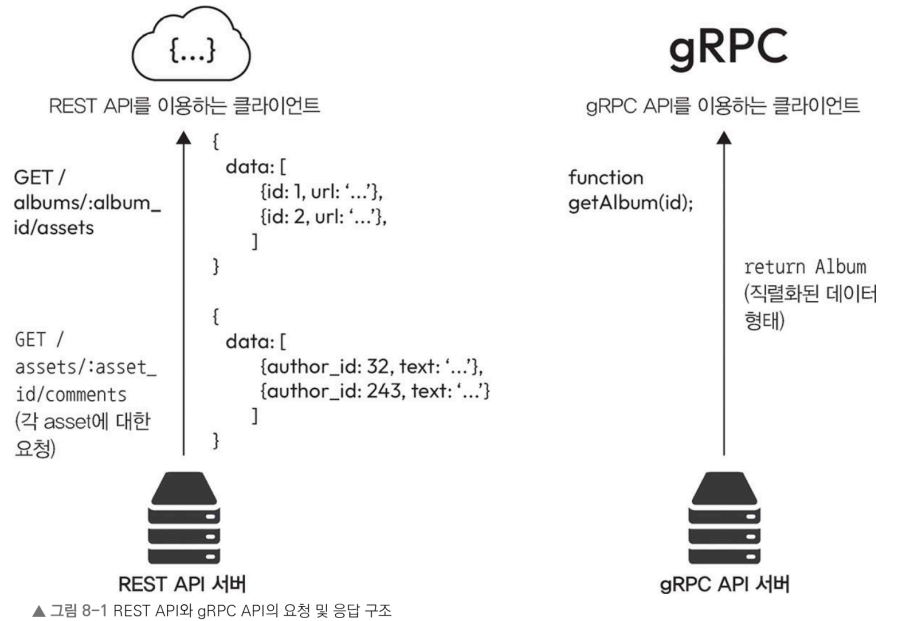

# 8.2 gRPC API

> gRPC(Google Remote Procedure Call)는 원격 프로시저 호출을 실행하는 고성능 오픈 소스 프레임워크  
> 구글이 개발했으며 HTTP/2 프로토콜을 기반으로 한다.

데이터 중심인 **REST**와 달리 **gRPC**는 함수 중심으로 설계되어 고효율 API를 구현하는 데 효과적이다.

## 8.2.1 gRPC API의 설계 원칙

### 프로토콜 버퍼(Protobuf) 사용

gRPC는 인터페이스 정의 언어(IDL)로 **프로토콜 버퍼(protocol buffers, protobuf)** 를 사용합니다.

- 언어와 플랫폼에 독립적
- 정형 데이터(Structured Data) 직렬화 지원
- JSON보다 더 효율적이고 빠름

### 코드 자동 생성

gRPC에서는 `proto` 파일에 서비스를 정의하면 다양한 언어로 다음 코드를 자동 생성할 수 있습니다.

- 클라이언트 코드
- 서버 코드
- 스텁(Stub)

> Stub(스텁) 은 원격 서버의 메서드를 로컬 메서드처럼 호출할 수 있도록 자동 생성되는 클라이언트 코드입니다.

이를 통해 다음과 같은 이점을 얻을 수 있습니다.

- API 생성 및 관리가 쉬움
- 서비스 정의 변경 시 코드 자동 반영
- 유지보수성 향상

### 다양한 기능 제공

gRPC는 여러 프로그래밍 언어를 지원하므로 다중 언어 환경에 적합합니다.

또한 다음과 같은 기능을 제공합니다.

- 인증(Authentication)
- 로드 밸런싱(Load Balancing)
- 양방향 스트리밍(Bidirectional Streaming)

---

## 8.2.2 gRPC API의 활용 사례

### 마이크로서비스 아키텍처(MSA)

gRPC는 서비스 간 빠르고 빈번한 통신이 필요한 환경에 적합합니다.

특히 다음과 같은 이유로 MSA 환경에서 많이 사용됩니다.

- 작은 메시지 크기
- 빠른 직렬화/역직렬화
- 낮은 네트워크 오버헤드

### 실시간 애플리케이션

프로토콜 버퍼 기반의 효율적인 통신과 양방향 스트리밍 기능 덕분에 다음과 같은 시스템에 적합합니다.

- 실시간 채팅
- 라이브 데이터 처리
- 스트리밍 서비스

### 고성능 서비스 간 통신

서비스 간 통신 부하를 줄여 시스템 전체의 효율을 높일 수 있습니다.

대표적인 사례

- 내부 API 통신
- 분산 시스템
- 대규모 백엔드 서비스

---

## 8.2.3 gRPC API의 장단점

### ✅ 장점

| 항목 | 설명 |
|--------|--------|
| 높은 성능 | REST API보다 작은 페이로드와 빠른 처리 속도 |
| 효율적인 데이터 전송 | Protobuf 기반 바이너리 직렬화 |
| 명확한 계약(Contract) | 데이터 구조를 명확하게 정의 가능 |
| 코드 자동 생성 | 생산성과 유지보수성 향상 |
| 스트리밍 지원 | 서버/클라이언트/양방향 스트리밍 가능 |
| 다중 언어 지원 | 다양한 언어 간 통신에 적합 |

### ❌ 단점

| 항목 | 설명 |
|--------|--------|
| 복잡한 설정 | HTTP/2 및 바이너리 프로토콜 사용 |
| 디버깅 어려움 | JSON처럼 사람이 바로 읽기 어려움 |
| 변경 비용 | Proto 수정 → 코드 생성 → 배포 과정 필요 |
| 학습 비용 | REST보다 진입 장벽이 높음 |

### REST와 비교

> gRPC는 성능과 효율성을 우선하는 내부 서비스 통신에 적합합니다.

반면,

> REST는 단순성과 개발 편의성이 중요한 외부 공개 API에 적합합니다.

REST는 메시지를 수정하고 테스트하는 과정이 비교적 간단하며 빠르게 개발할 수 있다는 장점이 있습니다.


# 8.3 REST와 gRPC 비교

REST와 gRPC는 모두 API를 설계할 때 많이 사용하는 방식으로, 저마다 장점과 적절한 사용 용도가 있습니다.

두 방식의 차이를 이해하면 요구 사항에 맞추어 어떤 방식을 사용해야 할지 고를 수 있습니다.

이 절에서는 **성능**, **사용 편의성**, **호환성**, **스트리밍 지원** 등 여러 측면에서 두 방식을 비교해 보겠습니다.

다음 그림을 참고하며 REST와 gRPC의 요청과 응답 구조를 살펴봅시다.

> REST는 테스트가 쉬워 공개 API에 적합하고, gRPC는 서비스 간 통신에 적합하며 바이너리 형식을 사용합니다.

---

## REST API와 gRPC API의 요청 및 응답 구조


#### album.proto 

```proto
syntax = "proto3";

package album;

service AlbumService {
    rpc GetAlbum(GetAlbumRequest)
        returns (AlbumResponse);
}

message GetAlbumRequest {
    int64 album_id = 1;
}

message AlbumResponse {
    int64 id = 1;
    string title = 2;
    string artist = 3;
}
```

`
AlbumServiceGrpc,
GetAlbumRequest,
AlbumResponse
`
#### Server 구현
``` java
@GrpcService
public class AlbumGrpcService
        extends AlbumServiceGrpc.AlbumServiceImplBase {

    @Override
    public void getAlbum(
            GetAlbumRequest request,
            StreamObserver<AlbumResponse> responseObserver) {

        AlbumResponse response =
                AlbumResponse.newBuilder()
                        .setId(1L)
                        .setTitle("Abbey Road")
                        .setArtist("The Beatles")
                        .build();

        responseObserver.onNext(response);
        responseObserver.onCompleted();
    }
}
```
#### Client 호출
``` java
ManagedChannel channel =
        ManagedChannelBuilder
                .forAddress("localhost", 9090)
                .usePlaintext()
                .build();

AlbumServiceGrpc.AlbumServiceBlockingStub stub =
        AlbumServiceGrpc.newBlockingStub(channel);

AlbumResponse response =
        stub.getAlbum(
                GetAlbumRequest.newBuilder()
                        .setAlbumId(1L)
                        .build());

System.out.println(response.getTitle());
```
REST API 서버와 gRPC API 서버는 모두 서비스 간 효율적인 통신을 구축하는 데 강점이 있지만, 웹 브라우저와의 호환성에서는 차이가 있습니다.

gRPC는 기계 간 통신을 목적으로 설계되었기 때문에 웹 브라우저 API의 한계로 인해 브라우저에서 직접 사용할 수 없습니다.

반면 웹 브라우저와 서버 간 데이터를 주고받아야 하는 애플리케이션에서는 REST API가 더 적합합니다.

하지만 서비스 간 통신에서 성능과 효율이 중요할 때는 gRPC가 더 나은 선택이 될 수 있습니다.

이제 성능, 사용 편의성, 호환성, 스트리밍 지원, 활용 사례를 기준으로 두 API의 차이를 비교해 보겠습니다.

---

## 성능

gRPC는 HTTP/2와 프로토콜 버퍼를 사용하므로 일반적으로 REST보다 성능이 뛰어납니다.

- HTTP/2는 단일 TCP 연결로 여러 요청을 동시에 처리 가능
- HTTP/1.1에서 발생하는 지연 시간 감소
- 프로토콜 버퍼는 JSON보다 더 효율적인 데이터 형식
- 더 작은 크기의 데이터를 전송 가능

---

## 사용 편의성

REST API는 HTTP 메서드와 상태 코드를 이미 알고 있는 개발자에게 더 쉽고 간단합니다.

또 다음과 같은 도구를 사용하여 쉽게 테스트하고 디버깅할 수 있습니다.

- cURL
- Postman

반면 gRPC API는 바이너리 형식을 사용하므로 테스트와 디버깅에 특정 도구가 필요합니다.

---

## 호환성

REST API는 HTTP를 기반으로 하기 때문에 인터넷에 연결된 거의 모든 장치에서 사용할 수 있습니다.

반면 gRPC는 HTTP/2가 필요하며, 이를 지원하지 않는 플랫폼이나 네트워크 환경에서는 사용할 수 없을 수도 있습니다.

---

## 스트리밍 지원

### gRPC

- 양방향 스트리밍 지원
- 클라이언트와 서버가 동시에 데이터를 주고받을 수 있음

### REST

- 요청(Request)과 응답(Response) 중심 구조
- 일반적으로 양방향 스트리밍을 지원하지 않음

---

## 활용 사례

### REST

REST는 인터넷으로 공개되는 API에 적합합니다.

특히 다음과 같은 경우에 잘 맞습니다.

- CRUD 기반 작업
- 공개 API
- 다양한 플랫폼 지원
- 폭넓은 네트워크 호환성 필요

### gRPC

gRPC는 서비스 간 통신에서 높은 성능이 요구될 때 강점을 발휘합니다.

특히 다음 환경에서 적합합니다.

- 마이크로서비스 아키텍처(MSA)
- 서비스 간 내부 통신
- 고성능 분산 시스템
- 실시간 애플리케이션

또한 양방향 스트리밍을 지원하기 때문에 실시간 데이터 처리 환경에도 잘 어울립니다.

---

## 정리

REST와 gRPC 중 어떤 방식을 선택할지는 다음 요소를 기준으로 결정하면 됩니다.

| 비교 항목 | REST | gRPC |
|-----------|------|------|
| 성능 | 보통 | 높음 |
| 데이터 형식 | JSON | Protobuf(Binary) |
| 사용 편의성 | 쉬움 | 상대적으로 복잡 |
| 테스트/디버깅 | 쉬움 | 전용 도구 필요 |
| 브라우저 호환성 | 매우 높음 | 제한적 |
| 스트리밍 | 제한적 | 양방향 스트리밍 지원 |
| 주요 활용 분야 | 공개 API, CRUD | MSA, 내부 서비스 통신 |

결론적으로 REST와 gRPC 중 어떤 방식을 선택할지는 **성능**, **사용 편의성**, **호환성**, **통신 방식**에 따라 결정하면 되겠습니다.

다음 절에서는 API 설계에서 매우 중요한 주제이기도 한 **API 보안**을 살펴보겠습니다.