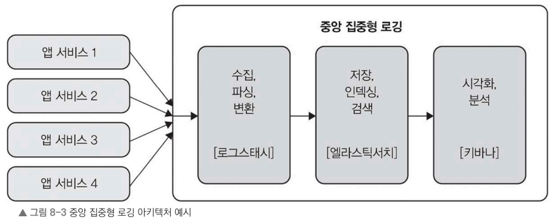

# 8.5 분산 시스템 로깅

여러 서버에서 다양한 서비스가 동시에 동작하는 분산 시스템에서는 로깅이 시스템 상태를 파악하고 문제를 해결하는 핵심 역할을 한다.

- 로깅: 시스템에서 발생하는 이벤트를 기록하는 작업, 애플리케이션 내부에서 무슨 일이 일어나는지 파악할 수 있게 한다. 
  - 이상 징후를 발견하거나 문제를 추적 가능 
    - 시스템 작동 방식을 명확히 이해하는 데 사용 
- 분산 시스템에서는 여러 서비스의 로그를 종합적으로 분석하면 시스템 전반의 동작 상태를 파악하기 쉽고, 문제 해결도 더 효율적으로 할 수 있다. 
- 대규모 시스템에서는 각 서비스에서 생성된 로그를 중앙 저장소로 모아 관리하는 중앙 집중형 로깅(centralized logging) 방식을 주로 사용한다. 

이제 중앙 집중형 로깅이 무엇인지 알아보자.

## 8.5.1 중앙 집중형 로깅

- 중앙 집중형 로깅: 분산 시스템에서 여러 기기에서 실행되는 다양한 서비스에서 생성된 로그를 쉽게 확인하고 분석할 수 있도록 한곳에 모아 저장하는 과정

### 장점
- 접근성 향상: 모든 로그가 한곳에 모여 있어 검색하고 분석하기가 훨씬 쉽다.
- 상관관계 분석: 서로 다른 서비스에서 생성된 로그를 타임스탬프나 고유 식별자를 기준으로 연결해서 트랜잭션이나 작업의 전체 흐름을 파악할 수 있다.
- 데이터 장기 보관: 로그를 보관하여 오랜 기간 저장하거나 컴플라이언스 요구 사항을 충족할 수 있다.

> - 컴플라이언스(Compliance) 요구 사항: 컴플라이언스는 법률, 규정, 업계 표준, 내부 정책을 준수해야 하는 요구사항을 의미
>   - ex. 금융 서비스 → 거래 기록을 5년 이상 보관, 개인정보 처리 시스템 → 누가 언제 어떤 데이터에 접근했는지 기록, 기업 보안 감사 → 관리자 계정 사용 이력 보관

#### 그림. 일반적으로 사용하는 중앙 집중형 로깅 방식의 아키텍처

로깅 인프라를 구축할 수 있는 여러 방법 중 하나에 해당한다.

로그스태시(Logstash)를 사용하여 로그를 수집·파싱 변환하고, 엘라스틱서치(Elasticsearch)를 활용하여 로그를 저장 인덱싱 검색한다.

키바나(Kibana)는 시각화와 분석을 담당합니다. 
- 예시: 에러 발생 추이
  ```
  월  ███
  화  ██████
  수  ████
  목  █████████
  ```

> - Logstash (로그스태시): 로그를 수집하고 가공하는 도구
> - Elasticsearch (엘라스틱서치): 로그를 저장하고 빠르게 검색하는 데이터베이스
> - Kibana (키바나): Elasticsearch에 저장된 데이터를 시각화하는 웹 화면



로그를 설계할 때 어떤 정보를 담을지 신중히 고민해야 한다. 

- 각 로그 항목 포함되어야 하는 최소한의 정보
  - 발생 시각: 이벤트가 발생한 날짜와 시간
  - 서비스 이름: 로그를 생성한 서비스 이름
  - 심각도: 이벤트의 중요도 수준에 INFO, WARNING, ERROR
  - 메시지: 이벤트 설명을 담은 메시지
  - 추가 정보: 사용자 ID, 트랜잭션 ID 등 이벤트와 관련된 세부 정보


### 중앙 집중형 로깅 오픈 소스 라이브러리: 분산 로깅을 구현하는 데 필요한 도구

중앙 집중형 로깅을 처리할 수 있는 오픈 소스

### 중앙 집중형 로깅 오픈소스 도구 정리

중앙 집중형 로깅에서는 여러 서버와 서비스에서 발생하는 로그를 한곳에 모아 저장·검색·분석합니다. 이를 위해 다양한 오픈소스 도구를 사용할 수 있다.

| 도구       | 역할            | 특징                                                                            |
| -------- | ------------- |-------------------------------------------------------------------------------|
| Logstash | 로그 수집·변환·전달   | Elastic Stack의 구성 요소. 다양한 데이터 소스에서 로그를 수집하고 파싱·변환한 후 Elasticsearch 등의 저장소로 전달 |
| Fluentd  | 로그 및 데이터 수집   | 여러 시스템의 데이터를 통합 수집하는 경량 데이터 수집기. 다양한 플러그인을 제공하여 확장성이 높음, 데이터 관리하고 분석 및 활용이 용이 |
| Graylog  | 중앙 집중형 로깅 플랫폼 | 로그 수집, 저장, 검색, 실시간 분석 기능을 통합 제공하는 완성형 솔루션, 개방형 표준(open standard)을 기반으로 설계     |

>   참고. 엘라스틱스택(Elastic Stack)의 구성 요소
>
>  | 구성 요소         | 역할                      |
> |---------------| ----------------------- |
> | Elasticsearch | 데이터 저장, 인덱싱, 검색, 분석     |
> | Logstash      | 로그·이벤트 데이터 수집 및 변환      |
> | Kibana        | 시각화, 대시보드, 모니터링         |
> | Beats         | 서버·애플리케이션의 데이터를 수집하여 전송 |
> | Elastic Agent | Beats를 통합한 데이터 수집 에이전트  |


> ### 1. Logstash
> 
> **"로그 가공 공장"**
> 
> ```text
> 서버 로그
>    ↓
> Logstash
> (수집·파싱·변환)
>    ↓
> Elasticsearch
> ```
> 
> * 다양한 데이터 소스 지원
> * 로그 파싱 및 필드 추출 가능
> * Elastic Stack과 함께 많이 사용
> 
> ---
> 
> ### 2. Fluentd
> 
> **"가벼운 로그 수집기"**
> 
> ```text
> 서버1 ─┐
> 서버2 ─┼─> Fluentd ─> 저장소
> 서버3 ─┘
> ```
> 
> * 여러 소스의 데이터를 통합 수집
> * 플러그인 기반 확장
> * Logstash보다 상대적으로 가볍고 효율적
> 
> ---
> 
> ### 3. Graylog
> 
> **"로그 관리 통합 솔루션"**
> 
> ```text
> 로그 수집
>    ↓
> 저장
>    ↓
> 검색
>    ↓
> 대시보드
>    ↓
> 실시간 분석
> ```
> 
> * 중앙 집중형 로깅 플랫폼
> * 웹 UI 제공
> * 실시간 검색 및 분석 지원
> * 로그 관리 기능이 통합되어 있음
> 
> ---
> 
> ## 비교 요약
> 
> | 항목    | Logstash  | Fluentd    | Graylog                    |
> | ----- | --------- | ---------- | -------------------------- |
> | 주 역할  | 수집·변환     | 수집·전달      | 통합 로그 관리                   |
> | 특징    | 강력한 파싱 기능 | 가볍고 확장성 높음 | UI 기반 분석 제공                |
> | 사용 위치 | 데이터 파이프라인 | 데이터 수집 계층  | 로그 관리 플랫폼                  |
> | 대표 조합 | ELK 스택    | EFK 스택     | 단독 또는 Elasticsearch와 함께 사용 |
> 
> ### 기억하기 쉽게
> 
> * **Logstash** → 로그를 **가공하는 도구**
> * **Fluentd** → 로그를 **모으는 도구**
> * **Graylog** → 로그를 **관리·분석하는 플랫폼**
> 
> 즉, Logstash와 Fluentd는 주로 **데이터 수집 계층**에 위치하고, Graylog는 **로그 검색·분석까지 제공하는 완성형 중앙 집중형 로깅 솔루션**이라고 이해


## 8.5.2 분산 로깅을 효과적으로 구현한 모범 사례

분산 로깅을 구현하는 것은 시스템 복잡성 때문에 어려울 수 있지만, 다음 방법을 따르면 더 효율적이고 체계적으로 구현할 수 있다.
- 일관된 로그 형식 사용(모든 서비스에서 생성되는 로그가 같은 형식 맞춤) ➡️ 검색과 분석이 수월. 특히 여러 서비스가 로그를 생성하는 분산 시스템에서 중요.
- 로그에 컨텍스트 정보 포함하기(사용자 ID, 트랜잭션 ID 등 관련 데이터를 로그에 추가) ➡️ 특정 이벤트의 범위와 영향을 더 명확히 파악.
- 예외를 적절히 처리하기(예외가 발생할 때 스택 트레이스를 포함하여 로깅) ➡️ 오류 원인 파악
- 적절한 로그 레벨 설정 ➡️ 필요한 정보를 빠르게 찾을 수 있고, 불필요한 로그로 시스템이 복잡해지는 것을 방지. 
  -  ex. 즉시 대응이 필요한 상황에는 ERROR 레벨을, 참고용으로 유용하지만 긴급하지 않은 상황에는 INFO 레벨을 사용하는 방법.
- 주기적인 로그 순환 및 아카이빙하기 ➡️ 효율적인 저장 공간 관리 및 규정 준수. 오래된 로그는 삭제하고, 장기적인 분석이 필요한 중요한 로그는 안전하게 보관하는 방법.


## 옮긴이 노트: 로그를 순환하는 의미

처음에는 '로그를 순환한다'는 표현은 쉽게 말해'로그의 자리 정리'라고 생각하면 된다. 

마치 냉장고를 관리하는 것과 비슷하다고 볼 수 있다.

냉장고에 있는 유통기한 지난 음식, 오래된 음식을 버리고 새로운 음식을 넣는 것과 비슷하다.

시스템이 로그를 계속 쌓아 두다 보면 저장 공간이 꽉 찰 수 있다. 이때 오래된 로그를 삭제하거나 다른 저장소에 옮겨서 공간을 확보하는 과정을 '로그를 순환한다'고 한다.

단순 저장 공간만 확보하는 것이 아니라, 시스템 성능을 유지하고 중요한 데이터를 놓치지 않도록 보장하는 데도 필요(냉장고를 주기적으로 청소하면서 음식 관리도 잘하게 되는 것처럼)
