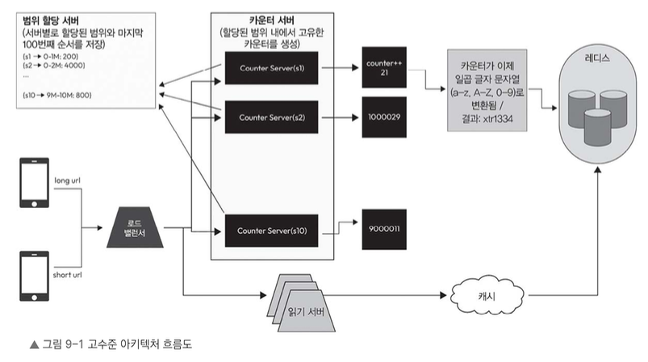

# 9.4.2 적절한 데이터베이스 선택

이 시스템에서 저장해야 할 핵심 데이터는 단축 URL과 원본 URL 간의 매핑이다.

```text
short_url -> long_url
````

이 구조는 단순 key-value 형태이기 때문에 관계형 데이터베이스보다 빠른 읽기/쓰기, 확장성, 내구성, 장애 허용성을 갖춘 데이터베이스가 적합하다.

---

# 9.4.3 고수준 아키텍처 솔루션



## 쓰기 처리 흐름

1. 클라이언트가 긴 URL을 입력하고 단축 URL 생성 API를 호출한다.
2. 로드 밸런서는 요청을 카운터 범위를 가진 카운터 서버 중 하나로 전달한다.
3. 카운터 서버는 자신에게 할당된 범위 안에서 현재 카운터 값을 하나 증가시켜 새로운 고유 숫자를 생성한다.
4. 카운터 서버가 생성한 숫자를 Base62 문자열로 변환하여 단축 URL을 만든다.
5. 생성된 단축 URL과 원본 URL을 Redis 에 short_url -> long_url 형식으로 저장한다.

## 읽기 처리 흐름

1. 클라이언트가 단축 URL에 맞는 긴 URL을 요청하는 API를 호출한다.
2. 로드 밸런서는 요청을 읽기 서버 중 하나로 전달한다.
3. 읽기 서버는 먼저 캐시에 단축 URL이 있는지 확인한다.
    1. 캐시에 있으면 원본 URL을 바로 반환한다.
    2. 캐시에 없으면 Redis 에서 긴 URL을 가져온다.
    3. 가져온 긴 URL을 클라이언트에 전달한다.

