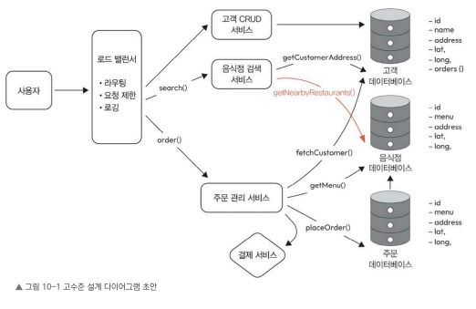

## 10.4 시스템 설계
이 장에서는 시스템을 설계한다.  

핵심 구성 요소를 정리하고, 기능적 요구 사항을 충족하는 데이터 흐름을 만들어 보며. 이후 시스템의 단일 장애 지점이나 문제점을 찾아내고, 해결해야 할 핵심 과제를 정리해서 설계를 다듬어 나간다

핵심 과제를 살펴보기 전에 먼저 전체 구성 요소와 데이터 흐름을 한눈에 볼 수 있도록 고수준 다이어그램을 살펴보자

### 10.4.1 고수준 다이어그램
다음 그림은 근접 서비스를 설계할 때 중요하게 여기는 구성 요소와 데이터 흐름을 보여 주는 설계 초안이다

여기에서 핵심 엔티티는 고객(customer), 음식점(restaurant), 주문(order)이다 

이 다이어그램은 기본적인 구성 요소와 데이터를 저장하는 단순한 데이터베이스만 나타내고 있는데, 이후 더 자세히 살펴보면서 설계를 보완해 보는것은 다음주에~