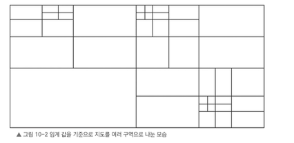
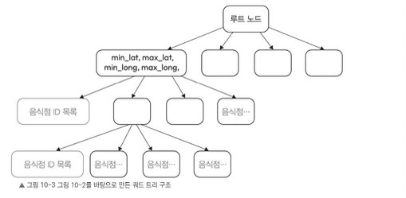

# 10.4.2 핵심 과제

근접 서비스 설계의 핵심 문제는 **사용자 위치를 기준으로 특정 반경 내에 있는 음식점을 찾는 것**이다.

사용자 위치는 위도와 경도로 표현할 수 있다.

- 위도: `lat`
- 경도: `long`
- 사용자 위치: `(lat, long)`


즉 음식점 검색 서비스는 음식점 검색 데이터베이스에 `getNearbyRestaurants()` 요청을 보내고, 사용자의 현재 위치를 기준으로 주변 음식점을 찾아야 한다.

그렇다면 위치 기반으로 주변 음식점을 어떻게 찾을 수 있을까?

---

# 방법 1: 위치 값으로 쿼리 작성하기

가장 단순한 방법은 음식점 정보를 관계형 데이터베이스에 저장하고, 사용자의 위도/경도 값을 이용해 SQL 쿼리로 검색하는 것이다.

예를 들어 사용자 위치가 다음과 같다고 하자.

- `user_lat`
- `user_long`

그러면 대략 아래와 같은 방식으로 주변 음식점을 찾을 수 있다.

```sql
SELECT restaurant_ids
FROM restaurant_table
WHERE lat > user_lat - 5
  AND lat < user_lat + 5
  AND long > user_long - 5
  AND long < user_long + 5;
````

하지만 이 방식은 비효율적이다.

이 쿼리를 실행하면 테이블 전체를 스캔할 가능성이 크다.  
위도와 경도에 인덱스를 걸어도 한계가 있다.

인덱스는 보통 한 방향으로는 효과적이지만, 두 가지 값을 동시에 처리하는 데는 한계가 있다.

예를 들어 `lat`와 `long` 각각 인덱스를 만들더라도, 한 번에 하나의 인덱스만 사용할 수 있다.  
이렇게 되면 검색 범위를 전 세계에서 대략 ±8km 정도까지 줄일 수는 있지만, 여전히 범위가 너무 넓어서 효율적이지 않다.

따라서 다른 방법을 고려해야 한다.

> 위도와 경도에 일반 B-Tree 인덱스를 걸어도 위치 기반 검색에는 한계가 있다. 예를 들어 `(lat, long)` 복합 인덱스를 사용하더라도 인덱스는 기본적으로 `lat` 기준으로 먼저 정렬된다. 문제는 주변 검색에서 `lat`이 보통 하나의 값이 아니라 범위 조건으로 사용된다는 점이다. 이 경우 DB는 위도 범위에 해당하는 데이터를 먼저 넓게 읽고, 그 안에서 다시 경도 조건에 맞지 않는 데이터를 필터링해야 한다. 즉 2차원 위치 검색을 1차원 정렬 인덱스로 처리하다 보니 skip 해야 하는 범위가 많아지고, 후보 데이터가 많아질수록 비효율적이다.

---

# 방법 2: 쿼드 트리 사용하기

쿼드 트리(Quadtree)는 이진 트리와 비슷하지만, 각 노드가 최대 네 개의 자식 노드를 가지는 트리 구조다.

위치 기반 검색에서는 지도를 여러 구역으로 나누는 데 사용할 수 있다.

## 쿼드 트리의 동작 방식

- 지도 전체를 여러 구역, 즉 쿼드런트(quadrant)로 나눈다.
- 각 구역은 음식점 수가 특정 임계값 이하가 될 때까지 계속 세분화된다.
    - 예: `N = 500`

- 각 쿼드런트는 쿼드 트리의 노드 역할을 한다.
- 리프 노드에는 음식점 ID 목록이 들어간다.
- 중간 노드에는 해당 영역의 위도/경도 최소값과 최댓값이 저장된다.


즉 쿼드 트리는 지도를 사각형 영역으로 계속 나누면서, 각 영역에 포함된 음식점 목록을 관리하는 구조이다.

---

## 쿼드 트리 노드 구조

쿼드 트리의 각 노드는 대략 다음 정보를 가진다.

```text
min_lat
max_lat
min_long
max_long
음식점 ID 목록 또는 자식 노드 목록
```

- 루트 노드
    - 지도 전체 의미
- 중간 노드 (위 그림의 직사각형)
    - 영역의 최소/최대 위도와 경도를 저장
    - 자식 노드 4개를 가질 수 있음
- 리프 노드
    - 더 이상 나누지 않는 최종 영역
    - 해당 영역 안에 있는 음식점 ID 목록을 저장


예를 들어 어떤 구역 안에 음식점이 500개 이하라면 더 이상 나누지 않고 리프 노드로 유지한다.  
해당 지역의 음식점 목록이 그 리프 노드에 저장된다.

---

# 쿼드 트리로 주변 음식점 찾기

사용자의 위치와 검색 반경 `D`가 주어졌을 때, 쿼드 트리를 이용해 주변 음식점을 찾는 과정은 다음과 같다.

1. 처음에는 루트 노드에서 탐색을 시작한다.
2. 현재 노드의 위도/경도 최소/최대 범위 안에 사용자 위치 `(lat, long)`가 포함되는지 확인한다.
3. 포함된다면 자식 노드 네 개를 대상으로 DFS, 즉 깊이 우선 탐색을 수행한다
    - 1번과 2번 과정을 반복한다.
    - 이 과정을 거쳐 리프 노드에 도달한다.
4. 리프 노드에 도달하면 다음 작업을 수행한다.
    - 해당 구역에 속한 음식점 목록을 가져온다.
    - 사용자 위치 `(lat, long)`를 기준으로 유클리드 거리나(좌표상 직선거리) 실제 주행 거리를 계산한다.
    - 반경 `D` 이내에 있는 음식점만 추려낸다.
    - 최종적으로 주변 음식점 목록을 반환한다.

현재 노드의 후보 음식점 수가 충분하지 않다면 검색 반경을 더 넓혀야 할 수 있다.
이때는 현재 노드의 부모 노드로 올라가서 나머지 자식 노드를 새롭게 탐색한다.

```text
현재 리프 노드에서 음식점 탐색
↓
결과 부족
↓
부모 노드로 이동
↓
주변 자식 노드 추가 탐색
↓
후보 음식점 확장
```

이렇게 하면 사용자의 위치 주변에서 충분한 음식점 후보를 찾을 수 있다.

---

# 쿼드 트리 방식의 장단점

## 장점

- 메모리에서 처리되기 때문에 속도가 빠르다.
- 위치 기반 검색 범위를 빠르게 좁힐 수 있다
- 전체 음식점 테이블을 매번 스캔하지 않아도 된다.
- 특정 지역의 후보 음식점만 탐색할 수 있다.
## 단점

- 데이터가 자주 바뀌면 트리를 지속적으로 수정해야 한다.
- 트리 유지 비용이 발생한다.
- 음식점 추가/삭제/위치 변경이 잦은 경우 관리가 복잡해질 수 있다.
- 특정 지역에 음식점이 과도하게 몰려 있으면 트리 균형 문제가 생길 수 있다.
    