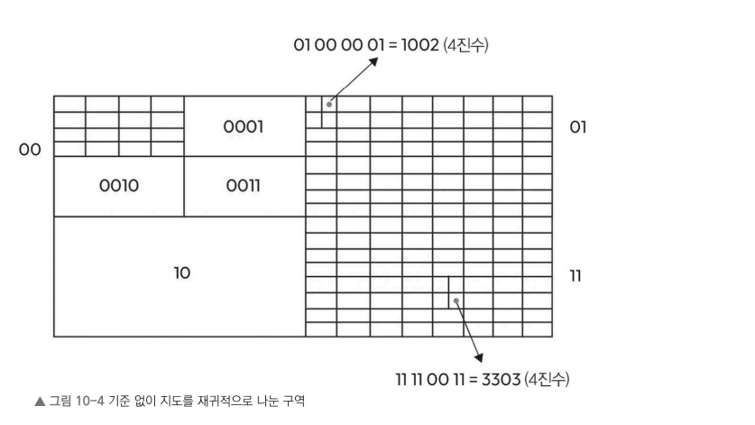

### 방법 3: 지오해시(Geohash) 이용하기

**지오해시(Geohash)** 는 **위도(Latitude)** 와 **경도(Longitude)** 를 하나의 짧은 문자열로 변환하는 방식

이를 통해 위치 정보를 효율적으로 저장하고, 가까운 위치를 빠르게 검색할 수 있다.


### 1. 지도를 일정한 크기의 사각형으로 분할

먼저 지도를 하나의 큰 사각형으로 생각합니다.

```text
+---------+
|         |
|   지도   |
|         |
+---------+
```

---

### 2. 사각형을 4개의 영역으로 분할

지도를 4개의 동일한 크기의 사각형으로 나눕니다.

```text
+-----+-----+
| 00  | 01  |
+-----+-----+
| 10  | 11  |
+-----+-----+
```

각 영역에는 고유한 라벨을 부여합니다.

---

### 3. 재귀적으로 계속 분할

각 사각형을 다시 4개의 사각형으로 나눕니다.

예를 들어 `00` 영역을 다시 분할하면

```text
00
│
├──0000
├──0001
├──0010
└──0011
```

기존 라벨 뒤에 새로운 라벨을 붙여 계속 위치를 표현합니다.


이 과정을 반복하면 위치를 매우 정밀하게 표현할 수 있습니다.


### 쿼드 트리와의 차이점

| 쿼드 트리(QuadTree) | 지오해시(Geohash) |
|--------------------|------------------|
| 음식점 수 등 특정 기준을 넘으면 분할 | 기준 없이 모든 영역을 동일하게 분할 |
| 데이터 분포에 따라 분할 깊이가 달라짐 | 항상 일정한 방식으로 분할 |


- **쿼드 트리**는 데이터 양에 따라 분할
- **지오해시**는 규칙적으로 동일하게 분할

---

다음 그림은 지도를 재귀적으로 더 작은 직사각형 영역으로 나누는 과정




### 분할 예시

지도의 전체 크기를

```text
40,000km × 20,000km
```

라고 가정할시 이를 **16단계(Level)** 까지 분할하면, 각 영역의 크기는 약

```text
0.6km × 0.3km
```

즉, 하나의 작은 영역이 하나의 위치를 의미하게 된다.

---

### 지오해시 표현 방식

분할된 각 영역은 고유한 **레이블(Label)** 을 갖는다.

레이블은 일반적으로 다음 두 가지 방식으로 표현

- 4진수(Base-4)
- 32진수(Base-32)

---

### 4진수 예시

예를 들어 어떤 위치가 다음과 같이 표현되었다고 가정

```text
0231 0101 0131 0131
```

이는 위치를 나타내는 **16자리 4진수**입니다.

---

### 왜 32진수로 변환할까?

4진수는 길이가 길어 사람이 사용하기 불편하여 이를 **32진수(Base-32)** 로 변환하여 더 짧은 문자열로 표현한다

---

### Geohash에서 사용하는 Base32 문자

일반적인 Base32와 달리, 비슷하게 보이는 문자는 제외

제외되는 문자

- `a`
- `i`
- `l`
- `o`

사용되는 문자

```text
0 1 2 3 4 5 6 7 8 9
b c d e f g h
j k m n p q r s t
u v w x y z
```

---

### 변환 예시

4진수

```text
0231 0101 0131 0131
```

↓

10진수 변환

```text
121610608
```

↓

32진수 변환 과정

```text
121610608 ÷ 32 = 3794087 ... 24
3794087  ÷ 32 = 118565  ... 7
118565   ÷ 32 = 3705    ... 25
3705     ÷ 32 = 115     ... 25
115      ÷ 32 = 3       ... 19
3        ÷ 32 = 0       ... 3
```

↓

Base32 문자로 변환

```text
2mtt653
```
위처럼 **긴 4진수 표현을 짧은 문자열**로 변환할 수 있다.


#### 서울시 좌표로 보는 Geohash 예시

서울시의 좌표는 다음과 같습니다.

```text
위도(Latitude)  : 37.5642135°
경도(Longitude): 127.0016985°
```

이 좌표를 **Geohash(Base32)** 로 변환하면 다음과 같은 문자열이 생성됩니다.

```text
wydm9yrg6
```

---

### Geohash 정밀도(Precision)

Geohash는 **문자 수가 길어질수록 더 작은 영역을 표현**


#### 정밀도별 영역 크기

| Geohash 길이 | 표현 범위 | 예시 |
|--------------|-----------|------|
| 1자리 | 약 **5,000km × 5,000km** | 대륙 |
| 2자리 | 약 **1,250km × 1,250km** | 국가 |
| 3자리 | 약 **156km × 156km** | 도시 |
| 4자리 | 약 **40km × 40km** | 구·도심 |
| 5자리 | 약 **4.8km × 4.8km** | 동네 |
| 6자리 | 약 **1.2km × 1.2km** | 거리 |
| 7~9자리 | 수백 m ~ 수십 m | 건물 수준 |


---

# 서울시 예시

서울시 좌표

```text
37.5642135
127.0016985
```

↓

Geohash

```text
wydm9yrg6
```

앞에서부터 몇 글자만 사용할 수도 있습니다.

| Geohash | 의미 |
|----------|------|
| `w` | 매우 넓은 지역 |
| `wy` | 국가 수준 |
| `wyd` | 서울 및 인근 도시 |
| `wydm` | 서울 도심 |
| `wydm9` | 서울 특정 구 |
| `wydm9yrg6` | 거의 건물 수준 |

---

#### Geohash를 데이터베이스에 저장하기

예를 들어 음식점의 위치를 Geohash로 저장한다고 가정해 보겠습니다.

| Geohash | 음식점 ID 목록 |
|----------|----------------|
| `wydm9yrg` | {3, 7, 97, 89, 234, ...} |
| `wydm9yrg6` | {1, 4, 73, 91, 212, ...} |
| `wydm9yrg6h` | {9, 13, 92, 893, 422, ...} |

---

## SQL 조회 예시

```sql
SELECT restaurant_ids
FROM restaurant_geohash
WHERE geohash LIKE 'wydm9yrg%';
```

Geohash를 사용하지 않으면 위도(latitude)와 경도(longitude)를 직접계산해야한

```sql
SELECT id
FROM restaurant
WHERE latitude BETWEEN 37.5600 AND 37.5680
AND longitude BETWEEN 126.9980 AND 127.0060;
```


