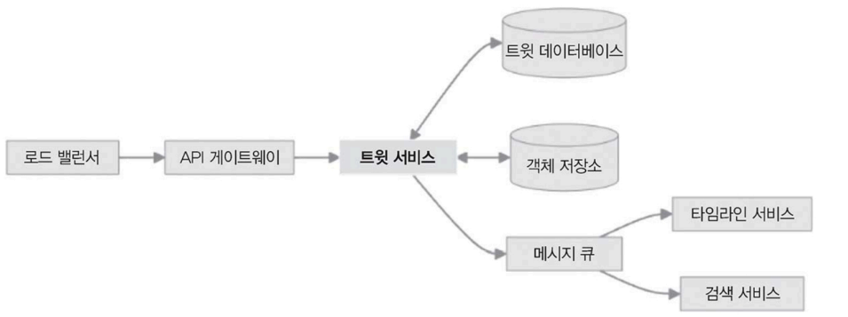
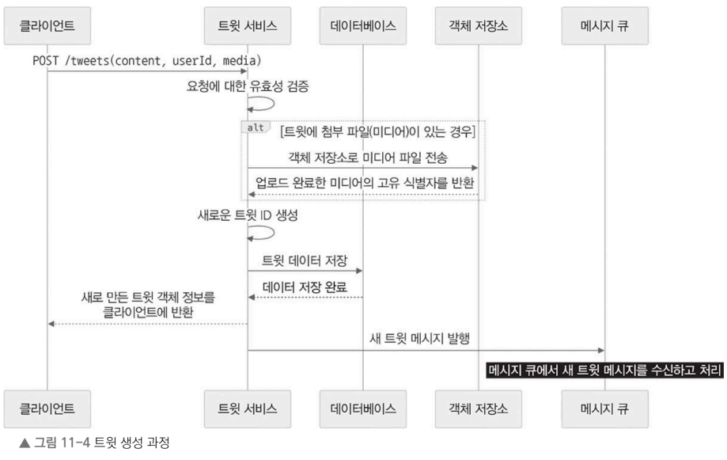

# 11.6 트윗 서비스 설계

트윗 서비스는 트윗 생성, 조회, 삭제를 처리하며, 트윗 관련 핵심 기능 관리 

### 트윗 서비스 내부 

- 트윗 서비스의 고수준 아키텍처
  - 
  - 로드 밸런서를 통해 API 게이트웨이를 거쳐 트윗 서비스로 요청이 전달되는 흐름
    - 트윗 서비스: 트윗 데이터베이스 테이블, 객체 저장소, 메시지 큐와 상호 작용하여 타임라인 서비스와 검색 서비스를 뒷받침. 

### 외부와의 통신을 위한 각 서비스가 제공하는 API 엔드포인트
- POST /tweets: 새로운 트윗 생성 
  - 요청 본문: 트윗 내용, 사용자 ID, 미디어 첨부 파일(옵셔널)
  - 응답: 새로 생성한 트윗 객체(트윗 ID와 타임스탬프 포함)
- GET /tweets/{tweetId}: 특정 트윗 조회(ID 기반)
  - 응답: 트윗 객체(트윗 내용, 사용자 정보, 타임스탬프, 좋아요와 리트윗 같은 활성 지표 포함)
- DELETE /tweets/{tweetId}: 트윗 삭제(ID 기반)
  - 요청: 사용자 인증 토큰(토큰 작성자만 삭제할 수 있도록)
  - 응답: 성공 또는 오류 메시지
- GET /users/{userId}/tweets: 특정 사용자가 작성한 트윗 조회
  - 요청: 사용자 ID, 페이지 매개변수(옵셔널)
  - 응답: 사용자가 작성한 트윗 목록

## 11.6.1 데이터 저장소

트윗 서비스에서 사용하는 데이터 모델과 저장소 구조를 살펴보자.

- 트윗 서비스는 데이터베이스와 객체 저장소를 조합하여 트윗 데이터를 저장
  - 데이터베이스(아파치 카산드라, 아마존 DynamoDB 등)
    - 트윗 ID(tweetId), 사용자 ID(userId), 트윗 내용(content), 타임스탬프(timestamp) 같은 내용을 하나의 데이터에 담아 관계형 데이터베이스에 저장
    - 데이터가 각 노드에 고르게 분산되도록 파티션 키는 트윗 ID로 설정
    - 시간 순서대로 트윗을 효율적으로 조회하려고 클러스터링 키로 타임스탬프를 사용
- 객체 저장소(아마존 S3 등)
  - 트윗에 첨부된 이미지나 동영상 등 미디어 파일은 객체 저장소에 개별 파일로 저장. 
    - 각 파일에는 고유한 식별자를 부여하고, 데이터베이스의 트윗 정보에는 해당 미디어 파일의 고유 식별자를 참조로 포함.

## 11.6.2 트윗 생성 과정

트윗 생성과 조회가 어떤 흐름으로 처리되는지 살펴보자.

- 트윗 생성 과정 - 데이터와 API 호출
  - 
  - 사용자가 애플리케이션으로 새 트윗을 만들면 서비스 내에서는 다음 절차를 따라 트윗을 처리.
    1. 클라이언트는 트윗 내용(content), 사용자 ID(userId), 미디어 파일(옵셔널)을 포함하여 POST /tweets 엔드포인트로 요청
    2. 클라이언트가 보낸 요청이 트윗 서비스에 도달시 유효성 검사 수행. 
       - 트윗 길이에 대한 검증이나 사용자 인증 같은 필수 유효성 검사
    3. 트윗에 미디어 파일이 포함되면 해당 파일을 객체 저장소에 업로드하고 고유 식별자를 만들어 가져옴
    4. 이후 기본 키로 사용할 트윗 ID를 만들어 트윗 데이터(트윗 내용, 사용자 ID, 타임스탬프, 미디어 참조)와 같이 데이터베이스에 저장
    5. 새롭게 만든 트윗 객체를 클라이언트에 응답 값으로 반환
    6. 5.에서 만든 트윗 객체의 메시지를 트윗 ID를 포함하여 아파치 카프카 같은 메시지 큐에 전달(발행)하면 타임라인 서비스나 검색 서비스가 받아 메시지 처리