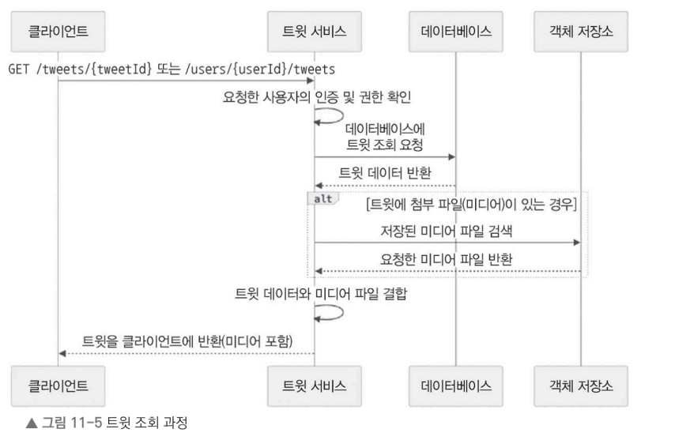

# 11.6.3 트윗 조회 과정


사용자가 특정 트윗이나 자신의 타임라인을 조회하면 다음 순서로 처리된다.


### 트윗 조회 흐름

#### 1. 조회 요청

```http
GET /tweets/{tweetId} 또는 GET /users/{userId}/tweets
```


#### 2. 인증 및 권한 확인
요청한 사용자가 해당 트윗을 조회할 수 있는지 확인


#### 3. 트윗 조회

트윗 ID 또는 사용자 ID를 이용하여 DB에서 트윗을 조회


#### 4. 미디어 조회

데이터베이스가 반환한 트윗에 미디어 파일이 포함되어 있다면 객체 저장소에서 해당 파일을 가져온다

#### 5. 응답 반환

트윗 정보와 미디어를 합쳐 클라이언트에 반환

규모가 큰 사용자와 서비스를 대상으로 하는 시스템에서는 성능이 매우 중요하다  캐싱 레이어를 추가하여 성능을 높이는 방법은 그중 하나라서 다음 절에서는 캐싱을 자세히 살펴본다.

## 11.6.4 캐싱(Cache)

트윗 조회 성능을 높이기 위해 **Redis**와 같은 캐싱 시스템을 사용한다.

인기 트윗이나 자주 조회되는 트윗을 캐시에 미리 저장해 두고, 사용자가 트윗을 요청하면 먼저 캐시를 조회한다. 캐시에 데이터가 존재하면 데이터베이스를 조회하지 않고 바로 응답을 반환한다.

반대로 캐시에 데이터가 없으면(Cache Miss) 데이터베이스에서 트윗을 조회한 뒤, 조회한 데이터를 캐시에 저장하고 사용자에게 응답한다. 이후 동일한 요청이 들어오면 캐시에서 바로 조회하므로 응답 속도를 높이고 데이터베이스의 부하를 줄일 수 있다.

---

### 캐싱 전략

#### 1. 시간 기반 슬라이딩 윈도우 캐싱

- 최근 일정 시간(예: 24시간) 이내에 작성된 트윗을 캐시에 유지한다.
- 새로운 트윗이 생성되면 캐시에 추가한다.
- 지정한 시간이 지나면 캐시에서 제거한다.
- 항상 최신 트윗을 빠르게 조회할 수 있도록 관리하는 방식이다.

---

#### 2. 인기도 기반 캐싱

- 좋아요, 리트윗, 댓글 등의 반응을 이용해 트윗 점수를 계산한다.
- 점수가 일정 기준 이상인 인기 트윗만 캐시에 저장한다.
- 일정 주기마다 점수를 다시 계산하여 캐시를 갱신한다.

---

#### 3. 하이브리드 캐싱

시간 기반과 인기도 기반 전략을 함께 사용하는 방식이다.

- 최근 몇 시간(예: 2시간) 이내에 작성된 트윗은 인기도와 관계없이 모두 캐시에 저장한다.
- 일정 시간이 지난 트윗은 인기도 기준을 만족하는 경우에만 캐시에 유지한다.

최신성과 인기도를 모두 고려할 수 있는 방식이다.

---

####4. 예측 기반 캐싱

머신러닝 모델을 이용해 앞으로 인기를 얻을 가능성이 높은 트윗을 예측한다.

예측 결과를 기반으로 인기 있을 것으로 예상되는 트윗을 미리 캐시에 저장하여 조회 성능을 높인다.

---

#### 5. 사용자 기반 캐싱

팔로워가 많거나 공식 인증된 사용자의 최신 트윗을 우선적으로 캐시에 저장한다.

영향력이 큰 사용자의 게시물은 조회 가능성이 높기 때문에 캐시에 유지하는 것이 효율적이다.

---

### 캐시 제거(Eviction) 전략

캐시의 용량은 한정되어 있기 때문에 어떤 데이터를 제거할지 결정하는 정책이 필요하다.


### LRU (Least Recently Used)

가장 오랫동안 사용되지 않은 데이터를 먼저 삭제한다.

현재 자주 조회되는 데이터를 캐시에 오래 유지할 수 있어 일반적으로 많이 사용하는 전략이다.

---

### TTL (Time To Live)

캐시에 저장되는 데이터마다 만료 시간을 설정한다.

만료 시간이 지나면 자동으로 캐시에서 삭제된다.

일반 트윗은 짧은 TTL을 설정하고, 인기 트윗은 더 긴 TTL을 설정하여 효율적으로 관리할 수 있다.

---

### LFU (Least Frequently Used)

캐시에 저장된 데이터의 조회 횟수를 기록한다.

캐시 공간이 부족하면 조회 횟수가 가장 적은 데이터를 먼저 삭제한다.

필요에 따라 오래된 조회 기록의 가중치를 낮추어 최근 인기도를 더 잘 반영할 수도 있다.

---

### 크기 기반 삭제

캐시의 최대 용량(예: 10GB)을 미리 정해 둔다.

캐시가 최대 용량에 도달하면 LRU나 LFU 같은 정책과 함께 사용하여 삭제 대상을 결정한다.

---

### 우선순위 기반 삭제

트윗마다 우선순위를 부여한 후 우선순위가 낮은 데이터부터 삭제한다.

우선순위는 다음과 같은 요소를 이용해 결정할 수 있다.

- 사용자 영향력
- 좋아요 수
- 리트윗 수
- 작성 시간

---

### 캐시 운영 전략

### Hot / Warm / Cold Cache

캐시를 여러 계층으로 나누어 관리할 수 있다.

- **Hot Cache** : 매우 자주 조회되는 트윗
- **Warm Cache** : 일정 수준으로 조회되는 트윗
- **Cold Cache** : 거의 조회되지 않는 트윗

조회 빈도에 따라 서로 다른 저장 공간과 정책을 적용하여 효율을 높일 수 있다.

---

### Cache Warming

시스템이 재시작되면 캐시가 비어 있어 초기 응답 속도가 느려질 수 있다.

이를 방지하기 위해 자주 조회되는 데이터를 미리 캐시에 적재하는 기법을 **Cache Warming**이라고 한다.

---

### Cache Versioning

트윗이 수정되거나 삭제되면 캐시에 남아 있는 이전 데이터를 제거해야 한다.

이를 위해 캐시 버전 관리(Cache Versioning)나 버전 번호를 사용하여 오래된 캐시를 무효화한다.

---

### 데이터 유형별 캐시 분리

트윗, 사용자 프로필, 타임라인 등 데이터 특성이 다르므로 각각 별도의 캐시를 운영할 수 있다.

데이터 유형에 맞는 캐싱 전략을 적용하면 전체 성능을 더욱 향상시킬 수 있다.

---

### 캐시 모니터링

캐시 적중률(Cache Hit Rate), 조회 패턴 등을 지속적으로 모니터링한다.

수집한 데이터를 기반으로 캐싱 전략과 삭제 정책을 지속적으로 개선한다.

다음 절에서는 트윗 서비스와 함께 작동하며, 플랫폼의 핵심 기능을 담당하는 사용자 서비스, 타임라인 서비스, 검색 서비스를 설계해보자잇~