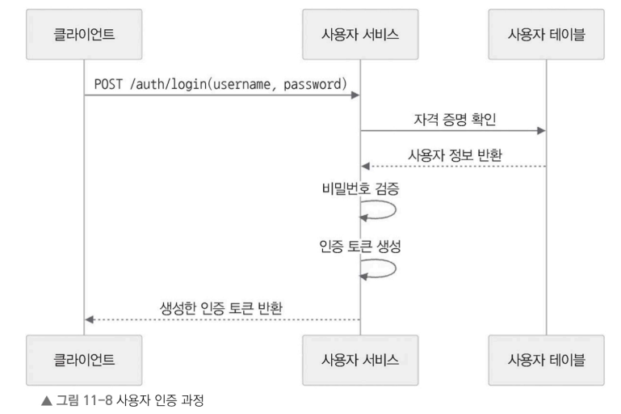
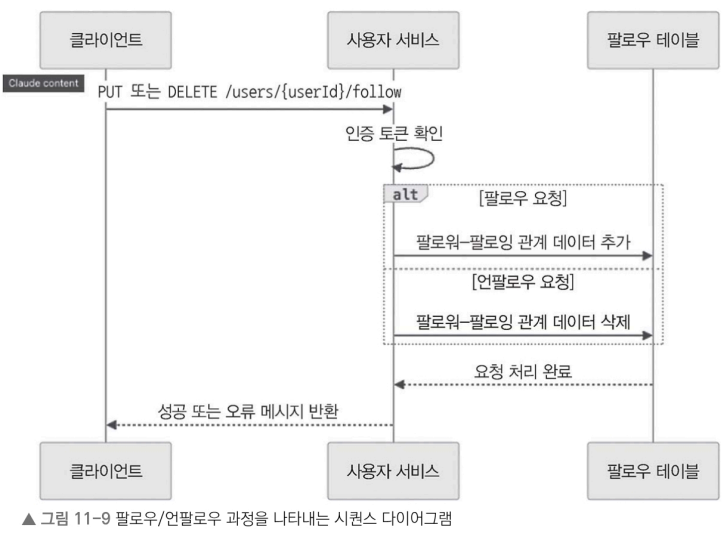
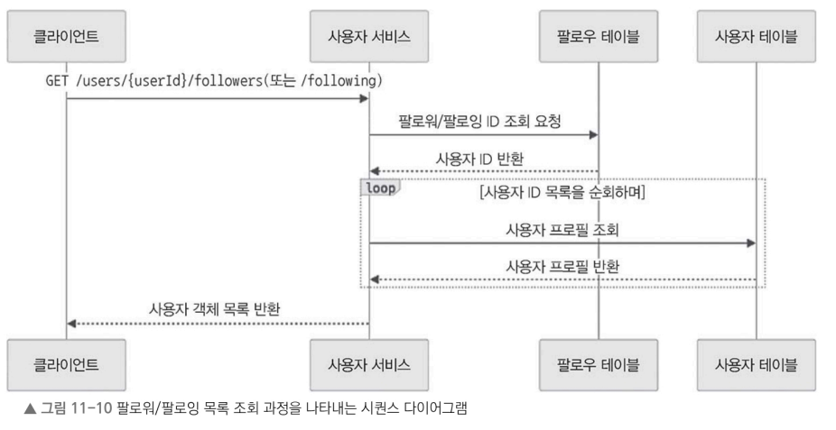

## 11.7.3 사용자 인증(로그인) 과정

(=자격 증명 확인과 토큰 생성 과정)

1. 사용자 인증: POST /auth/login 엔드포인트로 요청
   - 사용자 이름과 비밀번호 등 자격 증명이 요청에 포함
2. 유효성 확인: 사용자 테이블에 저장된 정보와 자격 증명을 대조
3. 자격 증명이 올바르다면 서비스는 사용자 ID와 관련된 정보를 담은 인증 토큰(에 JWT) 생성
4. 새롭게 생성한 인증 토큰 클라이언트에 반환 
   - 클라이언트는 이후의 요청에서 이 토큰을 포함하여 사용자 인증 및 권한 확인을 진행

## 11.7.4 팔로우/언팔로우 과정

1. 팔로우/언팔로우 요청: POST 또는 DELETE /users/{userId}/follow  요청
   - 사용자 인증 토큰과 대상 사용자 ID를 요청에 포함
2. 인증 토큰으로 사용자 유효성 확인
3. DB 업데이트
   - 팔로우 요청 - 팔로우 테이블에 팔로워 사용자 ID와 팔로우 대상 사용자 ID를 포함하는 항목 추가
   - 언팔로우 요청 - 해당 팔로우 관계에 해당 항목 팔로우 테이블에서 제거
5. 클라이언트에 성공 또는 오류 메시지를 반환

## 11.7.5 팔로워/팔로잉 목록 조회 과정

1. 목록 조회 요청: GET /users/{userId}/followers 또는 /users/{userId}/following 요청
2. 사용자의 팔로워 또는 팔로잉 사용자 ID 목록을 팔로우 테이블에서 조회
3. 각 사용자의 프로필 정보를 사용자 테이블에서 조회
4. 팔로워 또는 팔로잉 사용자를 나타내는 사용자 객체 목록 반환

사용자 서비스는 사용자 생성, 인증, 팔로우/언팔로우, 팔로워·팔로잉 조회 기능을 데이터베이스와 캐시를 기반으로 효율적으로 처리하여, 안정적인 사용자 경험과 원활한 소셜 네트워킹 서비스를 제공하는 방법을 알아보았다.

다음 절에서는 타임라인 서비스 설계를 자세히 다룰 예정입니다. 타임라인 서비스는 사용자가 팔로우하는 계정의 트윗을 기반으로 타임라인을 생성하고 제공하는 역할을 맡습니다.