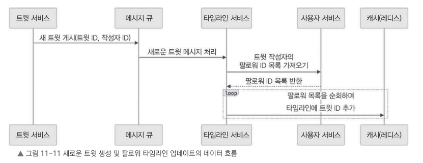
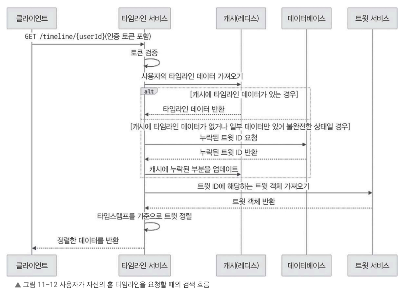
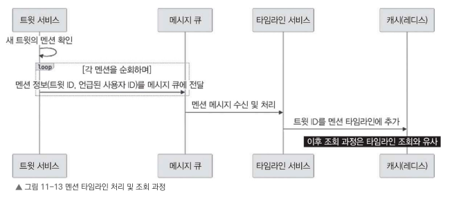

## 11.8 타임라인 서비스 세부 설계

타임라인 서비스는 X와 같은 SNS에서 사용자의 홈 타임라인을 생성하고 제공하는 역할을 담당한다.

사용자가 팔로우하는 계정의 트윗을 모아 시간순으로 정렬하여 보여준다.

트윗 서비스는 새로운 트윗이 생성되면 메시지 큐(Kafka)를 통해 타임라인 서비스에 이를 전달하고, 타임라인 서비스는 이를 이용해 각 사용자의 타임라인을 갱신한다.

---

### 홈 타임라인 조회

```http
GET /timeline/{userId}
```

#### 요청: 사용자 인증 토큰

#### 응답: 사용자의 홈 타임라인(트윗 객체 목록)

---

### 멘션 타임라인 조회

```http
GET /timeline/{userId}/mentions
```

#### 요청: 사용자 인증 토큰

#### 응답: 해당 사용자가 멘션된 트윗 목록


## 11.8.1 데이터 흐름

새로운 트윗이 생성되는 과정



### 처리 과정

#### 1. 새 트윗 생성

트윗 서비스는 트윗 ID와 작성자 ID를 포함한 메시지를 Kafka와 같은 메시지 큐에 발행한다.

#### 2. 메시지 처리

타임라인 서비스는 메시지 큐에서 새 트윗 이벤트를 수신한다.


#### 3. 팔로워 조회

사용자 서비스에 작성자의 팔로워 목록을 요청한다.


#### 4. 타임라인 갱신

조회한 팔로워를 순회하면서 각 사용자의 타임라인에 새 트윗 ID를 추가한다.

타임라인 데이터는 Redis와 같은 캐시에 저장한다.


#### 5. 데이터 유지

사용자별 타임라인은 최근 일정 시간 또는 최대 개수만 유지하도록 관리한다.

오래된 트윗 ID는 제거하여 캐시 크기를 제한한다.


## 11.8.2 타임라인 조회 과정

사용자가 홈 타임라인을 요청하면 캐시를 우선 조회하고, 필요한 경우 데이터베이스와 트윗 서비스를 이용하여 데이터를 보완한다.




### 처리 과정

#### 1. 조회 요청

클라이언트는 인증 토큰과 함께 홈 타임라인 조회를 요청한다.

```http
GET /timeline/{userId}
```


#### 2. 인증 확인

타임라인 서비스는 인증 토큰을 검증하여 요청한 사용자가 유효한지 확인한다.


#### 3. 캐시 조회

Redis에서 해당 사용자의 타임라인 데이터를 조회한다.


#### 4. 캐시 보완

캐시에 데이터가 없거나 일부 데이터만 존재하는 경우 데이터베이스에서 누락된 트윗 ID를 조회한다.

조회한 데이터는 다시 캐시에 업데이트한다.


#### 5. 트윗 조회

트윗 ID 목록을 이용하여 트윗 서비스에서 실제 트윗 객체를 조회한다.


#### 6. 정렬

조회한 트윗을 작성 시간(Timestamp) 기준으로 최신순 정렬한다.


#### 7. 응답

정렬된 트윗 목록을 사용자에게 반환한다.


### 멘션 타임라인

멘션 타임라인은 홈 타임라인과 비슷하지만 데이터 생성 방식이 다르다.

트윗에 사용자가 멘션되었을 때만 해당 사용자의 멘션 타임라인을 갱신한다.





### 처리 과정

#### 1. 멘션 확인

새로운 트윗이 생성되면 트윗 서비스는 멘션(@username)이 포함되어 있는지 확인한다.

#### 2. 이벤트 발행

멘션된 사용자마다

- 트윗 ID
- 멘션된 사용자 ID를 포함한 메시지를 메시지 큐에 발행한다.


#### 3. 멘션 타임라인 갱신

타임라인 서비스는 메시지를 받아 멘션된 사용자의 멘션 타임라인에 트윗 ID를 추가한다.


#### 4. 조회

멘션 타임라인 조회 방식은 홈 타임라인 조회와 동일하지만, 홈 타임라인 대신 멘션 타임라인 데이터를 사용한다.


### 11.8.3 푸시 기반 업데이트

타임라인을 실시간으로 갱신하기 위해 푸시(Push) 방식을 사용할 수 있다.

새로운 트윗이 작성되면 타임라인 서비스는 **WebSocket**을 이용하여 관련 사용자에게 즉시 알림을 전송한다.

클라이언트는 알림을 수신하면 서버를 다시 조회하지 않고도 새로운 트윗을 화면에 즉시 반영할 수 있다.

캐싱과 푸시 방식 업데이트를 활용하여 실시간으로 빠르게 반응하는 사용자
경험을 제공하고 트윗 서비스, 사용자 서비스, 메시지 큐와 연동하여 데이터의 일관성과 확장성을 확보한다

다음으로 검색 서비스가 어떻게 키워드를 포함한 여러 조건을 바탕으로 트윗과 사용자 프로필을 검색할수 있는지 살펴보자잇