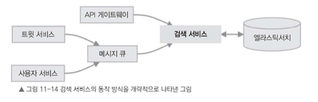
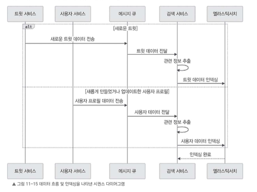

# 11.9 검색 서비스 세부 설계

검색 서비스는 X 서비스에서 키워드, 해시태그, 기타 조건을 바탕으로 트윗과 사용자 프로필을 찾을 수 있는 기능을 담당한다.

이 서비스는 사용자가 관련 콘텐츠를 쉽게 찾을 수 있도록 강력하고 효율적인 검색 기능을 제공해야 한다.

새로운 트윗이 작성되면 트윗 서비스는 해당 트윗을 메시지 큐에 전달한다.  
검색 서비스는 메시지 큐에서 데이터를 받아 엘라스틱서치에 인덱싱한다.



검색 서비스는 대략 다음 구성 요소와 상호작용한다.

- **트윗 서비스**
    - 새로운 트윗 데이터를 메시지 큐로 전달한다.

- **사용자 서비스**
    - 사용자 프로필 데이터 변경 사항을 메시지 큐로 전달한다.

- **메시지 큐**
    - 트윗 서비스와 사용자 서비스에서 발생한 이벤트를 검색 서비스로 전달한다.

- **검색 서비스**
    - 메시지 큐에서 데이터를 받아 검색에 필요한 정보를 추출한다.
    - 데이터를 엘라스틱서치에 인덱싱한다.

- **엘라스틱서치**
    - 트윗과 사용자 데이터를 검색 가능한 형태로 저장한다.
    - 키워드, 해시태그, 사용자 정보 기반 검색을 처리한다.

---

## 검색 API

검색 서비스는 다음과 같은 API가 필요하다.

### 트윗 검색 API

```http
GET /search/tweets?q={query}&limit={limit}&offset={offset}
````

주어진 검색어 `query`를 기반으로 트윗을 검색한다.

- **요청**

    - 검색어와 함께 `limit`, `offset`을 매개변수로 전달한다.

- **응답**

    - 검색어와 일치하는 트윗 객체 목록을 반환한다.


---

### 사용자 검색 API

```http
GET /search/users?q={query}&limit={limit}&offset={offset}
```

주어진 검색어 `query`를 기반으로 사용자 프로필을 검색한다.

- **요청**

    - 검색어와 함께 `limit`, `offset`을 매개변수로 전달한다.

- **응답**

    - 검색어와 일치하는 사용자 목록을 반환한다.


---

# 11.9.1 데이터 흐름과 인덱싱

검색 서비스는 엘라스틱서치 같은 검색 엔진을 활용하여 트윗과 사용자 데이터를 효율적으로 검색한다.

검색을 빠르게 처리하려면 데이터가 생성되거나 변경될 때 검색 엔진에 인덱싱해 두어야 한다.



데이터 흐름은 다음과 같다.

1. 사용자가 새로운 트윗을 작성하면 트윗 서비스가 트윗 데이터를 검색 서비스로 보낸다.

2. 검색 서비스는 트윗에서 필요한 정보를 추출한다.

    - 텍스트

    - 해시태그

    - 멘션

    - 사용자 정보

3. 추출한 데이터를 엘라스틱서치에 등록하여 인덱싱한다.

    - 각 단어와 트윗 ID를 연결하는 역색인(inverted index)을 생성한다.

4. 사용자가 새로 등록되거나 프로필 정보가 변경되면 사용자 서비스가 해당 사용자 데이터를 검색 서비스로 전달한다.

5. 검색 서비스는 사용자 이름, 소개, 위치 정보 등 중요한 데이터를 추출하여 엘라스틱서치에 저장한다.

    - 이후 이 데이터를 기반으로 사용자 검색 기능을 제공한다.


---

## 역색인

엘라스틱서치는 검색을 빠르게 수행하기 위해 역색인을 사용한다.

일반적인 데이터 저장 방식은 문서 ID를 기준으로 내용을 찾는다.

```text
tweet_id → tweet_text
```

반면 역색인은 단어를 기준으로 해당 단어가 포함된 문서를 찾는다.

```text
"java" → tweet_1, tweet_5, tweet_10
"spring" → tweet_3, tweet_5
```

이렇게 하면 검색어가 들어왔을 때 전체 트윗을 하나씩 검사하지 않고, 해당 단어가 포함된 트윗 목록을 빠르게 찾을 수 있다.

---

# 11.9.2 검색 쿼리 처리 과정

검색 요청은 클라이언트에서 시작해 API 게이트웨이, 검색 서비스, 엘라스틱서치를 거쳐 처리된다.

[그림 11-16 검색 쿼리가 처리되는 과정을 나타낸 시퀀스 다이어그램]

사용자가 검색 요청을 하면 다음 과정을 거친다.

1. 클라이언트가 `/search/tweets` 또는 `/search/users` 엔드포인트로 `GET` 요청을 보낸다.

    - 이때 검색 쿼리와 페이지네이션에 필요한 매개변수를 함께 전달한다.

2. 검색 서비스는 요청을 받아 검색 쿼리를 분석한다.

3. 분석한 쿼리를 엘라스틱서치에서 사용할 수 있는 쿼리로 변환한다.

    - 필요한 경우 쿼리 범위와 필터를 적용한다.

4. 변환된 쿼리를 엘라스틱서치에 보낸다.

    - 엘라스틱서치는 인덱싱된 데이터를 기준으로 검색 작업을 수행한다.

5. 엘라스틱서치는 검색 조건에 맞는 트윗이나 사용자 데이터를 찾아 반환한다.

6. 검색 서비스는 반환된 데이터에 대해 필요한 후처리를 수행한다.

    - 필터링

    - 정렬

    - 페이지네이션

7. 최종 결과를 클라이언트에 반환한다.


---

# 11.9.3 관련 점수와 순위 매기기

검색 서비스에서는 검색 결과의 관련성을 평가하고, 그 점수를 기준으로 결과 순위를 매긴다.

검색어와 문서 간의 관련성을 점수로 계산하려면 다음 요소를 활용할 수 있다.

- **단어의 등장 빈도(Term Frequency, TF)**

    - 검색어가 문서 안에서 얼마나 자주 등장하는지를 나타낸다.

    - 특정 단어가 문서에 자주 등장할수록 해당 문서와 검색어의 관련성이 높다고 볼 수 있다.

- **문서 내 중요도**

    - 검색어가 제목, 본문, 해시태그, 사용자 이름 등 어디에 등장했는지에 따라 중요도가 달라질 수 있다.

- **인기도 점수**

    - 좋아요 수, 리트윗 수, 댓글 수 같은 사용자 반응을 활용할 수 있다.

- **시간 정보**

    - 최근에 작성된 트윗을 더 높은 순위로 보여줄 수 있다.

- **개인화 요소**

    - 사용자가 팔로우한 계정, 관심사, 이전 검색 기록 등을 바탕으로 검색 결과를 조정할 수 있다.


이런 요소를 조합해 검색 결과가 사용자에게 표시되는 순서를 결정한다.

필요하다면 점수 계산 방식을 조정하거나 특정 필드를 강조하여 더 적합한 결과를 보여줄 수도 있다.

---

# 검색 서비스 정리

검색 서비스는 다음 흐름으로 동작한다.

1. 트윗 서비스와 사용자 서비스가 변경 데이터를 메시지 큐로 전달한다.

2. 검색 서비스는 메시지 큐에서 데이터를 읽는다.

3. 검색 서비스는 필요한 정보를 추출하고 엘라스틱서치에 인덱싱한다.

4. 사용자가 검색 요청을 보내면 검색 서비스가 쿼리를 분석한다.

5. 검색 서비스는 엘라스틱서치에 검색 쿼리를 전달한다.

6. 엘라스틱서치는 인덱싱된 데이터를 기준으로 결과를 반환한다.

7. 검색 서비스는 결과를 정렬, 필터링, 페이지네이션 처리한 후 클라이언트에 반환한다.


이 구조를 기반으로 검색 요청이 들어오면 엘라스틱서치를 활용해 데이터를 색인하고 검색한다.

검색 결과는 관련 점수와 순위 계산 로직을 이용해 정렬한다.  
또 캐싱을 활용하면 성능을 최적화할 수 있고, 트윗 서비스와 사용자 서비스와 연동하여 데이터 일관성을 유지하면서 실시간 검색 기능을 제공할 수 있다.

---

# 11.10 기타 고려 사항

X 서비스를 설계하고 구현할 때 추가적으로 고려해야 할 요소가 있다.

이런 요소들을 염두에 두면 시스템을 확장 가능하고 유지 보수하기 쉬우며, 비즈니스 요구 사항에 부합하도록 만들 수 있다.

---

## 인기 주제와 해시태그 관리

트렌드가 되는 주제와 해시태그를 추적하고 파악하면 이들을 인기도와 사용 빈도별로 분석할 수 있다.

실시간 인기 주제 분석을 위해 다음과 같은 도구를 사용할 수 있다.

- Apache Storm
- Apache Flink


이런 실시간 데이터 처리 도구를 활용하면 새롭게 들어오는 트윗 데이터를 실시간으로 분석하여 인기 주제를 빠르게 갱신할 수 있다.

분석 결과는 캐시나 데이터베이스에 저장하여 사용자가 인기 주제에 쉽게 접근할 수 있도록 구조를 만들 수 있다.

또 현재 인기 있는 주제와 관련된 트윗을 탐색할 수 있도록 API 엔드포인트를 추가하면 사용자에게 더 직관적인 검색 경험을 제공할 수 있다.

---

## 속도 제한과 트래픽 조절 구현

사용자 수백만 명을 지원하는 대규모 시스템에서는 시스템 남용을 방지하고 리소스를 효율적으로 관리하기 위해 속도 제한과 트래픽 조절 메커니즘이 필요하다.

이를 위해 각 API 엔드포인트의 예상 사용 패턴과 시스템 용량에 따라 적절한 속도 제한을 설정해야 한다.

예를 들면 다음과 같은 방식이 가능하다.

- 사용자별 요청 제한

- IP별 요청 제한

- API 엔드포인트별 요청 제한

- 특정 시간 내 요청 수 제한

- 비정상 요청 패턴 차단


또 토큰 버킷(token bucket) 같은 알고리즘을 활용하면 정해진 속도를 초과하는 요청을 제한하고, 트래픽을 효과적으로 제어할 수 있다.

이 방식은 공정한 리소스 분배뿐 아니라 시스템 성능을 보호하는 데도 크게 기여한다.

---

# 11.11 요약

이 장에서는 X 같은 서비스를 어떻게 설계할 수 있는지 살펴보았다.

서비스가 갖추어야 할 기능적 요구 사항과 비기능적 요구 사항, 데이터 모델링 방법, 확장성을 고려한 설계 방식, 주요 구성 요소를 하나씩 정리했다.

또 트윗 서비스, 타임라인 서비스, 사용자 서비스, 검색 서비스 같은 핵심 기능을 중심으로 전체 구조부터 세부적인 동작 방식까지 다루었다.

이런 방식으로 시스템을 만들면 수평적 확장, 데이터 분할, 분산 처리 방식을 활용하여 대규모 사용자와 많은 상호작용을 효율적으로 처리할 수 있다.

이 장에서는 확장성,안정성, 성능을 중점적으로 다루었다. 캐싱, 비동기 처리기술을 활용하여 응답속도를 개선하고 대규모 트래픽을 효율적으로 처리하는 방법을 살펴봤다

하지만 시스템 설계는 한 번으로 끝나는 것이 아니며, 사용자 요구 사항과 기술 발전에 맞추어 지속적으로 개선하고 유연하게 대응해야 한다.

여기에서 다룬 원칙과 방법을 기반으로 설계하면 사용자가 믿고 안정적으로 사용할 수 있는 시스템을 만들 수 있다.

