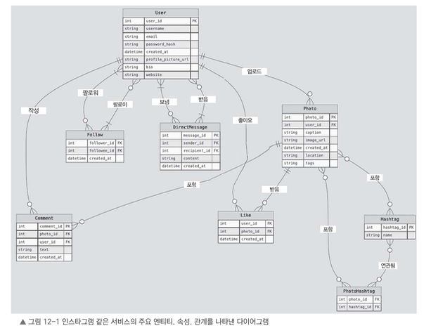

# 12.2 비기능적 요구 사항

기능적 요구 사항이 시스템이 무엇을 해야 하는지 정의한다면, 비기능적 요구 사항은 시스템이 어떻게 동작하고 어떤 성능을 보여야 하는지 정의한다.

인스타그램 같은 서비스는 다양한 환경에서 확장성, 가용성, 신뢰성을 유지해야 한다.  
이를 위해 주요 비기능적 요구 사항을 정리해 보자.

---

## 확장성

- 대규모 사용자와 사진 데이터를 감당할 수 있어야 한다.
    - 사용자 증가나 트래픽 급증에도 안정적으로 동작해야 한다.

- 서버를 추가하고 부하를 분산시켜 수평 확장이 가능해야 한다.
    - 특정 서버 한 대에 부하가 몰리지 않도록 설계해야 한다.

- 사진 업로드 서비스나 뉴스 피드 서비스 같은 개별 기능도 독립적으로 확장할 수 있어야 한다.
    - 예를 들어 사진 업로드 트래픽이 많아지면 업로드 서비스만 따로 확장할 수 있어야 한다.

---

## 성능

- 사용자가 사진을 업로드하거나 뉴스 피드를 불러오거나 다른 사용자와 상호작용할 때 빠르게 처리되어야 한다.

- 리소스 사용을 최적화하고 캐싱을 적극 활용해 백엔드 서비스의 부하를 줄여야 한다.

- 사진 압축, 썸네일 생성 같은 작업은 비동기 처리 방식으로 전환하여 응답 속도를 빠르게 유지해야 한다.
    - 업로드 요청 안에서 모든 처리를 동기적으로 끝내려 하면 응답 지연이 커질 수 있다.
    - 원본 저장 후 비동기 작업으로 썸네일 생성, 압축, 메타데이터 처리 등을 수행하는 방식이 적합하다.

---

## 가용성

- 사용자가 언제든지 사진을 보고 서비스를 이용할 수 있도록 시스템이 안정적으로 운영되어야 한다.

- 데이터 복제, 로드 밸런싱, 장애 허용성 같은 방식을 도입하여 중단 없이 서비스가 지속되도록 해야 한다.

- 정기적으로 데이터를 백업하고, 비상 상황에 대비한 복구 체계를 갖추어야 한다.
    - 데이터 손실을 방지하고 신뢰성 있는 복구가 가능해야 한다.

---

## 신뢰성

- 서비스는 데이터 무결성과 일관성을 유지하며 안정적으로 동작해야 한다.

- 오류가 발생했을 때 데이터를 손상시키거나 불일치가 생기지 않도록 처리하고 복구할 수 있는 메커니즘을 갖추어야 한다.

- 사용자 데이터, 좋아요, 댓글, 기타 상호작용의 정확성과 신뢰성을 유지하기 위해 적절한 트랜잭션 처리 방식과 데이터 일관성 모델을 선택해야 한다.

---

## 사용성

- 사용자가 콘텐츠를 더 쉽게 찾고 서비스를 적극적으로 활용할 수 있도록 검색, 필터, 추천 기능을 제공해야 한다.

---

# 정리

이러한 비기능정 요구사항을 충족하면, 인스타그램 같은 서비스를 만들 때 안정성, 확장성을 확보하면서 높은 성능으로 사용자에게 좋은 서비스 경험을 전할 수 있다.

---

# 12.3 데이터 모델 설계

데이터 모델은 인스타그램 같은 서비스를 만들 때 매우 중요한 부분이다.

데이터가 어떤 구조를 가지고 서로 어떻게 연결될지 정의하는 역할을 하기 때문이다.  
데이터 모델을 효율적으로 저장하고, 빠르게 조회하고, 필요한 작업을 매끄럽게 처리하려면 데이터 모델을 제대로 설계해야 한다.

특히 서비스가 사용자에게 제공해야 하는 다양한 기능을 뒷받침하려면 주요 엔티티와 관계를 명확하게 정의해야 한다.

---

## 주요 엔티티

인스타그램 같은 서비스에서 주요 엔티티는 다음과 같다.

- `User`
- `Photo`
- `Comment`
- `Like`
- `Follow`
- `Hashtag`
- `PhotoHashtag`
- `DirectMessage`

---

## User 엔티티

`User` 엔티티는 사용자 정보를 저장한다.

주요 속성은 다음과 같다.

- 사용자 이름
- 이메일
- 비밀번호 해시
- 프로필 사진
- 소개글
- 웹사이트 주소

각 사용자는 서비스 내에서 `user_id`를 기반으로 구분한다.

## Photo 엔티티

`Photo` 엔티티는 사용자가 업로드한 사진 정보를 저장한다.

주요 속성은 다음과 같다.

- 사진 정보
- 이미지 URL
- 설명
- 위치 정보
- 태그
- 생성 시간

각 사진은 `photo_id`로 관리된다.

---

## Comment 엔티티

`Comment` 엔티티는 사진에 달린 댓글 정보를 저장한다.

주요 속성은 다음과 같다.

- 댓글 내용
- 댓글을 작성한 사용자 ID
- 댓글이 달린 사진 ID
- 댓글 작성 시간

즉 댓글은 `user_id`와 `photo_id`를 통해 사용자와 사진에 연결된다.

---

## Like 엔티티

`Like` 엔티티는 사용자가 특정 사진에 좋아요를 누른 관계를 나타낸다.

주요 속성은 다음과 같다.

- 좋아요를 누른 사용자 ID
- 좋아요를 받은 사진 ID
- 생성 시간(created_at)

즉 `user_id`와 `photo_id`를 함께 저장하여 어떤 사용자가 어떤 사진에 좋아요를 눌렀는지 표현한다.

---

## Follow 엔티티

`Follow` 엔티티는 사용자 간 팔로우 관계를 나타낸다.

주요 속성은 다음과 같다.

- 팔로우를 한 사용자 ID (follower_id)
- 팔로우 대상 사용자 ID (followee_id)
- 관계가 만들어진 시간(created_at)

즉 `follower_id`와 `followee_id`를 통해 누가 누구를 팔로우하는지 저장한다.

---

## Hashtag 엔티티

`Hashtag` 엔티티는 사진에서 사용된 해시태그 정보를 저장한다.

주요 속성은 다음과 같다.

- 해시태그 ID
- 해시태그 이름

---

## PhotoHashtag 엔티티

`PhotoHashtag` 엔티티는 사진과 해시태그 사이의 관계를 나타낸다.

사진과 해시태그는 다대다 관계가 될 수 있다.

예를 들어 하나의 사진에는 여러 해시태그가 붙을 수 있고, 하나의 해시태그는 여러 사진에 연결될 수 있다.

따라서 `photo_id`와 `hashtag_id`를 함께 저장하여 특정 사진에 어떤 해시태그가 연결되어 있는지 표현한다.

---

## DirectMessage 엔티티

`DirectMessage` 엔티티는 사용자 간의 비공개 대화를 저장한다.

주요 속성은 다음과 같다.

- 메시지 ID
- 보낸 사람 ID
- 받는 사람 ID
- 메시지 내용
- 메시지 작성 시간

즉 `message_id`, `sender_id`, `recipient_id`, `created_at` 등을 통해 메시지 정보를 관리한다.

---

# ERD

이 다이어그램은 인스타그램 같은 서비스에서 다양한 엔티티 간의 복잡한 관계를 보여준다.

사용자와 사진, 댓글, 좋아요, 팔로우, 해시태그, 다이렉트 메시지가 어떻게 상호작용하는지 시각적으로 표현한다.

---

# 데이터 모델 정리

이 데이터 모델을 기반으로 인스타그램 같은 서비스에서 다음 기능을 효율적으로 지원할 수 있다.

- 사용자 관리
- 사진 업로드
- 댓글 작성
- 좋아요
- 팔로우 관계
- 해시태그 검색
- 다이렉트 메시지

이런 설계 덕분에 서비스가 성장하더라도 사용자 경험을 유지하면서 많은 사용자가 동시에 사용할 수 있는 환경을 구성할 수 있다.

데이터 모델 설계는 사용자 규모를 기준으로 저장 용량, 대역폭, 처리 성능에 필요한 자원을 계산하는 데도 중요하다.

이제 다음으로 인스타그램 같은 서비스를 원활하게 운영하는 데 어떤 자원이 필요한지 구체적으로 살펴보자.