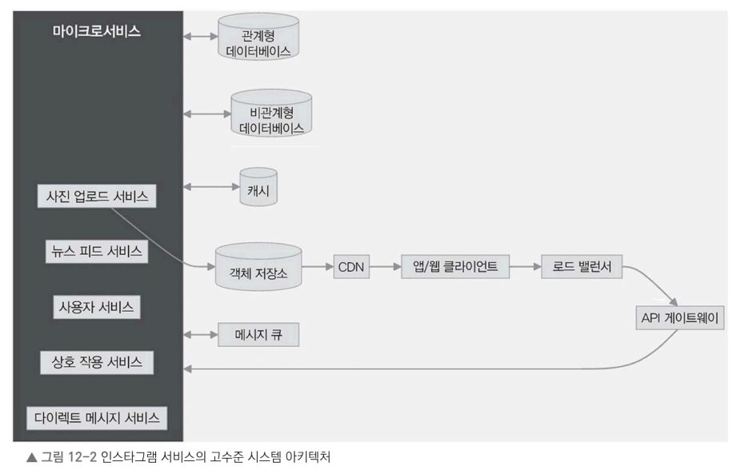

# 12.5 고수준 설계

기능적 요구 사항, 비기능적 요구 사항, 규모 산정을 바탕으로 인스타그램 같은 서비스의 고수준 설계를 살펴보자. 

- 목표: 방대한 양의 사진 및 사용자, 상호 작용을 처리하면서도 확장성과 안정성, 효율성을 갖춘 아키텍처를 만드는 것

### 인스타그램 시스템의 고수준 설계 다이어그램

- 클라이언트 애플리케이션, 로드 밸런서, API 게이트웨이, 마이크로서비스, 데이터베이스, 캐싱 시스템, 객체 저장소, CDN, 메시지 큐 등 다양한 구성 요소 간의 데이터 흐름과 상호 작용을 표현

이 설계로 효율적이고 확장 가능한 사진 공유 플랫폼을 구현하는 데 필요한 요소들을 한눈에 이해할 수 있다.

## 12.5.1 고수준 아키텍처의 구성 요소와 모듈

그림을 바탕으로, 고수준 아키텍처는 어떤 구성 요소와 모듈이 있는지 살펴보자.

- 클라이언트-서버 아키텍처: 인스타그램 같은 서비스는 클라이언트-서버 구조를 기반으로 동작
  - 모바일 앱이나 웹 브라우저 같은 클라이언트는 API를 이용하여 서버와 직접 통신
  - 서버는 핵심 기능을 수행하고 데이터를 저장하거나 처리하여 클라이언트에 필요한 정보를 전달
- 로드 밸런서: 들어오는 트래픽을 여러 서버에 고르게 분산하려고 서버 구성 요소 앞쪽에 로드 밸런서를 둔다. 
  - 서버 부하, 요청 유형, 지리적 위치 등을 기준으로 요청을 적절한 서버로 효율적으로 전달하도록 설계
- API 게이트웨이: API 게이트웨이는 모든 클라이언트 요청의 진입점 역할
  - 요청 라우팅, 인증, 속도 제한, 요청 및 응답 변환 등을 처리 
  - 또 사진 업로드, 뉴스 피드 조회, 사용자 간 상호 작용, 개인 메시지 같은 다양한 기능을 처리하려고 여러 API를 제공
- 마이크로서비스 아키텍처: 서버 측은 모듈화, 확장성, 유지 보수성을 높이려고 마이크로서비스로 구성
  - 각 마이크로서비스는 특정 도메인이나 기능을 맡아서 처리
  - 인스타그램 같은 서비스에서는 다음과 같은 주요 마이크로서비스를 사용
    > - 사진 업로드 서비스
    >   - 사용자가 업로드한 사진을 처리/저장
    >   - 이미지 압축, 크기 조정, 썸네일 생성 작업
    >   - 사진은 아마존 S3 같은 객체 저장소에 보관
    > - 뉴스 피드 서비스
    >   - 사용자가 팔로우한 사람들의 사진을 모아 개인 맞춤형 뉴스 피드 생성
    >   - 수집한 사진에 순위 알고리즘을 적용하여 더 적합한 순서로 사진 재배열
    >   - 성능 향상과 빠른 응답을 위한 캐싱 활용
    > - 사용자 서비스
    >   - 사용자 프로필 관리, 인증, 권한 부여
    >   - 회원 가입, 로그인, 프로필 수정 등 사용자 관련 작업
    >   - 사용자 데이터를 MySQL이나 PostgreSQL 등 데이터베이스에 저장
    > - 상호 작용 서비스
    >   - 좋아요, 댓글, 해시태그 등 사용자 간의 상호 작용 처리
    >   - 상호 작용 데이터를 데이터베이스에 저장하고 관련 수치 업데이트
    >   - 새로운 상호 작용이 발생하면 사용자에게 알림 전송
    > - 다이렉트 메시지 서비스
    >   - 사용자 간의 비공개 메시지 소통 기능
    >   - 메시지 전달, 저장, 실시간 업데이트
    >   - 아파치 카프카 같은 메시지 큐를 사용한 비동기 메시지 처리
- 데이터베이스와 캐싱: 효율적인 데이터 저장과 조회를 위한 데이터베이스&캐싱 조합
   > -  관계형 데이터베이스(MySQL, PostgreSQL 등)
   >   - 사용자 프로필, 사진 메타데이터, 댓글, 좋아요, 해시태그 등 정형 데이터 저장
   >   - 복잡한 쿼리를 처리할 수 있고, 데이터 무결성과 안정성을 보장하는 ACID 특성 지원
   > - 비관계형 데이터베이스(아파치 카산드라, MongoDB 등)
   >   - 대량의 쓰기 작업이 필요한 사용자 활동 데이터와 실시간 데이터를 처리하는 데 적합
   >   - 확장성이 뛰어나고 최종 일관성 모델 지원
   > - 캐싱(레디스, 맴캐시드 등)
   >   - 뉴스피드 사진, 사용자 프로필, 인기 해시태그 같은 자주 조회하는 데이터를 캐싱하여 데이터베이스 부하를 줄임, 빠른 응답 속도 보장
   > - 객체 저장소
   >   - 사진과 동영상은 아마존 S3 같은 객체 저장소에 저장
   >   - 객체 저장소는 확장성과 안정성을 갖추고 있어 미디어 파일을 효율적으로 저장하고 사용자에게 빠르게 전달하는 데 적합
- 객체 저장소: 사진과 동영상은 아마존 S3 같은 객체 저장소에 저장
  - 객체 저장소는 확장성과 안정성을 갖추고 있어 미디어 파일을 효율적으로 저장하고 사용자에게 빠르게 전달하는 데 적합
- 콘텐츠 전송 네트워크(CDN): 사진과 동영상을 사용자에게 더 빠르게 전달하려고 아마존 Cloudfront 같은 CDN을 활용
  - CDN은 사용자와 가까운 에지 서버에 콘텐츠를 캐싱하여 지연 시간을 줄이고 전송 속도를 높임
- 비동기 처리: 사진 처리나 알림처럼 리소스를 많이 사용하는 작업은 아파치 카프카 같은 메시지 큐와 백그라운드 프로세스를 이용하여 비동기로 처리
  - 서비스가 사용자 요청에 빠르게 응답하면서 많은 요청을 원활하게 처리
- 보안과 개인 정보 보호: 시스템 전반에서 보안과 개인 정보 보호를 강화하는 방안 적용
  - 사용자 인증과 권한 관리는 OAuth 같은 안전한 프로토콜을 사용하여 처리
  - 비밀번호 등 민감한 데이터는 해시 처리 후 안전하게 저장
  - 데이터를 전송하거나 저장할 때 암호화를 적용하여 사용자 정보 보호
  - 요청이 과도하게 몰리는 것을 막고 서비스의 공정한 이용을 유지하고자 요청 횟수를 제한하고 처리 속도를 조정

> - 고수준 설계에서 얻은 점
>   - 인스타그램 같은 서비스를 구성하는 주요 요소와 이들 간에 상호 작용 방식
>   - 서비스가 대규모 사용자와 데이터를 처리할 수 있도록 확장성과 효율성을 고려한 구조를 설계하는 데 필요한 기반 요소

다음 절: 사진 업로드, 뉴스피드, 사용자 관리 같은 핵심 기능과 각 기능의 동작 방식, 설계의 고민 포인트