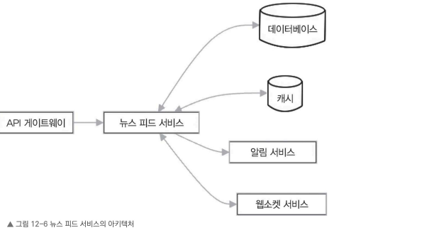

## 12.6.2 뉴스 피드 서비스

뉴스 피드 서비스는 사용자의 팔로우 관계와 활동 데이터를 바탕으로 맞춤형 사진 피드를 생성하고 사용자에게 전달하는 기능을 담당한다.

이 절에서는 뉴스 피드 서비스의 세부 설계 내용을 살펴본다.

다음 그림은 뉴스 피드 서비스의 아키텍처를 나타낸다. 데이터베이스, 캐시, 알림 서비스, 웹소켓 서비스와 상호 작용하여 효율적으로 피드를 생성하고 실시간 업데이트를 구현하는 과정을 보여준다.



## 뉴스 피드 서비스 API

뉴스 피드 서비스는 다음 API 엔드포인트를 담당한다.

- `GET /newsfeed/{userId}`: 사용자 맞춤 뉴스 피드를 가져오는 요청이다.

* **요청 매개변수:** `userId`, `limit`, `offset`
* **응답:** 사용자의 뉴스 피드에 포함될 사진 목록

---

## 뉴스 피드 생성 과정

### 1. 팔로우 관계 확인

뉴스 피드 서비스는 데이터베이스에서 사용자가 팔로우 중인 계정 목록을 가져온다.

이 정보는 팔로우 테이블에 저장되어 있으며, 팔로워와 팔로우 관계를 포함한다.

### 2. 사진 수집

사용자가 팔로우하는 각 계정의 최근 업로드된 사진을 데이터베이스에서 불러온다.

이 과정에서 다음과 같은 사진 메타데이터를 함께 가져온다.

* 사진 ID
* 사용자 ID
* 업로드 시간
* 참여 지표(좋아요 수, 댓글 수)

### 3. 정렬 및 순위 도입

불러온 사진의 최신 여부와 관련성을 기준으로 순위를 매기고 정렬한다.

다양한 랭킹 알고리즘을 선택할 수 있다.

* 시간 순 정렬
* 참여 기반 순위
* 업로드 시간
* 사진 소유자와 사용자의 친밀도
* 사진의 전체적인 참여도

이러한 요소를 조합하여 최종 순위를 산출한다.

### 4. 페이지네이션

뉴스 피드를 한 번에 모두 가져오는 대신 페이지 단위로 나누어 불러온다.

API 요청에 페이지네이션 토큰과 한 번에 가져올 항목 수(`limit`)를 포함한다.

페이지네이션 토큰은 이전 페이지의 마지막 사진 ID나 타임스탬프를 기준으로 다음 데이터를 빠르게 불러오는 역할을 한다.

이를 통해 성능을 높이고 네트워크 자원을 효율적으로 활용할 수 있다.

### 5. 캐시 활용

캐싱을 적용하면 뉴스 피드의 응답 속도를 높이고 백엔드 서비스의 부담을 줄일 수 있다.

새로 만든 뉴스 피드는 레디스 등 분산 캐싱 시스템에 저장한다.

사용자가 사진을 업로드하거나 좋아요, 댓글 활동을 하면 캐시 데이터도 즉시 업데이트하여 사용자 경험을 향상시킨다.

### 6. 중복 사진 처리

뉴스 피드에서 중복된 사진이 표시되지 않도록 사진 ID를 따로 관리한다.

새로운 사진을 피드에 추가하기 전에 기존 사진 ID 목록을 확인하여 중복 여부를 판단한 후 추가 여부를 결정한다.

이를 통해 뉴스 피드를 깔끔하게 유지할 수 있다.

---

## 실시간 업데이트

뉴스 피드 서비스는 사용자에게 실시간으로 소식을 전달하기 위해 다음 방식을 활용한다.

### 웹소켓 혹은 롱 폴링

클라이언트는 웹소켓이나 롱 폴링(long polling) 기술로 서버와 지속적으로 연결을 유지한다.

>
> **롱 폴링(Long Polling)**
>
> 클라이언트가 서버에 요청을 보내면 서버가 바로 응답하지 않고 **새로운 데이터가 발생할 때까지 연결을 유지하는 방식**이다.
>
> ```text
> 클라이언트 → 서버 : 새로운 데이터 있어? 
>                  ↓              
>                 대기 
>                  ↓ 
>            새로운 데이터 발생 
>                  ↓ 
> 서버 → 클라이언트 : 새로운 데이터 전달 
> ```

팔로우한 사용자가 새로운 사진을 올리거나 뉴스 피드에 포함된 사진에 좋아요나 댓글 같은 상호 작용을 만들면 서버가 이 정보를 실시간으로 클라이언트에 전달한다.

클라이언트는 받은 정보를 바탕으로 화면에서 뉴스 피드를 즉시 갱신한다.

### 알림 서비스 연동

뉴스 피드 서비스는 알림 서비스와 연동하여 중요한 업데이트가 발생했을 때 푸시 알림을 전송한다.

팔로우한 사용자가 새로운 사진을 업로드하거나 뉴스 피드의 사진에 좋아요나 댓글 같은 활동이 발생하면 알림이 생성되어 사용자 기기로 전달된다.

이를 통해 사용자는 업데이트된 뉴스 피드를 즉시 확인할 수 있다.


## 피드 동기화

사용자가 여러 기기에서 동일한 뉴스 피드를 자연스럽게 이어서 볼 수 있도록 뉴스 피드 서비스는 피드를 동기화할 수 있어야 한다.

### 타임스탬프 기반 동기화

뉴스 피드의 각 사진에는 해당 사진이 피드에 추가된 시점을 나타내는 타임스탬프를 저장한다.

사용자가 다른 기기에서 피드를 열면 클라이언트가 마지막으로 본 사진의 타임스탬프를 서버에 전달한다.

서버는 이 정보를 바탕으로 그 이후에 추가된 사진만 찾아 사용자에게 전송한다.

이를 통해 중복된 데이터를 불러오지 않고 새롭게 추가된 내용만 빠르게 확인할 수 있다.

### 점진적 업데이트

매번 전체 피드를 다시 불러오는 대신 클라이언트는 새로운 사진이나 새로 업데이트된 정보를 선택적으로 요청할 수 있다.

클라이언트가 마지막으로 확인한 사진의 ID나 타임스탬프를 서버에 전달하면 뉴스 피드 서비스는 이후 추가된 사진만 찾아 전달한다.

이를 통해 데이터 전송량을 줄이고 피드 업데이트 속도를 높일 수 있다.

---

지금까지 뉴스 피드 서비스를 설계할 때 고려해야 할 다양한 요소를 살펴보았다.

이러한 요소를 기반으로 서비스를 설계하면 사용자 맞춤형 사진 피드를 생성하는 과정에서 **랭킹 알고리즘, 캐싱, 실시간 업데이트, 피드 동기화** 등의 기술을 효과적으로 활용할 수 있다.

사용자는 최신 상태로 유지되는 끊김 없는 피드 경험을 누릴 수 있다.

다음 절에서는 사용자 프로필 관리, 인증, 소셜 상호 작용을 담당하는 사용자 서비스 설계를 보다 자세히 알아본다.
