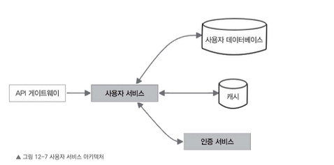
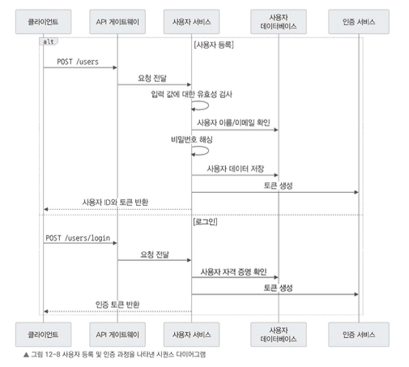
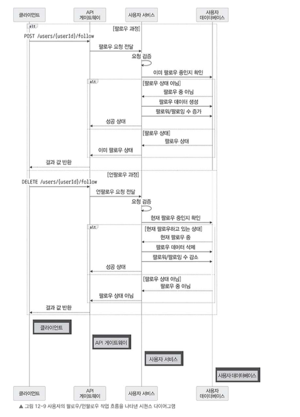

# 12.6.3 사용자 서비스

사용자 서비스는 인스타그램 같은 서비스에서 사용자 프로필 관리, 인증, 팔로우 등 사회적 활동을 처리하는 핵심 역할을 담당한다.

회원 가입, 로그인, 프로필 업데이트, 팔로우 및 언팔로우 기능을 처리하며, 이 과정에서 사용자 데이터를 체계적으로 관리한다.

이 절에서는 사용자 서비스의 상세 설계를 알아본다.  
다음 그림은 사용자 서비스의 아키텍처를 나타내며, 데이터베이스, 캐시, 인증 서비스와 상호작용하여 사용자 프로필과 인증을 관리하는 구조를 보여준다.



---

## 사용자 서비스 API

사용자 서비스는 담당하는 기능이 많기 때문에 엔드포인트도 여러 개가 필요하다.

---

### 사용자 생성

```http
POST /users
````

새로운 사용자를 생성한다.

- **요청 본문**
    - 사용자 이름
    - 이메일
    - 비밀번호
    - 프로필 사진 등 사용자 정보
- **응답**
    - 새로 만든 사용자 ID
    - 인증 토큰


---

### 로그인

```http
POST /users/login
```

사용자를 인증하고 인증 토큰을 발급한다.

- **요청 본문**
    - 이메일
    - 사용자 이름
    - 비밀번호

- **응답**
    - 인증 토큰


---

### 사용자 프로필 조회

```http
GET /users/{userId}
```

특정 사용자의 프로필 정보를 조회한다.

- **요청 매개변수**
    - 조회할 사용자 ID

- **응답**
    - 사용자 이름
    - 프로필 사진
    - 소개글
    - 팔로워 수
    - 팔로잉 수
    - 포함한 프로필 데이터


---

### 사용자 프로필 수정

```http
PUT /users/{userId}
```

사용자 프로필 정보를 업데이트한다.

- **요청 매개변수**
    - 업데이트할 사용자 ID

- **요청 본문**
    - 업데이트할 사용자 프로필 정보

- **응답**
    - 성공 상태


---

### 팔로우

```http
POST /users/{userId}/follow
```

특정 사용자를 팔로우한다.

- **요청 매개변수**
    - 팔로우할 사용자 ID

- **응답**
    - 성공 상태


---

### 언팔로우

```http
DELETE /users/{userId}/follow
```

특정 사용자를 언팔로우한다.

- **요청 매개변수**
    - 언팔로우할 사용자 ID

- **응답**
    - 성공 상태


---

# 사용자 등록과 인증 과정

사용자가 인스타그램 같은 서비스에 회원 가입하거나 로그인할 때는 다음 과정이 일어난다.



---

## 1. 클라이언트 요청

클라이언트는 사용자 정보 또는 자격 증명을 담아 사용자 서비스로 요청을 보낸다.

- 회원 가입

    - `POST /users`

- 로그인

    - `POST /users/login`


---

## 2. 사용자 서비스 처리

사용자 서비스는 요청을 받아 다음 작업을 수행한다.

### 회원 가입의 경우

- 입력받은 사용자 데이터를 검증한다.

- 사용자 이름이나 이메일이 이미 사용 중인지 확인한다.

- 비밀번호를 안전하게 해시 처리한다.

- 고유한 사용자 ID를 생성한다.

- 사용자 정보를 데이터베이스에 저장한다.

- 인증 토큰을 생성한다.


### 로그인의 경우

- 전달받은 자격 증명을 데이터베이스에 저장된 사용자 데이터와 비교해 확인한다.

- 자격 증명이 올바르면 인증 토큰을 생성한다.


---

## 3. 사용자 서비스 응답

사용자 서비스는 사용자 ID와 인증 토큰을 클라이언트에 반환한다.

---

## 4. 클라이언트 토큰 저장

클라이언트는 전달받은 인증 토큰을 안전하게 저장한다.

이후 요청을 보낼 때는 해당 토큰을 포함하여 사용자를 인증한다.

---

# 사용자 프로필 수정 과정

사용자가 자신의 프로필 정보를 수정할 때는 다음 과정이 일어난다.

1. 클라이언트가 수정할 프로필 데이터를 담아 요청을 보낸다.


```http
PUT /users/{userId}
```

2. 사용자 서비스는 요청 데이터를 검증한다.

3. 데이터베이스에서 해당 사용자 프로필을 업데이트한다.

4. 이후 바뀐 프로필 정보를 클라이언트에 반환한다.


---

# 팔로우/언팔로우 과정

사용자가 다른 사용자를 팔로우하거나 언팔로우할 때의 과정은 다음과 같다.


---

## 팔로우 요청 과정

1. 클라이언트가 팔로우할 사용자 ID를 포함해 팔로우 요청을 보낸다.


```http
POST /users/{userId}/follow
```

2. 사용자 서비스가 요청을 검증한다.

    - 사용자가 해당 작업을 수행할 권한이 있는지 확인한다.

    - 이미 팔로우 중인지 확인한다.

3. 팔로우 요청인 경우 사용자 서비스는 팔로우 테이블에 새로운 항목을 생성한다.

    - 팔로워와 팔로잉 관계를 기록한다.

4. 이후 두 사용자, 즉 요청한 사용자와 대상 사용자의 팔로워 수와 팔로잉 수를 각각 증가시킨다.

5. 마지막으로 사용자 서비스는 클라이언트에 성공 상태를 반환한다.


---

## 언팔로우 요청 과정

1. 클라이언트가 언팔로우할 사용자 ID를 포함해 언팔로우 요청을 보낸다.


```http
DELETE /users/{userId}/follow
```

2. 사용자 서비스가 요청을 검증한다.

    - 사용자가 해당 작업을 수행할 권한이 있는지 확인한다.

    - 현재 팔로우 중인지 확인한다.

3. 언팔로우 요청인 경우 사용자 서비스는 팔로우 테이블에서 해당 항목을 삭제한다.

4. 이후 두 사용자의 팔로워 수와 팔로잉 수를 각각 감소시킨다.

5. 마지막으로 사용자 서비스는 클라이언트에 성공 상태를 반환한다.


---

# 사용자 서비스 설계 시 고려할 점

앞에서 살펴본 내용은 사용자 서비스가 기본적으로 수행해야 하는 작업이다.

하지만 사용자 서비스가 더 빠르고 안정적으로 동작하려면 다음과 같은 요소도 함께 고려해야 한다.

---

## 캐싱을 이용한 성능 최적화

사용자 서비스 성능을 개선하고 데이터베이스에 과도한 부하가 걸리지 않도록 Redis 같은 분산 캐시 시스템을 사용할 수 있다.

캐싱 대상은 주로 자주 조회되는 사용자 데이터다.

- 사용자 프로필

- 인기 사용자 정보

- 팔로워 수

- 팔로잉 수


이런 데이터를 캐싱하면 데이터베이스 요청 횟수를 줄일 수 있다.

예를 들어 사용자의 프로필 정보를 수정하거나 팔로워/팔로잉 수가 변경되면 캐시된 데이터를 바로 업데이트해야 최신 상태를 유지할 수 있다.

---

## 알림 및 피드 업데이트

사용자 서비스는 알림 서비스와 뉴스 피드 서비스와 연동하여 관련 업데이트를 처리할 수 있다.

예를 들어 어떤 사용자가 다른 사용자를 팔로우하면 다음 작업이 필요할 수 있다.

- 사용자 서비스가 알림 서비스를 호출한다.

- 팔로우 대상 사용자에게 새 팔로워 알림을 생성한다.

- 사용자 서비스는 이벤트를 뉴스 피드 서비스로 전달한다.

- 뉴스 피드 서비스는 팔로우한 사용자의 피드에 새 콘텐츠를 포함할 수 있도록 처리한다.


이렇게 이벤트 기반으로 처리하면 서비스 간 결합도를 낮추고, 팔로우 처리 작업을 확장하기 쉽게 만들 수 있다.

---

## 보안과 개인 정보 보호

사용자 서비스는 사용자 데이터를 안전하게 보호해야 한다.

- 비밀번호는 bcrypt 같은 강력한 해시 알고리즘을 사용하여 안전하게 저장한다.

- OAuth 같은 안전한 프로토콜을 사용해 사용자 인증을 처리한다.

- 모든 통신은 HTTPS로 전송하여 전송 중 데이터 노출을 방지한다.

- 사용자 데이터는 저장할 때와 전송할 때 모두 암호화를 고려한다.

- 접근 제어를 적용하여 사용자가 자신의 프로필만 수정하거나 권한 내에서만 요청할 수 있도록 제한한다.

- 요청 속도 제한과 트래픽 제어를 적용하여 무단 접근과 남용을 방지한다.


---

이후 추가적인 검토 사항을 살펴보겠습니다요