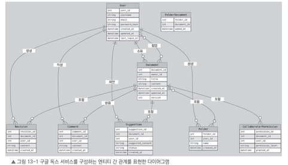

# 13.3 데이터 모델

데이터 모델은 파일 공유 서비스에서 매우 중요한 역할을 한다.

데이터 모델은 서비스에서 다루는 데이터 요소와 그 관계를 정의하며, 효율적인 데이터 저장, 조회, 처리를 가능하게 한다.  
구글 독스 같은 서비스는 여러 사용자와 문서가 복잡하게 연결되기 때문에 각 데이터 요소 간 관계를 명확히 설계해야 한다.

---

## 주요 엔티티

구글 독스 같은 서비스에서 사용할 수 있는 주요 엔티티는 다음과 같다.

- **User**
    - 파일 공유 서비스를 이용하는 사용자 정보를 나타낸다.
    - 사용자 이름, 이메일, 비밀번호 해시, 계정 생성일, 마지막 로그인 시간 등을 저장한다.
    - 각 사용자는 고유한 `user_id`로 구분한다.

- **Document**
    - 서비스 내에서 새롭게 만들거나 공유하는 문서를 나타낸다.
    - 문서 제목, 내용, 문서를 만든 사용자, 문서 생성 및 수정 시간, 현재 버전 번호를 포함한다.
    - 문서를 만든 사용자는 `owner_id`로 User 엔티티와 연결된다.

- **Revision**
    - 문서의 수정 내역을 저장한다.
    - 각 수정 기록은 특정 문서와 해당 문서를 수정한 사용자와 연결된다.
    - 수정 내용과 업데이트 시간을 함께 포함한다.

- **CollaboratorPermission**
    - 특정 문서에 대해 사용자에게 부여된 접근 권한을 정의한다.
    - 문서와 사용자를 연결하고, 보기(`view`), 편집(`edit`), 댓글(`comment`) 같은 권한 수준과 권한이 부여된 시간을 저장한다.

- **Comment**
    - 사용자가 특정 문서에 남긴 댓글을 나타낸다.
    - 댓글 내용, 연결된 문서, 댓글 작성자, 댓글 작성 시간을 포함한다.

- **Suggestion**
    - 문서에 대한 수정 제안 내용을 나타낸다.
    - 제안 내용, 관련 문서와 사용자 정보, 제안 상태를 포함한다.
    - 제안 상태는 대기 중, 승인됨, 거절됨 같은 값으로 표현할 수 있다.

- **Folder**
    - 사용자가 문서를 폴더로 정리할 수 있도록 하는 엔티티다.
    - 폴더 이름, 폴더와 연결된 사용자 정보, 폴더 생성 시간을 저장한다.

- **FolderDocument**
    - 폴더와 문서의 관계를 나타낸다.
    - 각 폴더에 어떤 문서가 포함되어 있는지 표현한다.

---

# ERD

이 다이어그램은 구글 독스 같은 서비스의 전체적인 데이터 모델을 보여준다.

주요 엔티티는 다음과 같다.

- 사용자(`User`)
- 문서(`Document`)
- 수정 기록(`Revision`)
- 폴더(`Folder`)
- 댓글(`Comment`)
- 제안(`Suggestion`)
- 협업 권한(`CollaboratorPermission`)
- 폴더-문서 관계(`FolderDocument`)

각 엔티티의 속성과 관계를 함께 보여주기 때문에, 시스템의 데이터 구조와 상호 연결성을 한눈에 이해할 수 있다.

---

# 13.3.1 데이터 간 관계

앞에서 설명한 데이터 모델에서는 여러 엔티티가 서로 관계를 맺는다.

이 관계는 문서 공유 서비스의 핵심 구조를 이룬다.

---

## 일대다 관계

일대다 관계는 하나의 엔티티가 여러 엔티티와 연결되는 관계다.

- **사용자와 문서**
    - 한 사용자는 여러 문서를 소유할 수 있다.
    - 하나의 문서는 한 명의 소유자를 가진다.

- **문서와 수정 기록**
    - 하나의 문서는 시간에 따라 여러 수정 기록을 가질 수 있다.
    - 각 수정 기록은 특정 문서에 속한다.

- **문서와 댓글**
    - 하나의 문서에는 여러 사용자가 남긴 댓글이 포함될 수 있다.

- **문서와 제안**
    - 하나의 문서에는 여러 수정 제안이 추가될 수 있다.

- **사용자와 폴더**
    - 한 사용자는 여러 폴더를 생성할 수 있다.

---

## 다대다 관계

다대다 관계는 여러 엔티티가 서로 여러 개씩 연결될 수 있는 관계다.

- **사용자와 문서**
    - 한 사용자는 여러 문서에서 협업할 수 있다.
    - 반대로 하나의 문서에도 여러 사용자가 권한을 받아 참여할 수 있다.
    - 이 관계는 `CollaboratorPermission` 엔티티로 관리한다.

- **폴더와 문서**
    - 하나의 폴더는 여러 문서를 포함할 수 있다.
    - 동시에 하나의 문서가 여러 폴더에 속할 수도 있다.
    - 이 관계는 `FolderDocument` 엔티티로 관리한다.

---

# 정리

이 데이터 모델은 사용자, 문서, 수정 이력, 협업 권한, 댓글, 제안, 폴더 정리 등 문서 공유 서비스에 필요한 핵심 요소를 표현한다.

특히 구글 독스 같은 협업 문서 서비스에서는 단순히 문서 내용만 저장하는 것이 아니라 다음과 같은 관계까지 함께 관리해야 한다.

- 누가 문서를 만들었는지
- 누가 문서에 접근할 수 있는지
- 어떤 권한을 가지고 있는지
- 문서가 어떻게 수정되었는지
- 누가 댓글이나 제안을 남겼는지
- 문서가 어떤 폴더에 정리되어 있는지

이런 데이터 모델을 기반으로 설계하면 사용자와 문서 간의 복잡한 상호작용을 매끄럽게 지원할 수 있고, 기능적 요구 사항을 충족하는 구조를 만들 수 있다.

다음으로는 예상 사용자 수와 사용 패턴을 고려하여 서비스에 필요한 저장소, 대역폭, 처리 능력을 추산해 본다.