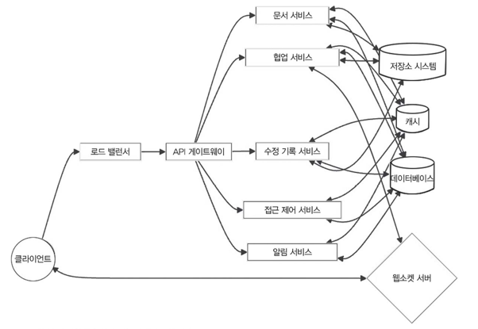

# 13.5 고수준 설계

> 이 절에서는 파일 공유 서비스의 주요 구성 요소와 각각이 상호 작용하는 방식을 전반적으로 살펴본다.
> 
> 특히 서비스가 확장성과 효율성을 갖추려면 어떤 요소들을 고려해야 하는지도 함께 알아본다.

- 파일 공유 서비스의 목적
  - 방대한 양의 문서 
  - 문서 수정 기록
  - 사용자 간 상호 작용을 효과적으로 처리할 수 있는 확장 가능
  - 안정적이며 효율적인 아키텍 처를 만드는 것

## 파일 공유 시스템의 고수준 설계

로드 밸런서, API 게이트웨이, 문서 관리, 협업, 접근 권한을 다루는 마이크로서비스, 캐시, 데이터베이스, 저장소 시스템 등을 포함.

## 13.5.1 고수준 설계의 소프트웨어 구성 요소와 모듈 

### 클라이언트-서버 아키텍처
파일 공유 서비스는 클라이언트-서버 아키텍처를 따른다. 

웹 브라우저나 모바일 앱 같은 클라이언트가 서버 측 구성 요소와 API로 통신. 

서버는 핵심 기능 처리, 데이터 저장, 프로세싱 작업을 담당.

### 로드 밸런서
- 서버 앞에 로드 밸런서를 배치해 서비스로 들어오는 트래픽을 여러 서버에 고르게 나눈다.
- 서버 부하, 요청 유형, 서버 위치 등 요소를 고려해 요청을 적절한 서버로 라우팅. 

➡️ 트래픽 처리 효율 극대화 & 서버 간 균형 유지.

### API 게이트웨이

> 모든 클라이언트 요청 진입 지점

- 요청 라우팅, 인증, 요청 제한, 요청 및 응답 변환 등 작업을 처리.
- 문서 생성, 편집, 협업, 접근 제어 등 다양한 기능을 지원하는 API를 제공.

### 마이크로서비스 아키텍처
- 모듈화, 확장성, 유지 보수성을 높이기 위함.

각 마이크로서비스는 특정 도메인이나 기능을 담당하는 역할로 나눌 수 있습니다.

- 파일 공유 서비스에서의 추측 마이크로서비스
  - 문서 서비스
    - 문서 생성, 조회, 수정, 삭제 작업 처리.
    - 문서 메타데이터와 저장소 관리.
    - 문서 내용을 저장하고 불러오려고 저장소와 통신.
  - 협업 서비스
    - 실시간 동시 협업 및 동기화 지원.
    - 동시 편집 충돌 해결을 위한 운영 변환(Operational Transformation, OT) 알고리즘 활용.
    - 문서에 참여 중인 사용자 상태와 실시간 업데이트 정보 관리.
  -  수정 기록 서비스
    - 문서의 수정 이력과 버전 관리 담당.
      - 문서 수정본을 저장하고 필요할 때 조회.
      - 문서 수정본 간의 차이를 비교하고 병합 작업 수행.
  - 접근 제어 서비스
    - 사용자 인증 & 권한 관리 담당.
      - 문서에 대한 접근 권한 & 공유 설정 관리.
  - 알림 서비스
    - 문서 변경, 댓글 작성, 협업 관련 이벤트 같은 내용을 사용자에게 알림 전달.
      - 이메일, 푸시 알림, 실시간 메시징 시스템과 통합하여 다양한 방식으로 알림 제공.
### 캐싱
- 레디스 같은 분산 캐싱 레이어를 활용한 백엔드 서버 성능 향상.
- 자주 조회하는 데이터를 저장. 
- 문서 메타데이터, 사용자 세션, 자주 요청되는 문서 내용을 포함. 
- 데이터를 빠르게 제공하고 데이터베이스 같은 저장소에 요청하는 횟수를 줄임.

### 데이터베이스
파일 공유 서비스에서는 정형 데이터와 비정형 데이터를 저장하려고 여러 종류의 데이터베이스를 조합해 사용.
- 관계형 데이터베이스(PostgreSQL 등)
  - 사용자 프로필, 문서 메타데이터, 접근 권한, 협업 관련 정보 등 메타데이터를 저장.
  - ACID 특성 제공, 복잡한 쿼리와 트랜잭션 처리 가능
- 비관계형 데이터베이스(MongoDB 등)
  - 문서 내용과 수정 내역 저장.
  - 대량의 비정형 데이터를 처리하는 확장성과 유연성을 갖춤.

### 스토리지 시스템
- 데이터를 S3나 구글 클라우드 스토리지 같은 분산 스토리지 시스템에 저장
- 문서 유형: 텍스트 파일, 동영상, 이미지, 멀티미디어 파일 등 다양. 
- 대용량 파일을 처리하거나 병렬 업로드를 지원하려고 지능형 청킹(intelligent chunking)이 나 멀티파트 API를 활용하는 것도 가능. 
- 대용량 파일을 효과적으로 처리할 수 있도록 설계되어 확장성과 내구성을 갖춤
- 빠르고 효율적인 데이터 검색, 전달.

### 실시간 통신
문서 변경 사항을 여러 사용자 간에 즉각적으로 공유하고 동기화하려고 클라이언트와 통신하는 여러 서비스 간에 웹소켓 활용. 
- 웹소켓은 양방향 통신을 지원하므로, 협업 중인 사용자가 실 시간으로 업데이트 내용을 확인하고 동기화 상태를 유지할 수 있게 한다.

### 모니터링 및 로깅
- 서비스의 안정성과 성능을 관리. 
- 요청 지연 시간, 오류율, 자원 사용량 등 핵심 지표를 프로메테우스와 그라파나를 이용하여 수집하고 한눈에 볼 수 있도록 시각화. 
- 서비스 전체에서 생성되는 로그를 ELK 스택 같은 중앙 집중식 로깅 시스템으 로 모아 분석하면, 시스템 상태를 더 정확히 파악하고 문제를 빠르게 해결할 수 있다.

### 보안 및 개인 정보
- 서비스 전반에서 철저한 보안 및 개인 정보 보호 조치를 적용하여 서비스 보호. 
- 사용자 인증과 권한 관리는 OAuth 같은 안전한 프로토콜을 사용.
- 비밀번호나 액세스 토큰 등 민감한 데이터는 안전하게 해시 처리한 후 저장. 
- 데이터를 전송, 저장할 때는 암호화로 사용자 정보 보호. 
- 정기적인 보안 감사와 모의 해킹 테스트를 활용해 서비스의 취약점 파악 후 개선.

구성 요소의 역할과 상호 작용 방식을 깊이 이해하는 것이 중요

다음 절에서는 문서 서비스, 협업 서비스, 접근 제어 서비스 등 핵심 구성 요소를 더 구체적으로 살펴보자.

