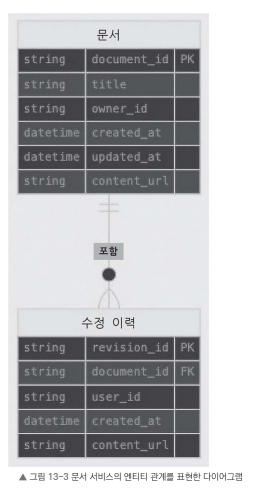

# 13.6 마이크로서비스 세부 설계

파일 공유 서비스를 구성하는 여러 마이크로서비스의 상세 설계를 살펴본다.

첫 번째로 **문서 서비스**의 설계를 살펴본다.

## 13.6.1 문서 서비스 설계

문서 서비스는 파일 공유 시스템에서 핵심적인 역할을 담당한다.

문서 생성, 조회, 수정, 삭제 같은 작업을 처리하며, 문서 메타데이터를 관리하고 스토리지 시스템과 연동하여 문서 내용을 저장하거나 불러오는 역할을 한다.

---

## 문서 서비스 API

문서 서비스는 다음 엔드포인트를 갖는다.

### `POST /documents`

새 문서를 생성한다.

- **요청 본문:** 문서 메타데이터(제목, 소유자 등)와 문서 내용(`content`)의 초깃값
- **응답:** 새로 만든 문서 객체와 해당 문서의 ID

### `GET /documents/{documentId}`

특정 문서 ID로 문서를 조회한다.

- **응답:** 문서 메타데이터와 콘텐츠를 포함한 문서 객체

### `PUT /documents/{documentId}`

특정 문서의 메타데이터 또는 콘텐츠를 수정한다.

- **요청 본문:** 수정된 문서 메타데이터 또는 콘텐츠
- **응답:** 수정된 문서 객체

### `DELETE /documents/{documentId}`

특정 문서 ID로 문서를 삭제한다.

- **응답:** 성공 또는 오류 메시지

### `GET /documents/{documentId}/revisions`

특정 문서의 수정 이력을 조회한다.

- **응답:** 문서와 연관된 수정 이력 객체 목록

---

## 데이터 모델

문서 서비스에서는 **문서(Document)**와 **수정 이력(Revision)** 엔티티를 사용한다.

하나의 문서는 여러 개의 수정 이력을 가질 수 있는 **일대다(1:N) 관계**다.

