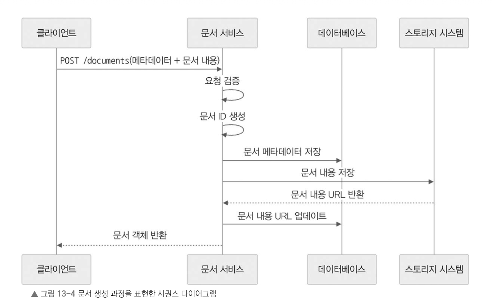
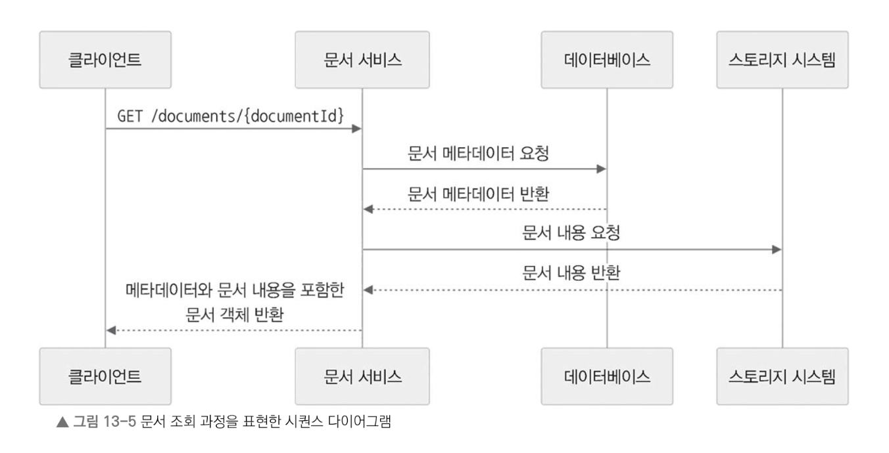
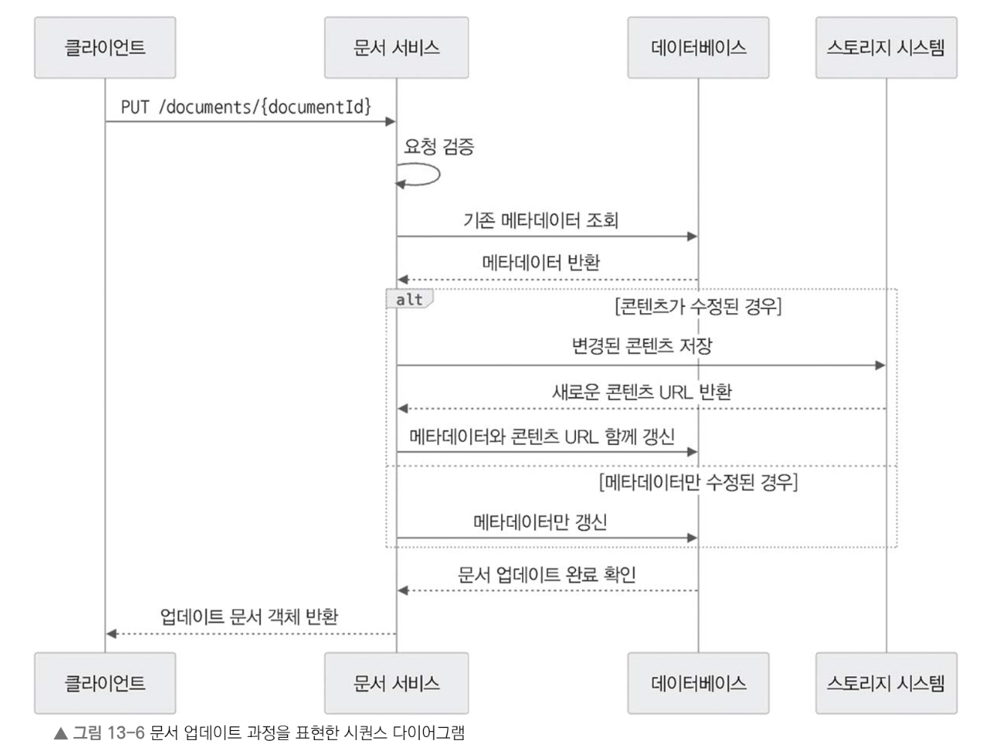

# [13장]_구글 독스 서비스 설계

---

### 문서  생성 과정
-  새 문서를 만들면 다음과 같은  과정을 거치고 문서의 메타데이터를 저장하고 실제 콘텐츠를 업로드하는 과정이 포함되어 있다.

1. **클라이언트가** `POST /documents` 엔드포인트로 문서 메타데이터와 문서의 초기 내용을 포함한 요청을 보낸다.

2. **문서 서비스는** 요청을 검증한 후 고유한 문서 ID를 생성한다.

3. 문서 메타데이터를 관계형 데이터베이스에 저장한다.

4. 문서 내용은 S3 같은 저장소 시스템에 저장한다. 이때 저장된 문서 내용의 URL을 가져온다.

5. 문서 메타데이터에 가져온 문서 내용의 URL을 업데이트한다.

6. 새로 만든 문서 객체와 문서 ID를 클라이언트에 반환한다.

### 문서 조회 과정

그림 13-5의 과정을 표현하면 다음과 같다.

1. **클라이언트가** `/documents/{documentId}` 엔드포인트에 수정된 문서 메타데이터와 문서 내용을 포함하여 GET 요청을 보낸다.

2. **문서 서비스가** 요청을 검증한 후 관계형 데이터베이스에서 기존 문서 메타데이터를 조회한다.

3. 문서가 있다면 문서 서비스는 메타데이터에 포함된 콘텐츠 URL을 사용하여 실제 문서 내용을 스토리지에서 가져온다.

4. 메타데이터와 콘텐츠가 모두 담긴 문서 객체를 클라이언트에 반환한다.

5. 업데이트한 문서 객체를 클라이언트에 반환한다.

### 문서 업데이트 과정

그림 13-6은 문서를 업데이트할 때 과정이다. 이 과정에는 메타데이터나 본문 내용이 수정될 때, 시스템이 이를 어떻게 처리하는지가 포함되어 있다.

그림 13-6의 과정을 표현하자면 다음과 같다.

1. 클라이언트가 `/documents/{documentId}` 엔드포인트로 PUT 요청을 보내면서 수정한 문서의 메타데이터나 내용을 함께 전달한다.

2. 문서 서비스는 요청을 확인한 후 관계형 데이터베이스에서 해당 문서의 기존 메타데이터를 가져온다.

3. 문서가 있다면 문서 서비스는 데이터베이스에 저장된 메타데이터를 갱신한다.

4. 요청에 문서 내용도 포함되어 있을 때 문서 서비스는 해당 내용을 저장 시스템에 새로 저장하고, 이 내용의 URL을 메타데이터에 반영한다.

5. 마지막으로 갱신이 완료된 문서 객체를 클라이언트에 전달한다.

