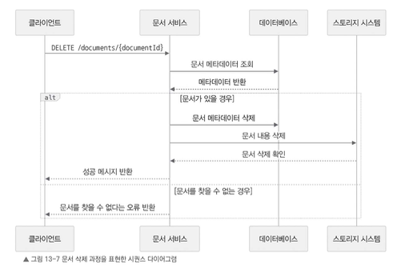
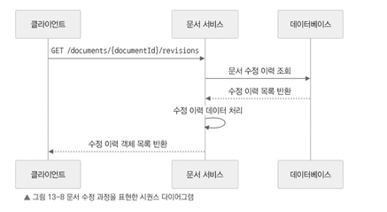

# 문서 삭제 과정

문서 삭제 과정은 문서가 실제로 존재하는지 확인한 뒤, 데이터베이스와 저장소 시스템에서 관련 데이터를 삭제하는 절차이다.



문서 삭제 과정은 다음과 같다.

1. 클라이언트가 `DELETE /documents/{documentId}` 엔드포인트로 요청을 보낸다.

2. 문서 서비스는 문서 ID를 기준으로 데이터베이스에서 해당 문서의 메타데이터를 조회한다.

3. 문서가 있다면 문서 서비스는 데이터베이스에서 문서 메타데이터를 삭제한다.

4. 이어서 문서 서비스는 저장소 시스템에서 해당 문서의 실제 내용을 삭제한다.

5. 삭제가 완료되면 클라이언트에 성공 메시지를 반환한다.

만약 문서를 찾을 수 없다면 클라이언트에 문서를 찾을 수 없다는 오류를 반환한다.

---

# 문서 수정 이력 조회 과정

문서 수정 이력 조회 과정은 특정 문서의 변경 기록을 가져와 클라이언트에 반환하는 과정이다.


수정 이력 조회 흐름은 다음과 같다.

1. 클라이언트가 `GET /documents/{documentId}/revisions` 엔드포인트로 요청을 보낸다.

2. 문서 서비스는 데이터베이스에서 해당 문서 ID와 연결된 수정 이력 정보를 가져온다.

3. 각 수정 버전에 대한 메타데이터와 문서 내용 URL이 포함된 수정 이력 목록을 클라이언트에 반환한다.

---

# 문서 서비스 설계 시 고려 사항

문서 서비스의 기본 흐름을 살펴보았으니, 성능과 신뢰성을 유지하기 위해 고려해야 할 사항(캐싱, 외부 시스템 연동)을 정리해 보자.

## 캐싱

### 레디스

레디스 같은 분산 캐시 레이어를 사용해 문서 조회 성능을 향상시킬 수 있다.

자주 조회하는 문서 내용이나 메타데이터를 캐시에 저장하면 문서 조회 요청이 들어왔을 때 매번 데이터베이스나 저장소 시스템에 접근하지 않아도 된다.

기본 흐름은 다음과 같다.

1. 클라이언트가 문서 조회를 요청한다.
2. 문서 서비스는 먼저 캐시에서 문서를 확인한다.
3. 캐시에 문서가 있다면 바로 클라이언트에 반환한다.
4. 캐시에 없다면 데이터베이스와 스토리지 시스템에서 문서를 가져온다.
5. 이후 요청을 대비하여 가져온 데이터를 캐시에 저장한다.

이를 통해 반복 조회가 많은 문서의 응답 속도를 높일 수 있다.

---

### 브라우저 캐시와 오프라인 지원

서버 캐싱뿐만 아니라 사용자 웹 브라우저의 캐시도 활용할 수 있다.

클라이언트 애플리케이션은 IndexedDB나 로컬 스토리지 같은 브라우저 저장소를 활용하여 문서의 최신 버전 사본을 저장하고, 일정 간격으로 서버와 동기화 할 수 있다.

이렇게 하면 다음과 같은 장점이 있다.

- **반응 속도 향상**
    - 변경 사항이 로컬 캐시에 즉시 반영되므로 사용자 입장에서 더 빠르게 업데이트된 것처럼 느낄 수 있다.

- **오프라인 지원**
    - 인터넷이 끊긴 상태에서도 문서를 열어 보거나 수정할 수 있다.
    - 변경된 내용은 연결이 복구되면 자동으로 동기화되도록 처리할 수 있다.

- **복원력**
    - 네트워크가 잠시 끊기더라도 작업 내용이 사라지지 않는다.
    - 연결이 복구되면 서버와 다시 동기화할 수 있다.

- **서버 부하 감소**
    - 변경 사항을 모아서 일정 간격으로 동기화하면 실시간 서버 요청 횟수를 줄일 수 있다.

다만 오프라인 상태에서 여러 사용자가 동일한 문서를 수정했을 경우 충돌이 발생할 수 있다.  
이 경우 적절한 병합 전략을 적용하거나, 사용자가 직접 충돌을 해결할 수 있는 인터페이스를 제공해야 한다.

---

## 오류 처리와 데이터 일관성

문서 서비스는 오류를 안정적으로 처리하고 클라이언트에 전달할 수 있어야 한다.

오류가 발생했을 때는 명확한 오류 코드와 메시지를 반환하여 API 사용자나 클라이언트 개발자가 문제를 쉽게 파악할 수 있도록 해야 한다.

또 데이터베이스에서 문서 메타데이터를 수정할때는 트랜잭션과 개별 연산이 중간에 실패하지 않고 한 번에 처리되도록 보장하는 방식을 이용하여 데이터가 엉키지 않도록 한다.

문서 내용을 저장하거나 조회하는 과정에서 오류가 발생하면 문서 서비스는 자동으로 재시도하거나 적절한 오류 응답을 반환해야 한다.

---

## 다른 서비스와 연동

문서 서비스는 협업 서비스, 접근 제어 서비스 등 파일 공유 시스템의 다른 서비스와 연동된다.

문서를 생성하거나 수정하면 문서 서비스는 협업 서비스에 해당 사실을 알려야 한다.

이를 통해 실시간으로 동기화되며 누가 문서를 보고 있는지 등 정보가 업데이트된다.

또 문서 작업을 수행할 때는 접근 제어 서비스를 거쳐 사용자의 권한을 확인해야 한다.

허용된 사용자만 문서를 조회하거나 편집할 수 있도록 보장해야 한다.

---

## 확장성과 성능

문서 서비스는 높은 확장성과 성능을 유지해야 한다.

이를 위해 문서 서비스는 상태를 저장하지 않는 stateless 마이크로서비스 형태로 배포할 수 있다.

이렇게 하면 문서 서비스 인스턴스를 여러 개 실행하고, 로드 밸런서를 사용해 들어오는 요청을 분산할 수 있다.

```
Client
↓
Load Balancer
↓
Document Service Instance 들 
```

데이터베이스 역시 샤딩이나 파티셔닝 기법을 활용하여 문서 ID 범위에 따라 데이터를 나누어 저장하면 확장성을 높일 수 있다.

또 Amazon S3 같은 객체 저장소를 사용하면 대규모 문서 데이터를 안정적으로 저장하고 빠르게 조회할 수 있다.

---

# 정리

지금까지 문서 서비스가 어떻게 문서 관련 작업을 효율적으로 처리하고, 데이터 일관성을 유지하면서 파일 공유 시스템의 다른 서비스와 원활히 연동하는지 알아보았다.
또한 확장성과 성능을 고려한 설계로 많은 사용자가 동시에 문서를 수정하고 상호 작용하더라도 안정적으로 동작할 수 있도록 만들 수 있음을 알아보았다.

다음 절에서는 협업 서비스의 세부 설계를 살펴본다. 협업 서비스는 여러 사용자가 같은 문서를 실시간으로 편집하고 동기화할 수 있도록 지원한다.