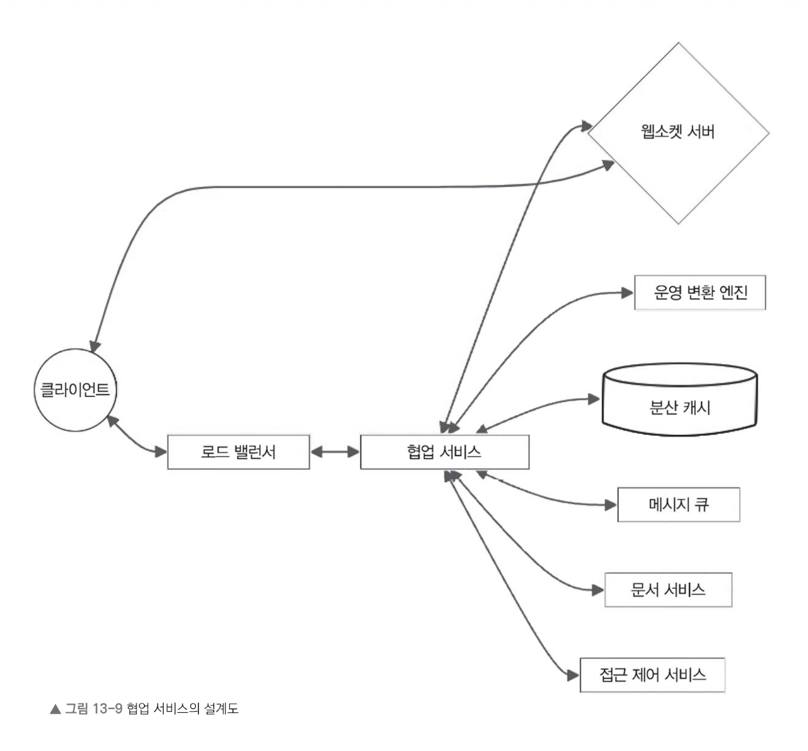
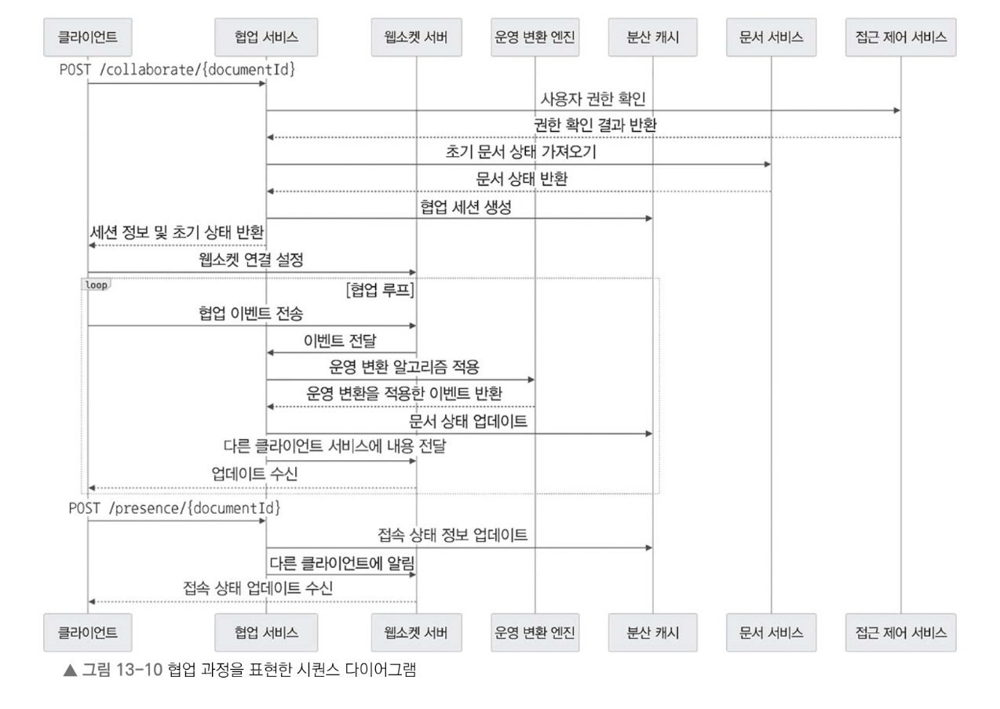

# [13장]_구글 독스 서비스 설계

---

### 13.6.2 협업 서비스 설계

- 협업 서비스는 여러 사용자가 동일한 문서를 실시간으로 공동 편집하고 동기화할 수 있도록 관리한다.
- 이를 위해 **운영 변환(Operational Transformation)**, **충돌 해결**, **접속 상태 관리**를 처리하여 원활한 협업 환경을 만든다.

#### API 엔드포인트

- `POST /collaborate/{documentId}` — 문서에서 편집 모드로 전환한다.
   - 요청 본문: 사용자 ID 및 세션 정보
   - 응답: 협업 세션 정보와 초기 문서 상태

- `WebSocket /collaborate/{documentId}` — 실시간 협업을 위한 웹소켓 연결을 설정한다.
   - 클라이언트는 웹소켓으로 협업 관련 이벤트를 주고받는다.

- `POST /presence/{documentId}` — 문서에서 사용자 접속 상태를 업데이트한다.
   - 요청 본문: 사용자 ID 및 접속 상태(온라인, 오프라인, 자리 비움)
   - 응답: 성공 또는 오류 메시지

#### 협업 처리 흐름

1. 사용자가 문서를 편집하려고 하면 클라이언트는 `POST /collaborate/{documentId}` 로 요청을 보낸다.
2. 협업 서비스는 요청을 검증하고, 사용자가 해당 문서에 대한 접근 권한이 있는지 확인한다.
3. 권한이 있으면 새로운 협업 세션을 생성하고, 세션 정보와 초기 문서 상태를 클라이언트에 반환한다.
4. 클라이언트는 `/collaborate/{documentId}` 엔드포인트로 웹소켓 연결을 설정한다.
5. 협업 서비스는 동일한 문서를 편집하는 모든 클라이언트의 웹소켓 연결을 관리한다.
6. 사용자가 문서를 수정하면 클라이언트는 삽입, 삭제, 서식 변경 같은 협업 이벤트를 웹소켓으로 전송한다.
7. 협업 서비스는 이 이벤트에 **운영 변환 알고리즘**을 적용해 충돌을 해결하고, 모든 사용자가 동일한 문서를 바라볼 수 있게 한다.
8. 변환된 이벤트는 각 클라이언트의 웹소켓을 통해 모든 연결된 사용자에게 전달된다.
9. 클라이언트는 전달받은 협업 이벤트를 반영해 문서의 로컬 상태를 업데이트하고 실시간 동기화를 유지한다.

>옮긴이 노트
>#### 운영 변환 (Operational Transformation)
>
>- 운영 변환은 실시간 협업을 지원하면서 문서의 일관성을 유지하는 기법이다.
>- 핵심 개념은 **현재 문서 상태**와 **이전에 적용된 작업 이력**을 바탕으로 새로 들어오는 작업을 변환하는 것이다.
   >   - 작업이 도착한 순서와 관계없이 모든 사용자가 동일한 최종 문서 상태를 유지할 수 있다.
>
>- 동작 방식
   >   - 협업 서비스는 **서버 측 문서 상태**를 유지하고, 클라이언트에서 전송된 작업을 문서 상태에 적용한다.
>   - 각 클라이언트별 **작업 이력**을 추적하여 관리한다.
>   - 클라이언트가 새 작업을 전송하면, 해당 클라이언트의 작업 이력과 서버의 현재 문서 상태를 기준으로 작업을 변환한다.
>   - 변환된 작업은 서버 측 문서 상태에 반영되고, 이를 모든 클라이언트에 전파하여 실시간으로 동기화한다.
>
>- **직관적 비유 (화이트보드)**
   >   - 두 사람이 동시에 화이트보드에 `Hello`와 `World`를 적는 상황을 떠올려보자.
>  - 운영 변환이 없으면 누가 먼저 썼느냐에 따라 `HelloWorld` 또는 `WorldHello`처럼 서로 다른 결과가 나온다.
   >   - 운영 변환은 어떤 순서로 작업이 도착하든 **모든 사람이 동일한 최종 결과**를 보도록 자동으로 조정해준다.
>  - 이를 온라인 문서 편집기로 확장하면, 여러 사용자가 동시에 편집해도 문서가 뒤엉키지 않고 모두가 같은 내용을 보게 된다.