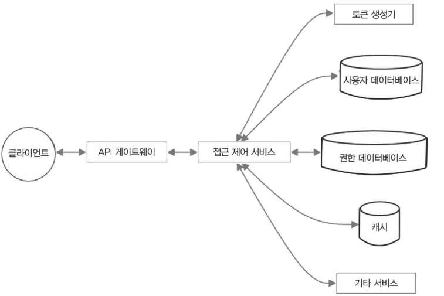
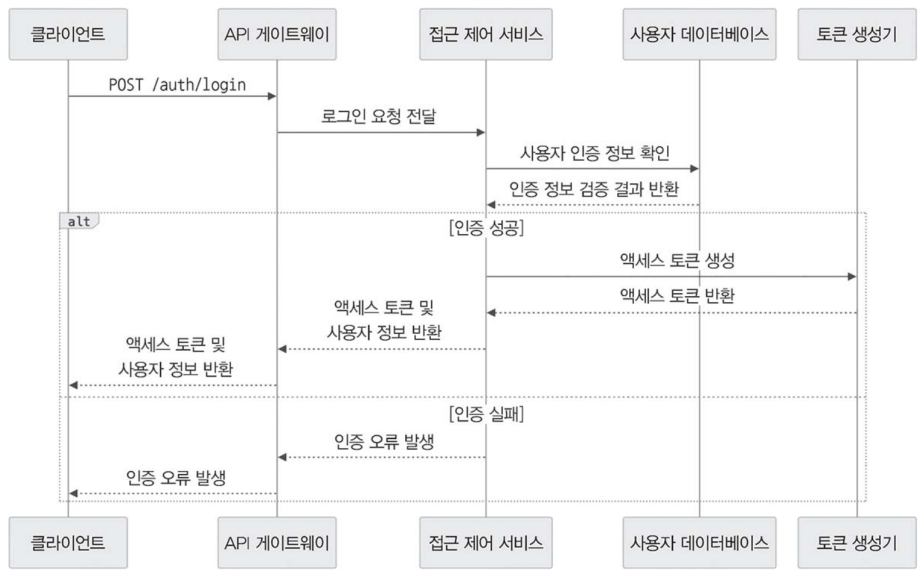

## 협업 서비스의 접속 상태 관리하기

- 사용자의 접속 상태를 관리 (➡️ 협업 중인 사용자가 서로의 온라인 상태를 실시간 파악) 
  - 사용자의 접속 상태 갱신
    - 사용자가 협업 세션에 참여하면 클라이언트는 /presence/{documentId} 엔드포인트로 접속 상태 업데이트 요청. 
    - 일정 간격으로 비활성 상태이거나 연결이 끊긴 클라이언트를 확인하고, 이에 따라 접속 상태를 업데이트. 
    - 변경 사항을 다른 협업 참여자에게 알림. 
    - 문서별로 접속 상태를 관리하는 해시 맵을 유지하여 문서별로 협업 중인 사용자 목록과 접속 상태 정보 관리. 
      - ```java
         Map<DocumentId, Map<UserId, PresenceStatus>> presenceMap;
        ```
- 클라이언트는 필요할 경우 직접 협업 서비스에 오프라인 상태 전환/비활성 알림 가능.

## 협업 서비스의 확장성 및 성능

- 스테이트리스 마이크로서비스 형태 배포: 협업 서비스는 확장성과 높은 성능을 유지하기 위해 상태를 저장하지 않을 수 있음. 
- 서비스 인스턴스 여러 개 실행
- 로드 밸런서 사용: 들어오는 요청과 웹소켓 연결을 분산으로 부하 감소. 
- 레디스 같은 분산 캐시 활용: 문서의 현재 상태와 접속 정보 저장 ➡️ 여러 서비스 인스턴스 간 빠른 데이터 동기화 및 접근.
- 아파치 카프카 같은 메시지 큐 활용: 현재 연결 고리가 살아 있는 클라이언트에 협업 이벤트를 전달. 
  - 웹소켓 연결을 직접 관리하는 것과 이벤트 처리를 분리할 수 있어 비동기 방식으로 확장성을 높이고 효율적인 작업 처리.

## 협업 서비스의 다른 서비스와 연동
- 문서 서비스 연동 ➡️ 문서 내용 조회/수정. 
  1. 협업 세션이 시작되면 문서 서비스에서 문서 초기 상태를 불러옴. 
  2. 사용자가 문서를 수정
  3. 협업 서비스는 업데이트된 내용을 문서 서비스로 보내 영구적으로 저장.
- 접근 제어 서비스 연동 ➡️ 문서 접근 권한 관리. 
  1. 협업 세션 참여 전, 사용자의 문서 편집 권한 확인.
  2. 허가된 사용자만 협업할 수 있도록 보장.

## 협업 서비스의 오류 처리와 복원력
- 다양한 장애 상황을 감지 및 복구를 위한 오류 처리 메커니즘. 
  - 오류 로깅과 모니터링 기능: 문제를 효과적으로 파악하고 진단
- 네트워크 장애나 서비스 오류가 발생하면 클라이언트와 다시 연결을 시도하고 문서 상태를 동기화.
- (문서 상태와 접속 정보)여러 수정 작업을 하나의 단위로 처리 ➡️ 일부만 적용되는 일이 없도록 처리 ➡️ 데이터의 무결성과 일관성을 보장 
- 데이터 검증 및 정제 기능 ➡️ 악의적인 협업 이벤트나 유효하지 않은 데이터가 문서에 영향을 미치지 않도록 방지 ➡️ 문서 상태 보호

## 협업 서비스의 기타 보안 고려 사항

- 기밀성과 무결성을 보호를 위한 조치. 
- HTTPS와 WSS 같은 안전한 통신 프로토콜을 사용하여 데이터를 암호화 ➡️ 데이터 전송 과정에서 보안을 강화 
- 접근 제어 메커니즘을 적용 ➡️ 허용한 사용자만 협업 세션에 참여하고 문서 내용을 확인할 수 있도록 제한. 
- 요청 속도 제한과 트래픽 제어 기능을 적용 ➡️ 악의적인 사용이나 DoS(서비스 거부) 공격을 방지
- 모니터링하고 로그를 기록 ➡️ 보안 분석과 감사 용도로 활용

> ### 옮긴이 노트: DoS와 DDoS의 차이
> DoS(서비스 거부)와 DDoS(분산 서비스 거부)는 둘 다 서버에 과부하를 발생시켜 정상적인 사용자가 서비스를 이용하지 못 하도록 만드는 공격 방식. 
> 
> - 공격 방식에 차이
>   - DoS(Denial of Service: 서비스 거부) 공격: 컴퓨터 한 대에서 과도한 요청을 보내 서버를 마비시키는 방식. 
>   - DDoS(Distributed Denial of Service: 분산 서비스 거부) 공격: 컴퓨터(보통 봇넷 활용) 여러 대를 동원하여 동시에 공격하는 방식, 훨씬 더 강력하고 방어하기 어렵다. 
> > 예시, 인기 많은 식당
> > 
> > - DoS 공격: 한 사람이 전화를 계속 걸어서 예약을 잡고, 다른 손님이 전화를 할 수 없도록 방해하는 것입니다.
> > - DDoS 공격: 수백 명이 동시에 전화를 걸어 모든 예약을 차지해 버리는 것입니다. 이 경우 식당은 정상적인 손님을 받을 수 없습니다.
> >
> > - DDoS가 더 위험한 이유는 한 명이 아니라 여러 명이 동시에 공격하므로, 차단하기 어렵고 피해 규모도 훨씬 크기 때문.
> > - ➡️ 다양한 보안 조치 필요.

- 협업서비스 요약 
  - 여러 사용자가 동시에 문서를 편집하고 동기화할 수 있도록 지원하여 끊김 없고 서로 상호 작용이 가능한 편집 환경을 제공. 
  - 문서 서비스 및 접근 제어 서비스와 연동
    - 동시 편집 충돌 해결
    - 문서의 일관성을 유지
    - ➡️ 완전한 공동 편집 솔루션 구성

# 13.6.3 접근 제어 서비스 설계
- 접근 제어 서비스
  - 파일 공유 시스템에서 사용자 인증, 권한 부여, 접근 권한 관리를 담당. 
  - 사용자의 역할과 권한에 따라 허용한 사용자만 문서를 조회하거나 수정할 수 있도록 보장. 
- 접근 제어 서비스의 설계도
  
  - 접근 제어 서비스의 핵심 구성 요소 및 클라이언트, 데이터베이스, 기타 시스템 내 서비스 간의 상호 작용을 나타낸다.
  
## 접근 제어 서비스의 API 엔드포인트

- POST /auth/login: 사용자 인증을 수행하고 액세스 토큰 발급.
  - 요청 본문: 사용자 인증 정보(에 아이디, 비밀번호)
  - 응답: 인증이 성공하면 액세스 토큰과 사용자 정보 반환

- POST /auth/logout: 사용자의 액세스 토큰을 무효화하고 로그아웃.
  - 요청 본문: 액세스 토큰
  - 응답: 성공 또는 오류 메시지

- GET /permissions/{documentId}: 특정 문서에 대한 접근 권한 조회.
  - 요청 매개변수: 문서 ID
  - 응답: 해당 문서에 대한 사용자 권한 목록 반환

- POST /permissions/{documentId}: 특정 문서에 대한 사용자의 접근 권한을 부여하거나 수정.
  - 요청 본문: 사용자 ID, 문서 ID, 권한 수준에 읽기, 쓰기, 소유자)
  - 응답: 성공 또는 오류 메시지

- DELETE /permissions/{documentId}/{userId}: 특정 문서에서 사용자의 접근 권한 제거.
  - 요청 매개변수: 문서 ID, 사용자 ID
  - 응답: 성공 또는 오류 메시지

## 접근 제어 서비스의 사용자 인증 과정

- 로그인 요청부터 액세스 토큰이 발급되는 과정까지 흐름
  

1. 로그인: `POST /auth/login`로 사용자 인증 정보를 요청.
2. 사용자 데이터베이스에서 해당 인증 정보가 올바른지 확인.
3. 인증 정보가 올바르면 접근 제어 서비스는 JWT 같은 액세스 토큰(사용자의 ID, 역할, 기타 관련 정보가 포함 됨)을 생성.
4. 생성한 액세스 토큰과 사용자 정보를 클라이언트에 반환.
5. 이후 모든 요청은 헤더에 액세스 토큰을 담아 전송하여 인증 및 권한 검사를 진행.