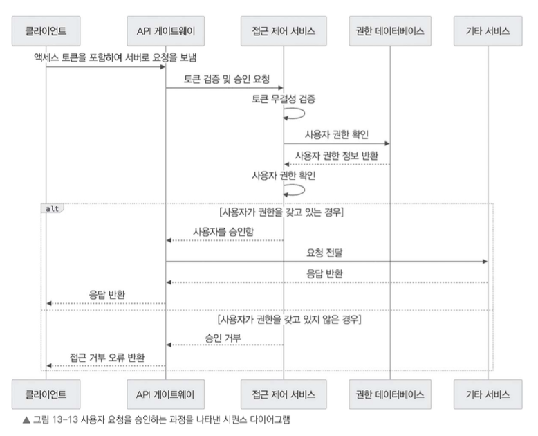
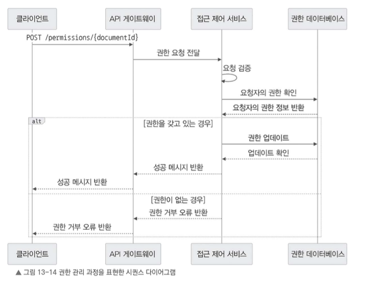
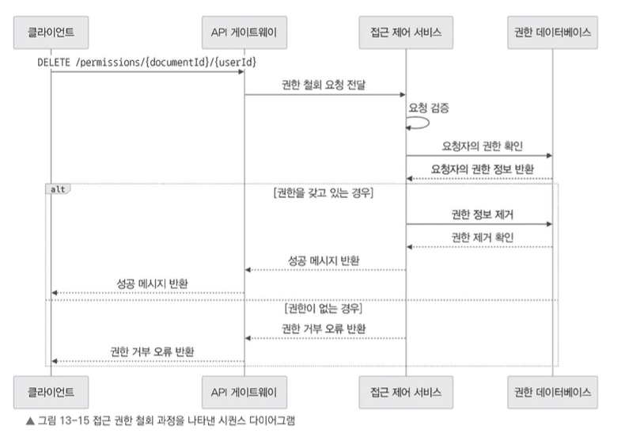

## 13.6.3 접근 제어 서비스 설계

앞에서 API 엔드포인트를 살펴보았으니, 이번에는 인증 및 권한 관리 흐름을 좀 더 자세히 알아본다.

---

## 사용자 인가 과정

다음 그림은 토큰 검증과 권한 확인 절차를 포함하여 사용자 요청을 승인하는 과정 전반을 나타낸다.

1. 클라이언트가 문서에 접근하거나 특정 작업을 수행하려고 요청을 보낼 때, 액세스 토큰을 요청 헤더에 포함한다.
2. 접근 제어 서비스는 요청을 가로채 액세스 토큰의 유효성과 무결성을 검증한다.
3. 토큰이 유효하면 접근 제어 서비스는 토큰에서 사용자 ID와 역할을 추출한다.
4. 권한 데이터베이스에서 해당 문서에 대한 사용자의 접근 권한을 조회한다.
5. 사용자의 역할과 권한을 바탕으로 요청받은 작업을 수행할 권한이 있는지 확인한다.
6. 사용자가 권한을 가지고 있다면 문서 서비스 같은 적절한 서비스로 요청을 전달하여 추가적인 처리를 진행한다.
7. 반대로 사용자에게 권한이 없으면 적절한 오류 응답을 반환하여 요청을 거부한다.

---

## 권한 관리

다음 그림은 문서에 권한을 부여하거나 수정하는 과정을 나타낸다.

요청을 보낸 사용자가 적절한 권한을 가지고 있는지 검증하는 절차까지 포함하고 있다.

1. 문서 소유자나 적절한 권한을 가진 사용자가 다른 사용자에게 문서 접근 권한을 부여하거나 기존 권한을 수정한다.
2. 클라이언트는 사용자 ID, 문서 ID, 권한 수준을 포함한 `POST /permissions/{documentId}` 요청을 보낸다.
3. 접근 제어 서비스는 요청을 검증한 후, 요청한 사용자가 권한을 부여하거나 수정할 수 있는 충분한 권한을 가지고 있는지 확인한다.
4. 요청이 유효하면 접근 제어 서비스는 권한 데이터베이스를 업데이트하여 새로운 권한을 추가하거나 기존 권한을 변경한다.
5. 권한 업데이트가 완료되면 클라이언트에 성공 메시지를 반환한다.

권한이 없는 경우에는 권한 거부 오류를 반환한다.

---

## 권한 철회

다음으로 사용자의 문서 접근 권한을 철회하는 과정을 살펴본다.

요청자의 권한을 검증하고, 데이터베이스에서 해당 권한을 제거하는 과정까지 포함한다.

1. 문서 소유자나 적절한 권한을 가진 사용자가 다른 사용자의 문서 접근 권한을 철회한다.
2. 클라이언트는 문서 ID와 사용자 ID를 포함한 `DELETE /permissions/{documentId}/{userId}` 요청을 보낸다.
3. 접근 제어 서비스는 요청을 검증한 후, 요청한 사용자가 권한을 철회할 수 있는 충분한 권한을 가지고 있는지 확인한다.
4. 요청이 유효하면 접근 제어 서비스는 권한 데이터베이스에서 해당 사용자의 권한을 제거한다.
5. 권한 제거가 완료되면 클라이언트에 성공 메시지를 반환한다.

권한이 없는 경우에는 권한 거부 오류를 반환한다.

