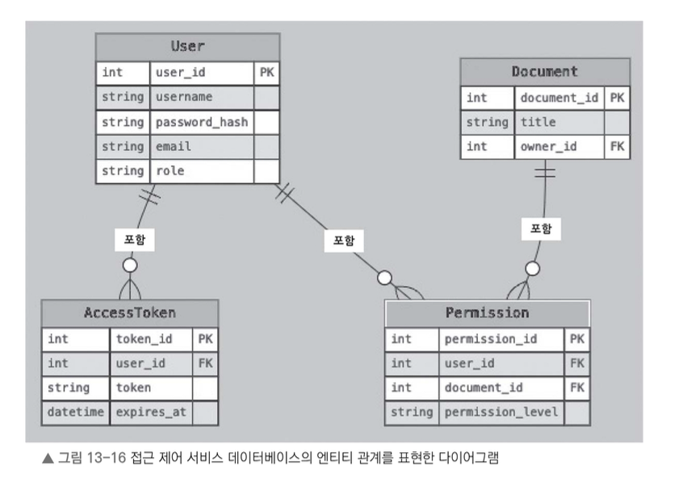

# 접근 제어 서비스 데이터베이스 설계

접근 제어 서비스는 데이터베이스에 다음 정보를 저장한다.

- 사용자 정보
- 액세스 토큰
- 사용자 권한

다음 그림은 접근 제어 서비스에서 사용하는 데이터베이스 테이블 구조를 보여준다.  
사용자(`User`), 액세스 토큰(`AccessToken`), 권한(`Permission`), 문서(`Document`) 엔티티의 관계를 나타낸다.

이 그림에서 나타내는 엔티티 관계의 핵심은 다음과 같다.

- 사용자(`User`)는 액세스 토큰(`AccessToken`) 여러 개와 권한(`Permission`)을 가질 수 있다.
- 문서(`Document`)는 권한(`Permission`) 여러 개와 연결될 수 있다.
- 권한(`Permission`) 테이블은 사용자(`User`)와 문서(`Document`)를 연결하는 중간 테이블 역할을 한다.
- 액세스 토큰(`AccessToken`) 테이블은 활성 세션과 토큰 만료 시간을 관리하는 데 사용한다.

---

# 캐싱 및 성능 최적화

Redis 같은 캐싱 시스템에 자주 조회하는 권한 정보와 사용자 정보를 저장하면 접근 제어 서비스의 성능을 높일 수 있다.

권한 확인 요청이 들어오면 서비스는 먼저 캐시를 조회한다.

- 필요한 정보가 캐시에 있으면 바로 응답한다.
- 필요한 정보가 캐시에 없으면 데이터베이스를 조회한다.

이렇게 하면 데이터베이스에 불필요한 부하가 걸리는 것을 줄이고, 응답 속도도 개선할 수 있다.

또 서비스의 요청 제한이나 속도 제한을 걸어 비정상적인 접근이나 과도한 요청을 막을 수 있다.  
이와 함께 서비스 접근 기록을 남기면 보안 분석과 감사 용도로 활용할 수 있다.

지금까지 접근 제어 서비스를 설계하는 방식을 살펴보았다.  
이런 방식을 바탕으로 접근 제어 서비스를 만들면 다음 기능을 안정적으로 관리할 수 있다.

- 사용자 인증
- 권한 부여
- 접근 제어

사용자는 각각에게 부여된 역할과 권한에 따라 문서에 접근하고 조작할 수 있다.  
서비스는 시스템 전반에서 접근 제어가 철저하게 적용되도록 다른 구성 요소와 연동된다.

다음 절에서는 파일 공유 시스템을 만들 때 고려해야 할 추가 사항과 모범 사례를 살펴본다.  
특히 성능 최적화, 데이터 일관성 유지, 장애 허용성 같은 요소에 초점을 맞춘다.

---

# 13.7 기타 검토 사항 및 모범 사례

구글 독스 같은 파일 공유 시스템을 만들 때는 성능, 안정성, 사용자 경험을 극대화하기 위해 추가로 고려해야 할 요소가 있다.

이런 요소를 신경 쓰면 시스템이 더 안정적으로 동작하고, 빠른 성능을 제공하며, 사용자 경험도 원활하게 만들 수 있다.

---

## 성능 최적화

- 서비스의 여러 계층에서 캐싱 메커니즘을 구현한다.
    - 자주 접근하는 문서
    - 사용자 권한 정보
    - 메타데이터

- 캐싱을 통해 자원의 지연 시간을 줄이고 응답 속도를 개선할 수 있다.

- 콘텐츠 전송 네트워크를 활용한다.
    - 이미지나 클라이언트 사이드 스크립트 같은 정적 자산을 지리적으로 분산된 서버에서 제공한다.
    - 사용자와 가까운 서버에서 데이터를 불러올 수 있어 로딩 속도를 줄일 수 있다.

- 데이터베이스 쿼리와 인덱스를 최적화한다.
    - 문서 조회나 권한 확인 같은 일반적인 작업의 응답 시간을 최소화할 수 있다.

- 문서 내용과 공동 작업자를 필요한 순간에 점진적으로 불러오는 레이지 로딩(lazy loading) 기법을 적용한다.
    - 초기 로딩 시간을 줄일 수 있다.

- 페이지네이션을 구현한다.
    - API 엔드포인트에서 반환하는 결과 개수를 제한한다.
    - 시스템 과부하를 방지하고 성능을 개선할 수 있다.

---

## 데이터 일관성 및 동시성

- 서비스가 모든 서비스와 구성 요소에서 데이터 일관성을 유지하도록 해야 한다.
    - 특히 동시 편집이나 실시간 협업을 하는 환경에서는 더 중요하다.

- 버전 번호나 타임스탬프를 활용한 낙관적 동시성 제어 기법을 적용한다.
    - 동일한 문서를 여러 사용자가 동시에 편집할 때 발생할 수 있는 충돌을 감지하고 해결할 수 있다.

- 데이터 불일치를 방지하고, 필요한 경우 작업이 중간에 끊기지 않도록 보장하려면 분산 잠금이나 동기화 기법을 활용할 수 있다.

- 높은 가용성과 성능을 유지하려면 일시적으로 데이터에 불일치가 생기더라도 이를 허용하는 최종 일관성 모델을 적절하게 적용하는 것도 고려해야 한다.

---

## 장애 내성과 복원력

- 서비스가 장애를 만나더라도 영향을 최소화하고, 오류나 예외 상황에서도 원활하게 복구할 수 있도록 설계해야 한다.

- 오류를 신속하게 감지하고 원인을 분석할 수 있도록 오류 핸들링과 로깅 시스템을 구축해야 한다.

- 일시적인 장애가 발생하면 서킷 브레이커(circuit breaker) 패턴과 재시도 메커니즘을 적용한다.
    - 장애가 연쇄적으로 퍼지는 것을 막을 수 있다.

- 이중화 및 복제 기술을 활용한다.
    - 하드웨어 또는 네트워크 장애가 발생하더라도 서비스 가용성을 유지할 수 있다.

- 데이터를 정기적으로 백업한다.
    - 핵심 비즈니스 로직이 끊기지 않도록 장애 복구 절차를 마련해야 한다.

---

## 확장성과 탄력성

- 서비스가 수평 확장 가능하도록 설계해야 한다.
    - 사용자가 늘어나고 트래픽이 증가하더라도 새로운 서비스 인스턴스를 추가할 수 있어야 한다.

- 자동 스케일링 기법을 활용한다.
    - 트래픽 부하에 따라 서비스 인스턴스 수를 자동으로 조절할 수 있다.
    - 자원을 효율적으로 사용하고 비용도 절감할 수 있다.

- 로드 밸런싱을 적용한다.
    - 여러 서비스 인스턴스에 작업을 균등하게 분배할 수 있다.
    - 특정 서버에 과부하가 걸리는 상황을 방지할 수 있다.

- 메시지 큐와 비동기 처리 방식을 사용한다.
    - 서비스 간 결합도를 낮출 수 있다.
    - 트래픽이 갑자기 튀거나 연산이 많은 작업이 들어오더라도 효과적으로 처리할 수 있다.

---

## 지속적 통합 및 지속적 배포

- 파일 공유 서비스 내에서 CI/CD 파이프라인을 만든다.
    - 빌드부터 테스트, 배포 과정을 자동화할 수 있다.

- Git 같은 버전 관리 시스템을 활용한다.
    - 작업 변경 내역을 체계적으로 관리할 수 있다.
    - 업무 협업 효율도 높일 수 있다.

- 단위 테스트, 통합 테스트, E2E 테스트를 자동화한다.
    - 버그를 미리 발견하게 되어 시스템 안정성을 높일 수 있다.

- Docker 같은 컨테이너 기술과 Kubernetes 같은 오케스트레이션 플랫폼을 사용한다.
    - 배포와 서비스 운영을 더 효율적으로 할 수 있다.

- 배포 과정에서 서버 다운타임과 장애를 최소화하려면 다음 전략을 사용할 수 있다.
    - 블루-그린 배포
    - 카나리 배포
    - 롤링 업데이트

지금까지 파일 공유 시스템을 만드는 방법을 살펴보았다.

앞서 살펴본 요소와 모범 사례를 반영하면 시스템을 다음과 같은 형태로 설계하고 구현할 수 있다.

- 성능이 뛰어난 시스템
- 확장성이 우수한 시스템
- 보안과 사용 편의성을 모두 갖춘 시스템

이외에도 끊임없이 바뀌는 요구 사항에 맞추어 시스템을 만들고, 사용자 피드백과 성능 지표를 바탕으로 서비스를 개선해 나가는 과정이 있어야 서비스를 오래도록 안정적으로 발전시키며 운영할 수 있다.

---

# 옮긴이 노트: 낙관적 동시성 제어와 비관적 동시성 제어란

낙관적 동시성 제어(optimistic concurrency control)는 “일단 해 보고 안 되면 조정하자!”라는 철학을 가진 방식이다.

예를 들어 친구와 같이 온라인 문서를 편집한다고 가정해 보자.  
두 사람이 같은 문서의 같은 부분을 동시에 수정했다.

- 나는 “안녕하세요!”라고 입력했다.
- 친구는 “Hello!”라고 입력했다.

이때 낙관적 동시성 제어는 다음과 같이 동작한다.

1. 두 사람이 각자 수정한 내용을 서버로 보낸다.
2. 서버는 같은 부분을 수정했는지 감지한다.
3. 서버는 누가 먼저 보냈는지, 충돌을 어떻게 해결할지 판단한다.
4. 충돌이 발생하면 가장 최근 내용을 적용하거나 사용자가 직접 선택하도록 한다.

이 방식은 매번 데이터에 락을 걸지 않기 때문에 성능이 뛰어나다.  
하지만 충돌이 발생하면 해결해야 한다는 단점이 있다.

반대로 비관적 동시성 제어는 “혹시라도 문제가 생길까 봐, 내가 끝낼 때까지 아무도 못 건드리게 해야지!”라는 방식이다.

한마디로 이렇게 정리할 수 있다.

- **낙관적 동시성 제어**
    - “수정해도 돼! 다만 충돌이 나면 해결해야 해!”

- **비관적 동시성 제어**
    - “잠깐! 내가 다 할 때까지 아무도 손대지 마!”

어떤 방식이 더 좋은지는 상황에 따라 달라진다.  
다만 협업 편집 같은 환경에서는 낙관적 방식을 더 자주 사용한다.

---

# 옮긴이 노트: 서킷 브레이커란

서킷 브레이커는 전기 회로 차단기처럼 서비스에서 장애가 발생했을 때 문제가 확산되지 않도록 막아 주는 보호 장치다.

예를 들어 어떤 서비스가 갑자기 응답하지 않거나 지연이 심할 때, 이를 계속 호출하면 전체 서비스가 마비될 수도 있다.

서킷 브레이커 패턴은 이런 상황에서 다음과 같이 동작한다.

- 일정 횟수 이상 요청이 실패하면 자동으로 해당 서비스 호출을 차단한다.
- 일정 시간이 지나거나 상태가 복구되었을 때 다시 연결을 시도한다.

쉽게 말해 “이제 그만! 잠깐 쉬었다가 다시 시도해!”라고 말해 주는 보호 장치라고 보면 된다.