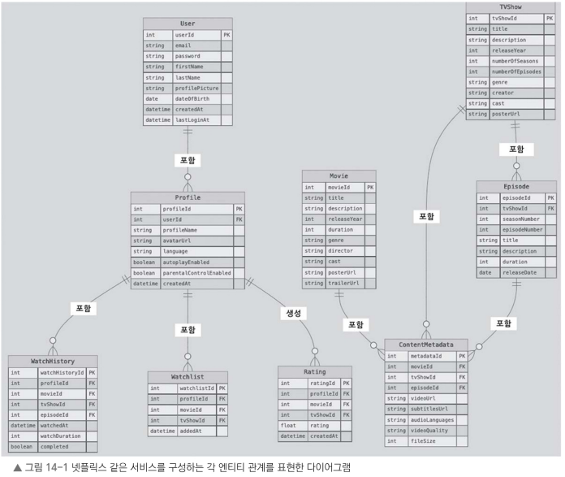

# 14.3 데이터 모델

넷플릭스 같은 서비스를 만들려면 **효율적이면서도 확장성이 좋은 데이터 모델**을 설계하는 것이 중요하다.

데이터 모델은 시스템에서 다루는 주요 엔티티의 구조와 관계를 정의하며, 데이터를 효과적으로 저장하고 조회할 수 있도록 만들어준다.

주요 엔티티와 각 엔티티 관계를 살펴보자

### 사용자(User)

서비스의 핵심 엔티티로, 하나의 계정에 프로필을 여러 개 연결할 수 있다.

이를 통해 각 사용자에게 맞는 맞춤형 서비스를 제공할 수 있다.

### 프로필(Profile)

특정 사용자 계정에 연결된 개별 프로필로, **시청 선호도 및 설정**을 저장한다.

다음 엔티티와 연관되어 사용자의 콘텐츠 이용 기록과 상호 작용을 관리한다.

* 시청 기록(WatchHistory)
* 찜한 콘텐츠(Watchlist)
* 평점(Rating)

### 영화(Movie)

독립적인 콘텐츠 엔티티로 자체적인 메타데이터를 갖고 있다.

* 사용자의 시청 기록에 포함될 수 있다.
* 찜한 콘텐츠에 추가할 수 있다.
* 프로필(Profile)로부터 평점을 받을 수 있다.

### TV 프로그램(TVShow)

에피소드(Episode) 여러 개로 구성된 시리즈 형태의 콘텐츠를 의미한다.

자체적인 메타데이터를 가지고 있으며, 영화(Movie)와 마찬가지로 다음과 같은 사용자 상호 작용이 가능하다.

* 시청 기록에 포함될 수 있다.
* 찜한 콘텐츠에 추가할 수 있다.
* 프로필로부터 평점을 받을 수 있다.

### 에피소드(Episode)

특정 TV 프로그램(TVShow)에 속하는 개별 콘텐츠 단위로, 자체적인 메타데이터를 포함하고 있다.

또한 시청 기록(WatchHistory)을 통해 사용자의 **시청 진행 상황을 상세하게 추적**할 수 있다.

### 시청 기록(WatchHistory)

특정 프로필의 시청 활동을 기록하는 엔티티다.

영화, TV 프로그램, 개별 에피소드와 연결되며 다음과 같은 기능에 활용할 수 있다.

* 이전에 보던 콘텐츠 이어서 시청
* 개인별 시청 통계 확인
* 콘텐츠별 시청 진행 상황 추적

### 찜한 콘텐츠(Watchlist)

특정 프로필이 나중에 시청할 영화나 TV 프로그램을 저장할 수 있도록 한다.

이를 통해 새로운 콘텐츠를 발견하고 개인 맞춤형 추천을 받을 수 있다.

### 평점(Rating)

프로필이 영화나 TV 프로그램에 대한 평점을 남길 수 있도록 한다.

이러한 평점은 다음과 같은 기능에 활용할 수 있다.

* 개인화 추천 시스템
* 콘텐츠 품질 평가

### 콘텐츠 메타데이터(ContentMetadata)

영화, TV 프로그램, 에피소드의 **비디오 품질, 파일 크기 등 기술적인 정보**를 저장한다.

이를 통해 적응형 스트리밍 및 콘텐츠 전송 최적화를 지원한다.

## 엔티티 관계

그림 14-1은 넷플릭스 같은 스트리밍 서비스의 전체적인 데이터 모델을 나타내며, 핵심 엔티티와 각 속성 및 관계를 보여준다.

이제 데이터 모델에서 **관계**가 어떻게 설정되는지 살펴본다.

---

## 일대다 관계

우선 데이터 모델에서 정의된 **일대다(1:N) 관계**를 중심으로 주요 관계를 정리한다.

| 관계                      | 설명                                            |
| ----------------------- | --------------------------------------------- |
| **사용자 → 프로필**           | 하나의 사용자는 프로필을 여러 개 가질 수 있다.                   |
| **영화 → 콘텐츠 메타데이터**      | 한 영화는 여러 화질 옵션이나 언어 선택 등 메타데이터를 여러 개 가질 수 있다. |
| **TV 프로그램 → 에피소드**      | 하나의 TV 프로그램은 여러 에피소드로 구성된다.                   |
| **TV 프로그램 → 콘텐츠 메타데이터** | 한 TV 프로그램은 메타데이터 버전을 여러 개 가질 수 있다.            |
| **에피소드 → 콘텐츠 메타데이터**    | 한 에피소드는 여러 화질이나 언어 선택 등 메타데이터를 여러 개 가질 수 있다.  |
| **프로필 → 시청 기록**         | 각 프로필은 시청 기록을 여러 개 가질 수 있다.                   |
| **프로필 → 시청 목록**         | 한 프로필에 시청 목록 항목을 여러 개 저장할 수 있다.               |
| **프로필 → 평점**            | 한 프로필에 여러 영화나 TV 프로그램을 평가한 내용을 저장할 수 있다.      |

---

지금까지 데이터 모델을 살펴봤다.

데이터 모델은 스트리밍 서비스의 **핵심 구조를 정의**하기 때문에 잘 설계하면 서비스에서 다루는 다음과 같은 데이터를 효율적으로 저장하고 관리할 수 있다.

* 사용자 정보
* 프로필
* 영화
* TV 프로그램
* 에피소드
* 시청 기록
* 시청 목록
* 평가
* 콘텐츠 메타데이터

또한 데이터 모델을 체계적으로 설계하면 **대량의 데이터를 안정적으로 처리**할 수 있을 뿐만 아니라, 주요 기능을 빠르게 구동할 수 있게 할 수 있다.

이제 다음 단계로 넘어가 **예상 사용자 수와 서비스 이용 패턴을 고려하여 서비스 규모를 산정**한다.

