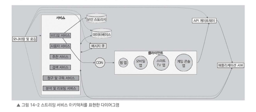

# 14.5 고수준 설계

지금까지 기능적 요구 사항, 비기능적 요구 사항, 데이터 모델 설계, 서비스 용량을 함께 산정해 보았다.

이제 이를 바탕으로 넷플릭스 같은 스트리밍 서비스의 전체적인 아키텍처를 설계해 보자.  
아키텍처 설계 목표는 방대한 양의 비디오 콘텐츠와 사용자 트래픽을 안정적으로 처리하면서도, 서비스가 쉽게 확장될 수 있도록 구성하는 것이다.

아래 그림은 이러한 서비스를 위한 고수준 아키텍처를 나타낸다.

그림에서 표현하는 아키텍처는 다음 요소들로 구성된다.

- 클라이언트 애플리케이션
- API 게이트웨이
- 애플리케이션 서버
- 비디오 서비스
- 사용자 서비스
- 추천 서비스
- 검색 서비스
- 청구 및 구독 서비스
- 분석 및 리포팅 서비스
- CDN
- 스토리지 시스템
- 데이터베이스
- 메시지 큐
- 모니터링 및 로깅 시스템

---

## 클라이언트 애플리케이션

아키텍처의 가장 앞쪽에는 사용자가 직접 사용하는 **클라이언트 애플리케이션**이 있다.

클라이언트 애플리케이션에는 다음과 같은 환경이 포함된다.

- 웹 애플리케이션
- 모바일 앱
    - iOS
    - Android
- 스마트 TV 앱
- 게임 콘솔 앱

사용자는 클라이언트 앱을 통해 스트리밍 서비스와 상호작용한다.

---

## API 게이트웨이

사용자가 클라이언트 앱을 통해 서비스를 요청하면 가장 먼저 **API 게이트웨이**를 통과한다.

API 게이트웨이는 모든 요청이 들어오는 첫 번째 관문 역할을 한다.

주요 역할은 다음과 같다.

- 클라이언트 요청을 적절한 서비스로 라우팅
- 사용자 인증 수행
- 과도한 요청 제한
- 하나의 통합 API 인터페이스 제공(프론트엔드가 여러 백엔드 컴포넌트와 직접 통신하지 않아도됨)
---

## 애플리케이션 서버

API 게이트웨이 뒤쪽에는 **애플리케이션 서버**가 위치한다.

애플리케이션 서버는 클라이언트가 보낸 요청에 대한 비즈니스 로직을 수행한다.

주요 역할은 다음과 같다.

- 서비스 로직 실행
- 백엔드 서비스 호출
- 사용자 요청 처리
- 데이터베이스 조회 및 저장
- 클라이언트에 필요한 응답 구성

애플리케이션 서버는 서비스 이용량이나 요청량 증가에 따라 쉽게 수평 확장할 수 있도록 설계되어야 한다.

---

## 비디오 서비스

스트리밍 서비스에서 특히 중요한 역할을 하는 요소는 **비디오 서비스**다.

비디오 서비스는 비디오 콘텐츠를 저장하고, 다양한 형식과 품질로 변환하며, 사용자에게 스트리밍하는 업무를 담당한다.

주요 역할은 다음과 같다.

- 새로운 비디오 콘텐츠 처리
- 비디오 메타데이터 관리
- 비디오 인코딩
- 다양한 포맷과 비트레이트로 변환
- 사용자 네트워크 상태에 따른 화질 조정
- CDN과 연동하여 비디오 전송

예를 들어 사용자가 업로드하거나 서비스가 확보한 비디오 원본은 분산 스토리지에 저장된다.  
이후 비디오 서비스가 해당 원본을 여러 포맷과 비트레이트로 변환한다.

이를 통해 사용자의 네트워크 상태에 따라 적절한 화질을 제공할 수 있다.(적응형 스트리밍)

---

## CDN

비디오 서비스는 콘텐츠를 효율적으로 사용자에게 전송하기 위해 **CDN**과 연동된다.

CDN은 세계 곳곳에 분산된 서버에 비디오 콘텐츠를 캐싱해 둔다.  
사용자가 콘텐츠를 요청하면 사용자와 가까운 서버에서 비디오를 전송한다.

이 방식의 장점은 다음과 같다.

- 전송 지연 감소
- 스트리밍 성능 향상
- 원본 서버 부하 감소
- 지역별 사용자에게 더 빠른 콘텐츠 제공

즉 CDN을 활용하면 물리적 거리가 가까운 서버에서 콘텐츠를 내려받을 수 있어, 사용자 경험이 좋아진다.

---

## 사용자 서비스

**사용자 서비스**는 회원 인증과 사용자 관련 데이터를 관리한다.

주요 역할은 다음과 같다.

- 회원 가입
- 로그인
- 사용자 인증
- 사용자 프로필 관리
- 접근 권한 관리
- 콘텐츠 이용 권한 확인

사용자가 회원 가입을 하거나 로그인하면 사용자 서비스가 인증 절차를 처리한다.  
이 과정에서 사용자 계정 정보, 프로필 데이터, 시청 기록 등이 데이터베이스에 저장된다.

또한 사용자가 자신이 이용할 수 있는 콘텐츠와 기능에만 접근하도록 제어한다.

---

## 추천 서비스

**추천 서비스**는 사용자의 시청 이력, 관심사, 행동 데이터를 기반으로 개인 맞춤형 콘텐츠를 추천한다.

주요 역할은 다음과 같다.

- 사용자 시청 이력 분석
- 관심사 데이터 분석(컨텐츠, 평점 기반 상호작용패턴)
- 행동 패턴 분석(머신러닝)
- 추천 콘텐츠 생성
- 추천 결과 제공

추천 서비스는 머신러닝 알고리즘을 활용할 수 있다.  
사용자의 취향과 행동에서 나타나는 패턴을 찾아 더 많은 사용자가 서비스에 지속적으로 관심을 갖고 이용할 수 있도록 돕는다.

---

## 검색 서비스

**검색 서비스**는 사용자가 원하는 콘텐츠를 쉽고 빠르게 찾을 수 있도록 돕는다.

넷플릭스 같은 서비스에는 수많은 비디오와 메타데이터가 있기 때문에 강력한 검색 기능이 필요하다.

검색 서비스는 다음 데이터를 기반으로 검색을 처리한다.

- 비디오 제목
- 설명
- 장르
- 태그
- 메타데이터

검색 서비스는 자동완성이나 유사 검색도 지원할 수 있다.  
이를 통해 사용자가 제목이나 정확한 철자를 기억하지 못해도 원하는 콘텐츠를 쉽게 찾을 수 있다.

---

## 청구 및 구독 서비스

**청구 및 구독 서비스**는 사용자의 구독 정보, 결제, 청구를 관리한다.

주요 역할은 다음과 같다.

- 사용자 구독 정보 관리
- 결제 처리
- 청구 관리
- 구독 갱신
- 구독 취소 처리
- 요금제 변경 처리

외부 결제 시스템과 연동하여 정기적으로 사용자에게 구독 요금을 결제받고, 결제 처리를 안전하게 수행한다.

또한 사용자가 구독 상태를 변경하거나 취소할 수 있도록 API를 제공한다.

---

## 분석 및 리포팅 서비스

**분석 및 리포팅 서비스**는 사용자와 서비스 운영에 필요한 데이터를 수집하고 분석한다.

주요 역할은 다음과 같다.

- 시청 지표 수집
- 사용자 행동 데이터 수집
- 인기 컨텐츠 파악
- 추천 기능 최적화
- 서비스 품질 향상
- 데이터 기반 의사결정 지원

분석 결과를 바탕으로 사용자가 더 만족할 수 있는 서비스를 만들 수 있다.

---

## 메시지 큐

각 서비스 간 효율적인 통신을 위해 **메시지 큐**를 활용한다.

메시지 큐는 비동기 방식으로 서비스끼리 메시지나 데이터를 주고받을 수 있게 한다.

주요 장점은 다음과 같다.

- 서비스 간 결합도 감소
- 비동기 처리 지원
- 트래픽 급증 상황에서 안정적인 처리
- 무거운 작업을 별도 서비스로 전달
- 서비스 장애 시 영향 범위 감소

예를 들어 사용자가 비디오를 새로 업로드하면 비디오 서비스가 인코딩 작업을 메시지 큐에 전달할 수 있다.  
이후 별도의 인코딩 서비스가 해당 작업을 비동기적으로 받아 처리한다.

이렇게 하면 시스템 부하가 높더라도 작업을 효율적이고 안정적으로 처리할 수 있다.

---

## 모니터링 및 로깅

**모니터링 및 로깅**은 서비스를 안정적으로 운영하기 위해 필요하다.

모든 시스템 구성 요소에서 발생하는 로그와 성능 지표를 한곳에 모아 관리하면, 시스템 문제를 빠르게 파악하고 해결할 수 있다.

주요 역할은 다음과 같다.

- 서비스 상태 확인
- 성능 지표 수집
- 로그 수집
- 장애 탐지
- 실시간 알림 제공
- 문제 원인 분석

대시보드와 실시간 알림 시스템을 갖추면 시스템 상태를 즉각적으로 확인하고 대응할 수 있다.

---

# 고수준 설계 흐름 정리

지금까지 설명한 내용을 다시 정리하면 다음과 같다.

1. 사용자는 클라이언트 앱을 통해 API 게이트웨이에 접근한다.
2. API 게이트웨이는 요청을 적절한 서비스로 전달한다.
3. 비디오 서비스는 비디오 저장, 인코딩, 스트리밍을 처리한다.
4. 사용자 서비스는 인증과 사용자 프로필 관리를 담당한다.
5. 추천 서비스는 개인 맞춤형 콘텐츠를 제공한다.
6. 검색 서비스는 원하는 콘텐츠를 찾을 수 있게 한다.
7. 청구 및 구독 서비스는 구독과 결제를 처리한다.
8. 분석 및 리포팅 서비스는 사용자 데이터를 분석하고 서비스 개선에 필요한 정보를 제공한다.
9. 메시지 큐는 서비스 간 비동기 소통을 지원한다.
10. 모니터링과 로깅은 시스템의 안정적인 운영을 지원한다.

---

다음 절에서는 시스템의 더 구체적인 부분을 다루는 서비스 상세 설계를 살펴본다.  
특히 비디오 서비스, 사용자 서비스, 추천 서비스, CDN 같은 핵심 구성 요소의 설계와 구현 세부 사항을 구체적으로 살펴볼 예정