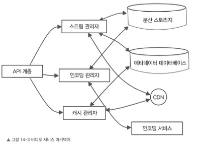
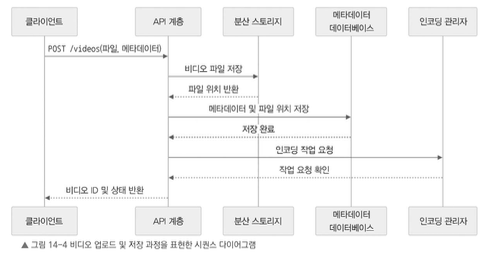
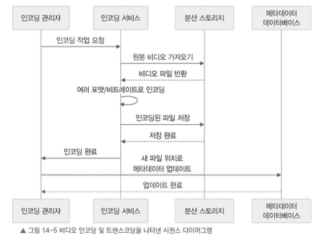
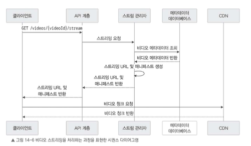
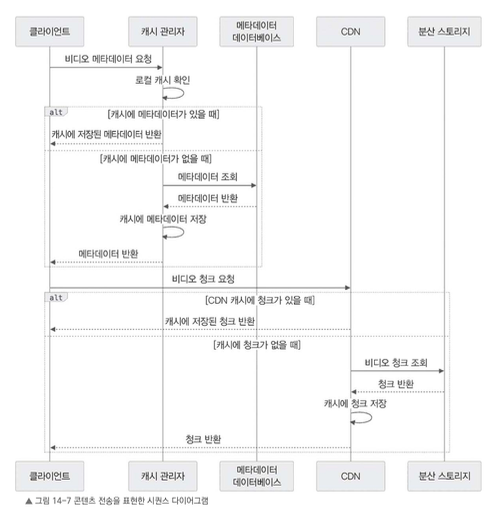

# 14.6 서비스 세부 설계

이 절에서는 스트리밍 서비스의 주요 마이크로서비스 중 몇 가지 중요한 서비스를 골라 세부 설계를 살펴본다.

모든 서비스를 전부 다루지는 않고, 핵심 서비스 몇 개를 중심으로 API와 처리 흐름을 정리한다.

---

# 14.6.1 비디오 서비스

비디오 서비스는 넷플릭스 같은 스트리밍 시스템에서 핵심적인 역할을 담당한다.

주요 역할은 다음과 같다.

- 동영상 파일 저장
- 비디오 인코딩
- 비디오 스트리밍
- 비디오 메타데이터 관리
- CDN과 연동한 콘텐츠 전송

### 비디오 서비스의 상위 구조를 표현한 아키텍쳐



---

## 비디오 서비스 API

비디오 서비스가 제공하는 주요 API는 다음과 같다.

### 비디오 업로드

```http
POST /videos
````

새로운 비디오 파일을 업로드한다.

* **요청 본문**

    * 비디오 파일
    * 메타데이터

        * 제목
        * 설명
        * 재생 시간 등

* **응답**

    * 새로 만든 비디오 ID
    * 업로드 상태

---

### 비디오 메타데이터 조회

```http
GET /videos/{videoId}
```

특정 비디오의 메타데이터를 조회한다.

* **응답**

    * 비디오 제목
    * 설명
    * 재생 시간 등 메타데이터

---

### 비디오 스트리밍

```http
GET /videos/{videoId}/stream
```

특정 비디오 콘텐츠를 스트리밍한다.

* **요청 쿼리 파라미터**

    * 비디오 ID
    * 화질
    * 재생 시작 위치(offset)

* **응답**

    * 비디오 조각(segment) 데이터

---

# 비디오 업로드 및 저장

비디오를 업로드하고 저장하는 과정은 다음과 같다.



1. 사용자가 비디오를 업로드하면, 비디오 서비스의 API 엔드포인트를 통해 파일과 메타데이터가 들어온다.

    * 제목
    * 설명
    * 길이 등

2. 비디오 서비스는 전달받은 비디오 파일을 분산 스토리지에 저장한다.

    * 예를 들어 Amazon S3나 Hadoop 분산 파일 시스템 같은 저장소를 사용할 수 있다.
    * 분산 스토리지는 확장성이 좋고, 데이터 손실 가능성이 적어 안정적으로 운영할 수 있다.

3. 비디오의 메타데이터는 PostgreSQL이나 Cassandra 같은 데이터베이스에 저장한다.

    * 실제 비디오 파일이 저장된 위치 정보도 함께 기록한다.

---

# 비디오 인코딩 및 트랜스코딩

비디오 업로드가 완료되면, 비디오 서비스는 해당 파일을 다양한 형식과 화질로 변환한다.




인코딩 및 트랜스코딩 작업 과정은 다음과 같다.

1. 비디오가 업로드되면 비디오 서비스가 해당 비디오를 다양한 형식과 화질로 변환하기 위해 인코딩 작업을 시작한다.

2. 인코딩 작업은 별도의 인코딩 전용 서비스나 인코딩 워커(worker)를 활용해 처리할 수 있다.

3. 비디오는 여러 포맷과 비트레이트로 변환된다.

    * 예: MP4, HLS, DASH 등
    * 사용자의 기기나 네트워크 상태에 따라 적절한 화질로 재생될 수 있도록 적응형 스트리밍을 지원하기 위함이다.

4. 인코딩이 완료되면 변환된 비디오 파일을 분산 스토리지에 저장한다.

5. 각 파일의 저장 위치는 메타데이터 데이터베이스에 업데이트한다.

---

# 비디오 스트리밍

비디오 스트리밍은 사용자가 비디오를 재생할 때 처리되는 과정이다.



비디오 스트리밍은 다음 과정으로 처리된다.

1. 사용자가 비디오를 재생하면 클라이언트 앱은 비디오 서비스의 API로 스트리밍 요청을 보낸다.

2. 비디오 서비스는 데이터베이스에서 비디오의 메타데이터를 가져온다.

    * 클라이언트의 기기 성능
    * 네트워크 환경
    * 요청한 화질
    * 재생 위치

3. 비디오 서비스는 클라이언트가 스트리밍에 필요한 정보를 담은 URL이나 매니페스트를 생성한다.

    * HLS 플레이리스트
    * DASH 매니페스트 등

4. 클라이언트 앱은 URL이나 매니페스트를 이용하여 CDN이나 비디오 서비스에 비디오 청크 파일을 요청한다.

5. CDN이나 비디오 서비스가 요청받은 비디오 청크를 클라이언트에 전달한다.

    * 클라이언트는 이 청크 파일을 순서대로 재생하여 사용자에게 끊김 없는 스트리밍을 제공한다.

> 추가) 비디오 스트리밍은 하나의 큰 파일을 한 번에 내려받는 방식이 아니라, 영상을 여러 개의 작은 청크(segment)로 나누어 순서대로 받아오며 재생하는 방식이다.
>
> 청크가 잘게 나뉘어 있으면 요청이 너무 자주 발생할 수 있다. 하지만 실제로는 클라이언트가 매니페스트 파일을 먼저 받아 청크 목록을 확인하고, 재생에 필요한 청크를 순서대로 요청한다.
>
> 청크 요청이 자주 발생하기 때문에 모든 요청을 비디오 서비스가 직접 처리하지는 않는다. 보통 CDN이 사용자와 가까운 엣지 서버에 청크를 캐싱해 두고 빠르게 응답한다.
>
> 로딩은 다음 청크를 제때 받아오지 못해 버퍼가 부족할 때 발생한다. 네트워크가 느리거나, CDN 캐시에 청크가 없거나, 너무 높은 화질의 청크를 요청하면 버퍼링이 생길 수 있다.
>
> 이를 줄이기 위해 HLS나 DASH 같은 방식은 같은 영상을 여러 화질로 준비해 두고, 클라이언트의 네트워크 상태에 따라 적절한 화질의 청크를 선택해 재생한다.

---

# 콘텐츠 전송 및 캐싱

비디오 콘텐츠를 빠르게 전달하려면 CDN과 캐싱 전략이 중요하다.



콘텐츠 전송 처리 과정은 다음과 같다.

1. 비디오 서비스는 CDN과 연동하여 스트리밍 성능을 높이고 지연 시간을 줄이는 방식으로 동작한다.

2. CDN은 사용자와 가까운 위치의 엣지 서버에 자주 요청하는 비디오 청크를 미리 캐싱해 둔다.

    * 사용자가 요청하면 가까운 서버에서 콘텐츠를 빠르게 전송할 수 있다.

3. 비디오 서비스 내부에서도 Redis나 Memcached 같은 캐시를 활용할 수 있다.

    * 자주 조회하는 비디오 메타데이터를 저장한다.
    * 데이터베이스 부하를 줄일 수 있다.

---

# 비디오 서비스 정리

비디오 서비스는 스트리밍 서비스에서 매우 중요한 역할을 한다.

비디오 서비스는 다음 작업을 담당한다.

* 비디오 업로드
* 비디오 파일 저장
* 메타데이터 저장
* 인코딩 및 트랜스코딩
* 여러 화질과 포맷 제공
* 스트리밍 URL 또는 매니페스트 생성
* CDN과 연동한 콘텐츠 전송
* 비디오 메타데이터 캐싱

분산 저장소를 활용해 대규모 영상 데이터를 안정적으로 보관하고, 인코딩 과정을 통해 다양한 기기와 네트워크 환경에 맞는 영상을 제공한다.

또 CDN을 통해 비디오 청크를 빠르게 전달할 수 있기 때문에 사용자는 끊김 없는 영상 재생 경험을 얻을 수 있다.

다음 절에서는 사용자 인증, 프로필 관리, 개인화 추천 같은 기능을 담당하는 사용자 서비스를 살펴본다.

