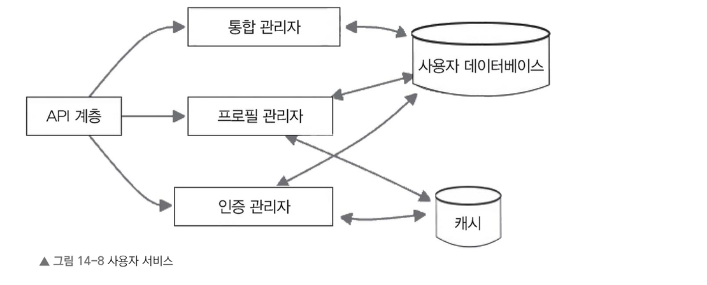
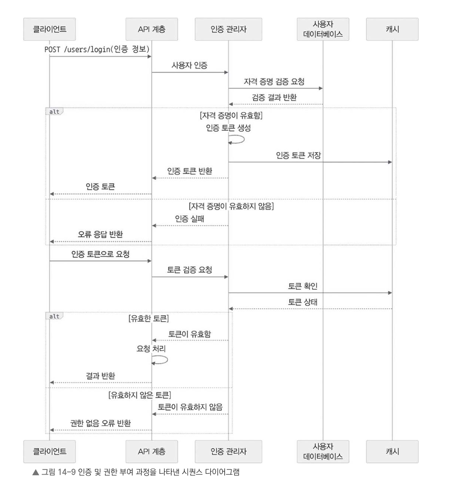
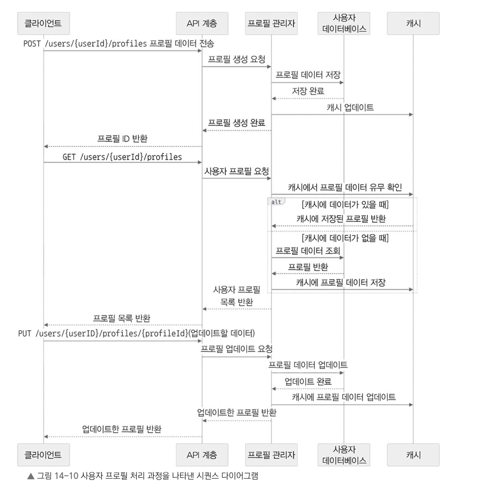

# [14장]_넷플릭스 서비스 설계

---

### 14.6.2 사용자 서비스

- 사용자 서비스는 **회원 가입, 로그인, 권한 관리, 프로필 관리**까지 담당하는 핵심 서비스다.
- 사용자는 이 서비스를 통해 계정을 안전하게 관리하고 개인 맞춤 서비스를 이용한다.

#### 사용자 서비스 구조

- **API 계층**에서 요청을 받아 세 개의 관리자로 분기한다.
   - **통합 관리자**: 사용자 데이터베이스와 연동해 계정 전반을 관리한다.
   - **프로필 관리자**: 사용자 데이터베이스 + 캐시와 연동해 프로필 정보를 관리한다.
   - **인증 관리자**: 사용자 데이터베이스 + 캐시와 연동해 인증을 처리한다.
- 데이터 저장소는 **사용자 데이터베이스**와 **캐시** 두 가지로 구성된다.

#### 14.6.2.1 제공 API

- **계정**
   - `POST /users`: 새 사용자 계정 생성
      - 요청: 이메일, 비밀번호, 이름 등 사용자 정보
      - 응답: 생성된 사용자 ID + 인증 토큰
   - `POST /users/login`: 로그인
      - 요청: 이메일, 비밀번호 등 로그인 정보
      - 응답: 인증 토큰

- **사용자 프로필**
   - `GET /users/{userId}`: 사용자 프로필 조회
      - 응답: 이름, 이메일, 프로필 사진 등
   - `PUT /users/{userId}`: 사용자 프로필 수정
      - 요청: 수정할 프로필 정보
      - 응답: 업데이트된 프로필 정보

- **서브 프로필 (한 계정 내 여러 프로필)**
   - `POST /users/{userId}/profiles`: 새 프로필 추가
      - 요청: 프로필 이름, 아바타, 취향 설정 등
      - 응답: 생성된 프로필 ID
   - `GET /users/{userId}/profiles`: 사용자의 모든 프로필 조회
      - 응답: 프로필 목록
   - `PUT /users/{userId}/profiles/{profileId}`: 특정 프로필 수정
      - 요청: 수정할 프로필 정보
      - 응답: 수정 완료된 프로필 정보

#### 14.6.2.2 사용자 인증 및 권한 부여

1. 회원 가입/로그인 시 입력한 계정 정보를 사용자 DB에 저장된 정보와 비교해 인증한다.
2. 인증 성공 시 사용자 ID 등을 담은 **JWT 같은 인증 토큰**을 생성한다.
3. 토큰을 클라이언트에 전달하고, 클라이언트는 이후 인증/권한이 필요한 모든 요청에 토큰을 함께 보낸다.
4. 사용자 서비스는 매 요청마다 토큰을 검증해 **인증된 사용자인지**, **해당 자원에 접근 권한이 있는지** 확인한다.

#### 14.6.2.3 사용자 프로필 처리 흐름

1. 한 계정 안에서 **프로필을 여러 개** 생성·관리할 수 있다.
2. 프로필마다 **시청 기록, 개인 취향, 추천 영상** 등을 별도로 관리한다.
3. 프로필 생성/조회/변경/삭제 API를 제공한다.
4. 프로필의 이름, 아바타, 취향 정보는 사용자 DB에 저장된다.

#### 14.6.2.4 다른 서비스와의 연동

- **추천 서비스**: 프로필 정보와 시청 기록을 넘겨 맞춤형 영상 추천을 받아온다.
- **비디오 서비스**: 시청 기록, 좋아요 표시 영상 등 개인화 메타데이터를 관리한다.
- **결제 및 구독 서비스**: 사용자의 구독 상태와 결제 정보를 관리한다.

---

### 14.6.3 데이터베이스와 캐싱

- 사용자/프로필 데이터는 주로 **PostgreSQL, MySQL 같은 관계형 DB**에 저장한다.
   - 테이블: 사용자, 프로필, 개인별 설정, 인증 토큰 등
- 자주 조회되는 사용자·프로필 정보는 **Redis, Memcached 같은 캐시**에 올려 응답 속도를 높이고 DB 부하를 줄인다.

#### 보안 및 개인 정보

- 비밀번호는 절대 평문 저장하지 않고 **해싱 + 솔트**를 거쳐 저장한다.
- 결제 정보 같은 민감 정보는 **암호화**해서 보관한다.
- **GDPR(유럽 일반 데이터 보호 규정)**, **CCPA(캘리포니아 소비자 개인 정보 보호법)** 등 데이터 보호 법률을 준수한다.

- 정리하면 사용자 서비스는 계정 관리·인증을 안전하게 처리하고, 개인 맞춤 프로필 정보를 체계적으로 관리해 스트리밍 서비스의 핵심 역할을 한다.
- 이를 기반으로 맞춤형 서비스 제공과 다른 서비스와의 자연스러운 연계가 가능해진다.

---
