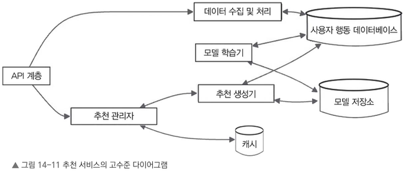
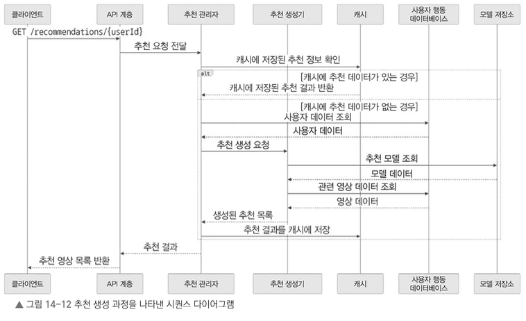
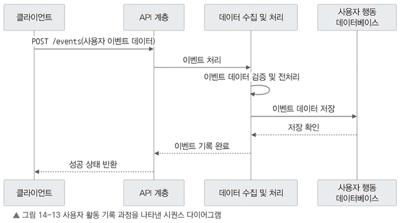
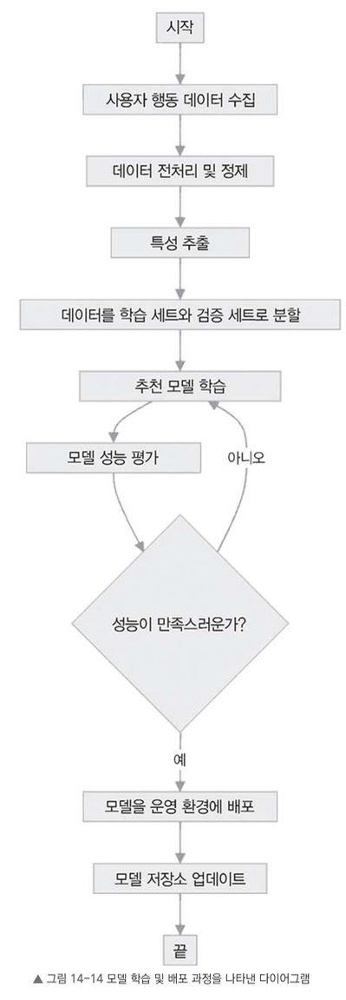

# 14.6.3 데이터베이스와 캐싱

사용자 서비스는 사용자 정보와 프로필 데이터를 주로 PostgreSQL, MySQL 같은 관계형 데이터베이스에 저장한다.
데이터베이스에는 사용자, 프로필, 개인별 설정, 인증 토큰 등을 담는 테이블이 들어간다.
자주 쓰는 사용자·프로필 정보는 레디스나 멤캐시드 같은 캐시에 두어 응답 속도를 높이고 데이터베이스 부하를 줄인다.

## 보안 및 개인 정보

사용자 정보를 보호하고 무단 접근을 막기 위해 철저한 인증 및 권한 관리 방식을 사용한다.

- 비밀번호는 그대로 저장하지 않고 해싱과 솔트를 거쳐 저장한다.
- 결제 정보처럼 민감한 개인 정보는 암호화해 보관한다.
- GDPR(유럽 일반 데이터 보호 규정), CCPA(캘리포니아 소비자 개인 정보 보호법) 같은 데이터 보호 법률을 준수한다.

사용자 서비스는 계정 관리와 인증을 안전하게 처리하고 개인 맞춤 프로필을 체계적으로 관리한다.
이를 기반으로 사용자 맞춤형 서비스를 제공하고 다른 서비스와도 자연스럽게 연계할 수 있다.

# 14.6.4 추천 서비스

추천 서비스는 사용자 취향과 시청 기록을 분석해 사용자별 맞춤 영상을 추천한다.
행동 패턴, 선호 장르와 콘텐츠, 과거 시청 내역을 토대로 관련성 높은 영상을 골라 보여 준다.

- 추천 서비스와 다른 서비스와의 연동을 나타낸 고수준 다이어그램

    

## API

- `GET /recommendations/{userId}`: 특정 사용자의 맞춤 추천 영상 목록 조회
  - 요청 파라미터: 사용자 ID, 추천 영상 수, 장르·언어 등 필터 조건
  - 응답: 추천 영상 목록과 각 영상의 메타데이터(제목, 설명 등)
- `POST /events`: 사용자 행동 데이터를 기록해 추천에 활용
  - 요청 본문: 사용자 ID, 이벤트 유형(영상 시청, 평가, 검색 등), 이벤트 상세 정보
  - 응답: 성공 여부

## 추천 생성 과정

1. 사용자가 추천을 요청하면 클라이언트는 `/recommendations/{userId}`로 GET 요청을 보낸다.
2. API 계층은 요청을 추천 관리자로 전달한다.
3. 추천 관리자는 캐시에 미리 만들어 둔 추천 결과가 있는지 확인한다.
   - 있으면 바로 반환한다.
   - 없으면 새 추천 결과를 생성한다.
4. 새 추천 결과는 다음 순서로 만든다.
   1. 추천 관리자가 사용자 행동 데이터베이스에서 시청 기록과 행동 데이터를 가져온다.
   2. 이 데이터로 추천 생성기에 맞춤 추천 목록 생성을 요청한다.
   3. 추천 생성기는 모델 저장소에서 사용자 성향에 맞는 추천 모델을 불러온다.
   4. 사용자 행동 데이터베이스에서 추천에 필요한 영상 정보를 가져온다.
   5. 영상 정보와 사용자 데이터를 모델에 넣어 개인화된 추천 목록을 만든다.
5. 추천 관리자는 다음 요청에 빠르게 응답하도록 결과를 캐시에 저장한다.
6. 추천 목록을 API 계층을 통해 클라이언트에 전달한다.

> 4-4의 영상 정보는 행동 데이터 기반 후보 영상으로 보이며, 메타데이터는 비디오 서비스에서 가져온다.

> 모델 저장소는 학습이 끝난 추천 모델(가중치, 버전, 성능 지표 등)을 보관하는 곳이다.
> 데이터가 아니라 "추천을 계산하는 함수"를 저장한다고 보면 된다.
> 학습 파이프라인이 모델을 올리고, 추천 생성기가 요청마다 꺼내 쓰며 학습과 서빙을 잇는다. (예: MLflow Model Registry, S3)

## 사용자 활동 기록 과정

영상 시청, 평가 같은 사용자 활동은 다음 흐름으로 기록된다.

1. 사용자가 영상 시청 같은 행동을 하면 클라이언트는 관련 데이터를 `/events`로 POST 요청한다.
2. API 계층은 이벤트 데이터를 데이터 수집 및 처리 컴포넌트로 보낸다.
3. 이벤트 데이터가 올바른 형태인지 검증하고 분석하기 쉽게 전처리한다.
4. 전처리한 데이터를 사용자 행동 데이터베이스에 저장한다.
5. 저장이 끝나면 클라이언트에 성공을 알린다.

## 추천 학습 및 배포 과정

1. 사용자 행동 데이터베이스에서 행동 데이터를 수집한다.
2. 데이터를 정리하고, 잘못되거나 일관성 없는 데이터를 걸러 내는 전처리를 한다.
3. 전처리한 데이터에서 모델 학습에 필요한 주요 특성을 추출한다.
4. 데이터를 학습용과 검증용으로 나눈다.
5. 학습용 데이터로 여러 추천 모델을 학습시킨다.
6. 검증용 데이터로 학습된 모델의 성능을 평가한다.
7. 성능이 만족스러우면 가장 우수한 모델을 운영 환경에 배포한다.
8. 배포된 모델은 모델 저장소에 업데이트된다.
9. 성능이 기대에 못 미치면 매개변수를 조정해 다시 학습한다.

### 다른 서비스와의 연동

- `사용자 서비스`에서 프로필 정보와 `시청 기록`을 가져온다.
- `비디오 서비스`에서 최신 비디오 메타데이터를 받아 정확한 `추천 결과`를 만든다.
- `분석 및 리포팅 서비스`에 `추천 시스템 성능 데이터`를 전달한다.

여러 프로세스가 함께 동작하기에 추천 서비스를 안정적이고 효율적으로 운영할 수 있다.

## 확장성 및 성능

많은 사용자가 동시에 추천을 요청해도 빠르고 안정적으로 응답하도록 설계한다.

- 여러 서버에 추천 서비스를 두고 로드 밸런서로 요청을 분산해 처리량을 늘린다.
- 자주 요청하는 추천 결과는 레디스나 멤캐시드 같은 캐시에 저장해 응답 속도를 높인다.
- 아파치 스파크, 텐서플로 서빙(TensorFlow Serving)처럼 확장성 좋은 인프라에 모델을 배포해 대량 요청을 효율적으로 처리한다.

## 모니터링 및 성능 평가

주요 지표를 지속적으로 모니터링해 서비스가 제대로 동작하는지 관리한다.

- 추천 요청 처리 속도, 캐시 적중률, 모델 정확도 같은 지표를 꾸준히 확인한다.
- 여러 추천 알고리즘이나 설정 값을 A/B 테스트해 사용자 참여도와 만족도 개선 정도를 측정한다.
- 사용자 피드백과 평가 점수를 수집·분석해 추천 품질을 점차 높인다.

추천 서비스는 스트리밍 서비스의 핵심 요소다.
정교한 추천 알고리즘, 데이터 수집, 실시간 처리 기술로 사용자 취향에 맞는 추천을 제공해 만족도와 서비스 지속성을 높인다.

다음 절에서는 전 세계 사용자에게 영상을 효율적으로 전송하는 데 필수인 CDN을 알아본다.
