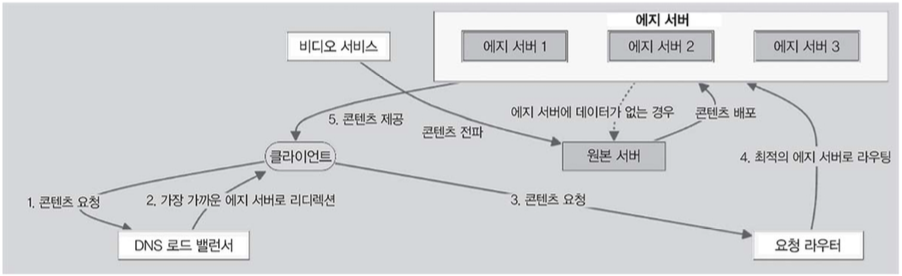
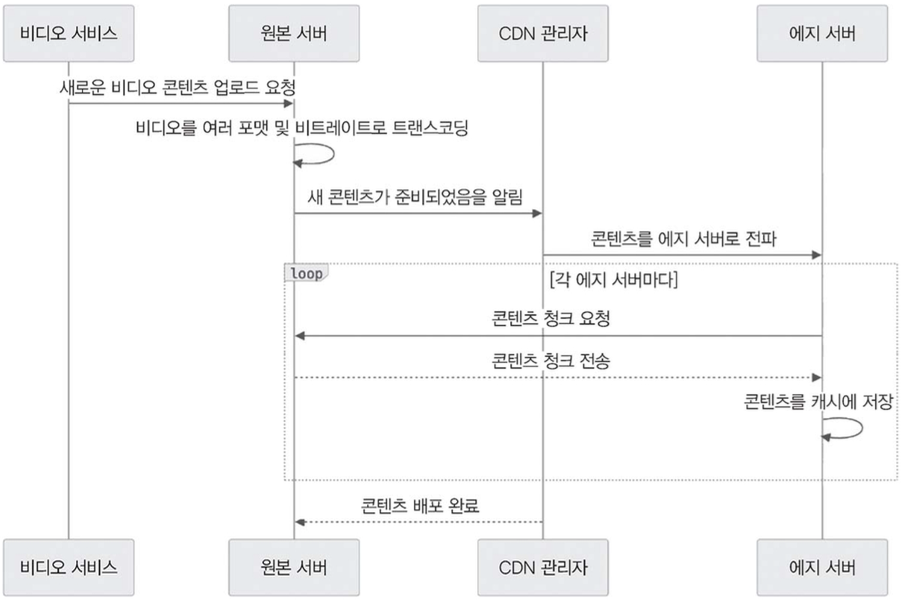
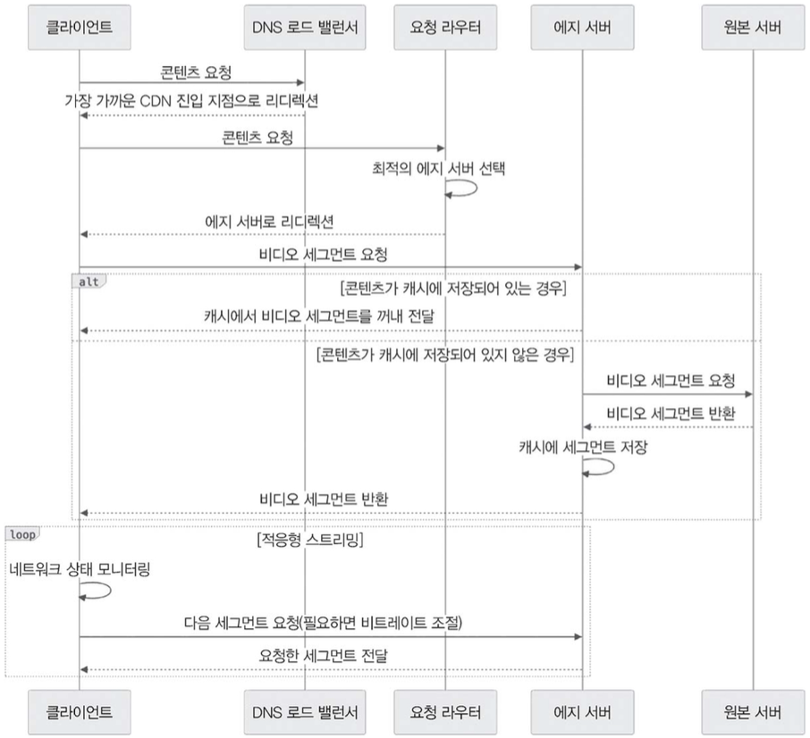

# 14.7 CDN

CDN은 넷플릭스 같은 서비스가 **전 세계 사용자에게 영상을 빠르고 효율적으로 전송**하는 데 핵심 역할을 한다.

여러 지역에 분산된 서버 네트워크를 통해 콘텐츠를 배포하고 관리하여, 서비스를 항상 빠르고 안정적으로 제공할 수 있도록 돕는다.

이 덕분에 전 세계 어디에 있는 사용자든 끊김 없이 고품질의 영상을 감상할 수 있다.

다음 그림은 CDN 아키텍처를 나타낸 다이어그램이다.

이제 CDN을 어떻게 설계하고 구현하는지 구체적으로 살펴본다.

---

## 14.7.1 CDN 아키텍처 및 콘텐츠 배포

다음 그림은 콘텐츠를 배포할 때 거치는 과정을 표현한 시퀀스 다이어그램이다.

콘텐츠 배포 과정은 다음과 같다.

1. CDN은 전 세계 여러 지역에 분산된 **에지 서버**로 구성되어 있으며, 이는 모든 콘텐츠의 원본을 보관하는 **원본 서버**와 연결되어 있다.
2. 비디오 서비스로 새로운 영상 콘텐츠가 업로드되면 다음 과정을 시작한다.
   1. 원본 서버는 다양한 기기와 네트워크 환경을 고려하여 영상을 여러 포맷과 비트레이트로 트랜스코딩한다.
   2. 새로운 콘텐츠가 등록되었음을 **CDN 관리자**에게 알린다.
   3. CDN 관리자는 에지 서버로 콘텐츠를 전파하는 작업을 시작한다.
   4. 각 에지 서버는 원본 서버에서 콘텐츠 청크를 요청하고 이를 캐시에 저장한다.
3. 이렇게 CDN을 활용하면 사용자에게 가장 가까운 서버에서 콘텐츠를 제공할 수 있어 **콘텐츠 전달까지 걸리는 지연 시간을 줄이고 스트리밍 성능을 끌어올릴 수 있다.**

이제 요청 라우팅과 영상 스트리밍 과정을 살펴본다.

---

## 14.7.2 요청 라우팅 및 영상 스트리밍

다음 그림은 요청 라우팅과 영상 스트리밍의 관계를 나타낸 시퀀스 다이어그램이다.

요청 라우팅은 다음 과정을 거친다.

1. 사용자가 영상을 재생하려고 요청하면 클라이언트 애플리케이션에서 다음 흐름을 시작한다.
2. 먼저 **클라이언트**가 **DNS 로드 밸런서**에 요청을 보낸다.
3. **DNS 로드 밸런서**는 클라이언트를 가장 가까운 CDN 진입 지점으로 리디렉션한다.
4. 클라이언트는 이후 **요청 라우터**와 통신한다.
5. **요청 라우터**는 다음 요소를 고려하여 최적의 에지 서버를 선택한다.
   * 사용자 위치
   * 서버 가용성
   * 네트워크 지연 시간
   * 서버 부하
6. 에지 서버를 선택했으면 클라이언트는 해당 에지 서버로 다시 리디렉션된다.
   * 이후 에지 서버에서 사용자가 요청한 영상 콘텐츠를 전달한다.
     * 콘텐츠가 캐시에 이미 저장되어 있다면 바로 에지 서버에서 전달한다.
     * 캐시에 없다면 원본 서버에서 콘텐츠를 가져와 캐시에 저장한 후 클라이언트에 전달한다.

이처럼 상황에 따라 최적의 서버로 라우팅되므로 전 세계 어디에서든 **빠르고 안정적인 스트리밍 환경**을 제공할 수 있다.

사용자가 보다 좋은 서비스 이용 경험을 느끼게 하려면 네트워크 상황에 맞추어 화질을 자동으로 조절하는 **적응형 비트레이트 스트리밍**을 지원해야 한다.

---

## 14.7.3 적응형 비트레이트 스트리밍

CDN은 사용자 환경에 맞는 최적의 화질을 제공하려고 적응형 비트레이트 스트리밍 방식을 사용한다.

* 비디오를 여러 비트레이트로 인코딩한 후 작은 세그먼트 단위로 나누어 저장한다.
* 비디오가 재생되는 동안 네트워크 상태를 지속적으로 모니터링한다.
* 상황에 따라 비트레이트를 조절하여 다음 세그먼트를 에지 서버에 요청한다.
* 에지 서버는 해당 요청에 맞는 비디오 세그먼트를 클라이언트로 전달한다.

이처럼 비트레이트를 실시간으로 조절하는 방식 덕분에 네트워크 환경이나 기기 성능이 다르더라도 **끊김 없는 시청 경험**을 유지할 수 있다.

---

## 14.7.4 콘텐츠 보안 및 DRM

CDN은 콘텐츠 보안을 위해 **DRM(Digital Rights Management)** 서비스와 통합하기도 한다.

* 비디오 콘텐츠는 마이크로소프트 플레이레디(PlayReady)나 구글 와이드바인(Widevine) 등 DRM 시스템을 사용하여 암호화한다.
* CDN은 DRM 서비스와 연동하여 콘텐츠를 암호화 상태로 안전하게 전달하고, 정식 사용자만 콘텐츠를 재생할 수 있도록 라이선스를 검증한다.
* 유효한 DRM 라이선스를 인증한 사용자만 비디오 콘텐츠에 접근하고 재생할 수 있도록 처리한다.

이렇게 연동하여 콘텐츠에 무단으로 접근하거나 복제하는 일을 막고, 라이선스 조건과 지역 제한 같은 규정을 지킬 수 있도록 한다.

즉, CDN은 넷플릭스 같은 비디오 스트리밍 서비스의 여러 핵심 구성 요소와 유기적으로 연동한다.

| 구성 요소         | 역할                                                    |
| ------------- | ----------------------------------------------------- |
| **비디오 서비스** | 콘텐츠를 인코딩하고 저장한 후 빠르게 배포할 수 있도록 연동하여 효율적인 콘텐츠 전송과 수신을 돕는다. |
| **추천 서비스**  | 사용자 맞춤 콘텐츠를 전달할 수 있도록 도우며, 개인화된 재생 목록이나 추천 영상을 동적으로 구성한다. |
| **분석 서비스**  | 콘텐츠 전송 성능에 대한 다양한 지표와 인사이트를 제공하여 CDN 운영을 지속적으로 최적화한다.   |
| **DRM 서비스** | 콘텐츠 암호화와 라이선스 관리로 콘텐츠가 안전하게 전송되도록 지원한다.                |

CDN은 다른 핵심 서비스와 유기적으로 연결되어 있을 뿐만 아니라, 콘텐츠 전송을 넘어 사용자 맞춤 전략을 활용하여 **서비스 사용 경험의 질을 높이고 보다 높은 수준의 보안**을 제공한다.

정교하게 설계된 아키텍처 위에서 CDN 서버를 만들면 전 세계 어디에서든 사용자에게 빠르고 안정적인 고화질 비디오 스트리밍을 제공할 수 있고, 네트워크 상황에 따라 유연하게 화질을 조절하면서 콘텐츠도 보호할 수 있다.

---

# 14.8 요약

이 장에서는 넷플릭스 같은 서비스의 시스템 설계를 다루면서 다음 내용을 알아보았다.

* 기능적 요구 사항과 비기능적 요구 사항
* 데이터 모델링
* 시스템 규모 산정
* 고수준 아키텍처
* 비디오 서비스, 사용자 서비스, 추천 서비스, CDN 등 핵심 컴포넌트 설계

먼저 서비스가 갖추어야 할 핵심 기능과 사용자 중심의 스트리밍 경험을 위한 필수 요소를 정의했고, 이어서 확장성, 성능, 안정성, 보안 같은 비기능적 요구 사항의 중요성도 짚어 보았다.

수백만 명의 사용자에게서 발생하는 대규모 데이터와 트래픽을 감당하려면 어느 정도의 규모가 필요한지 데이터 모델링 및 필요 용량을 산정했다.

핵심 엔티티와 각 엔티티 관계를 담은 데이터 모델을 구성하고 저장 공간, 네트워크 대역폭, 처리 성능 등을 계산했다.

이런 요구 사항과 규모 산정을 바탕으로 다양한 서비스와 컴포넌트가 조화를 이루는 고수준 아키텍처를 설계했고, 각 구성 요소의 역할과 상호 작용을 살펴보며 **비디오 저장, 인코딩, 스트리밍, 추천 생성, 콘텐츠 전송**을 어떻게 효율적으로 구현할 수 있을지 설명했다.

각 장에서 다룬 내용을 바탕으로 **확장성, 장애 허용성, 성능 최적화**의 중요성을 반복해서 강조했으며, 다음과 같은 기법을 이용하여 끊김 없고 안정적인 스트리밍 환경을 구축하는 방법을 다루었다.

* 데이터 샤딩
* 캐싱
* 콘텐츠 분산
* 적응형 비트레이트 스트리밍

다음 장에서는 시스템 설계 면접을 준비할 때 꼭 알아 두면 좋을 팁을 정리한다.
